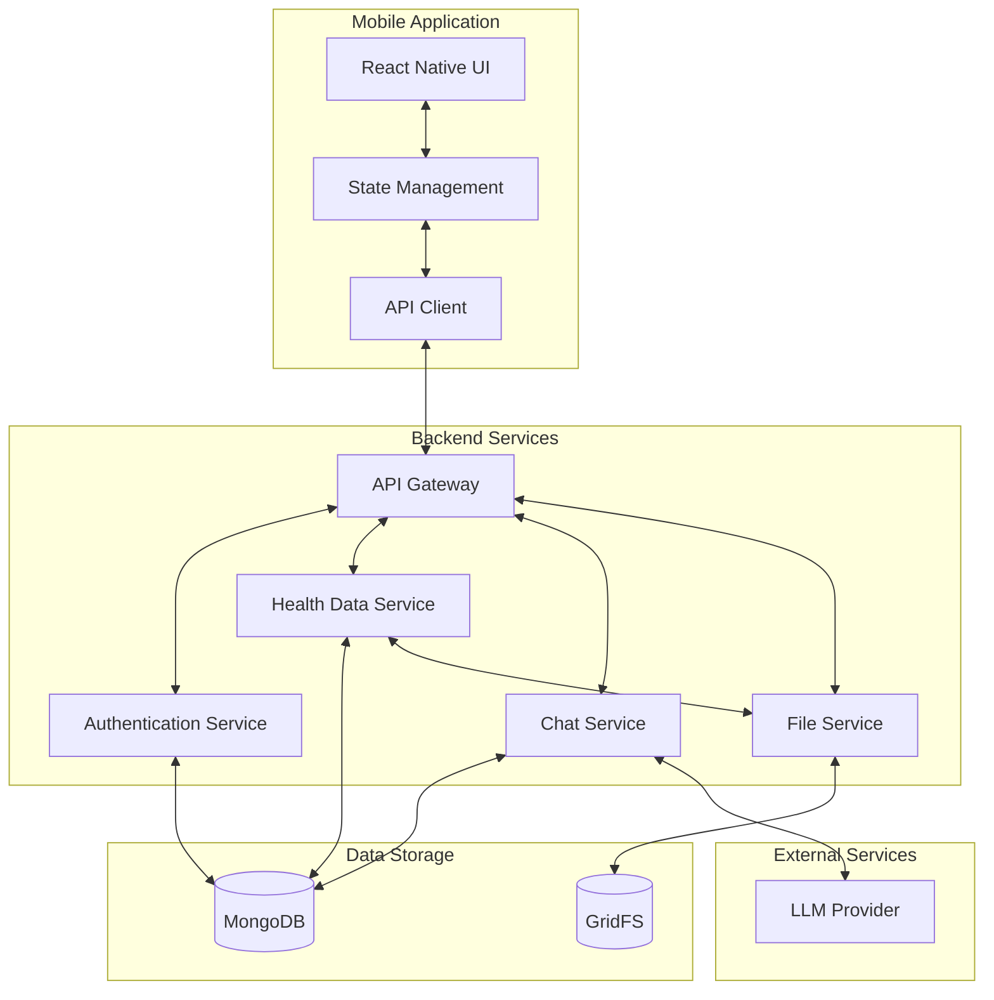

# Health Advisor

A React Native mobile application with an Express backend that enables users to interact with an LLM as a personalized health advisor.

## Overview

Health Advisor is a mobile application that allows users to log health data through various input methods (photos, text, voice), view their health history, and receive personalized health advice through a chat interface powered by a Large Language Model (LLM).

## Key Features

- User authentication via email/password
- Health data input (meals, lab results, symptoms) via photos, text, and voice
- Searchable health history with date filtering
- LLM-powered chat interface for personalized health advice
- Basic user profile management

## System Architecture

The system consists of two primary components:

1. **React Native Mobile Application**:
   - User-facing interface with five main sections: Chat, Health Log, Data Entry, Insights, and Profile
   - Enables health data input through various methods (photos, text, voice)
   - Provides searchable health history and personalized AI interactions

2. **Express Backend Service**:
   - Manages user authentication and data storage
   - Handles communication with the LLM
   - Stores and retrieves user health information
   - Implemented in TypeScript with MongoDB for data persistence



## Technology Stack

### Mobile Application
- React Native (v0.71+)
- TypeScript // Version: 4.9+
- React Navigation // Version: 6.x
- Axios // Version: 1.3+ for API communication
- AsyncStorage // Version: 1.18+ for local data persistence
- React Native Camera // Version: 4.x and Voice for data capture
- React Native Calendars // Version: 1.1294+

### Backend Service
- Node.js with Express.js // Version: 4.18+
- TypeScript // Version: 4.9+
- MongoDB with Mongoose ODM // Version: 7.0+
- JWT // Version: 9.0+ for authentication
- Multer // Version: 1.4+ for file upload handling
- Winston // Version: 3.8+ for logging

### External Integrations
- LLM Provider (OpenAI/Azure OpenAI)
- MongoDB Atlas (optional for production)

## Getting Started

### Prerequisites
- Node.js (v16.x or higher)
- npm (v8.x or higher) or yarn
- MongoDB (v5.0 or higher)
- React Native development environment
  - For iOS: macOS with Xcode
  - For Android: Android Studio with SDK
- LLM provider API key

### Installation

#### Clone the Repository
```bash
git clone https://github.com/your-organization/health-advisor.git
cd health-advisor
```

#### Backend Setup
```bash
cd src/backend
npm install
cp .env.example .env
# Edit .env with your configuration
npm run dev
```

#### Mobile Application Setup
```bash
cd src/web
npm install
cd ios && pod install && cd .. # For iOS only
cp .env.example .env
# Edit .env with your configuration
```

#### Running the Mobile Application
```bash
# For iOS
npm run ios

# For Android
npm run android
```

For detailed setup instructions, see [Development Environment Setup](docs/development/setup.md).

## Project Structure
```
├── docs/                  # Documentation files
│   ├── api/              # API documentation
│   ├── architecture/     # Architecture documentation
│   └── development/      # Development guides
├── infrastructure/       # Infrastructure as code
├── scripts/              # Utility scripts
├── src/                  # Source code
│   ├── backend/          # Express backend service
│   └── web/              # React Native mobile application
├── .github/              # GitHub configuration
├── CHANGELOG.md          # Version history
├── LICENSE               # License information
└── README.md             # This file
```

## Documentation
- [Backend Documentation](src/backend/README.md): Details about the Express backend service
- [Mobile Documentation](src/web/README.md): Details about the React Native mobile application
- [Architecture Documentation](docs/architecture/README.md): System architecture and design decisions
- [API Documentation](docs/api/README.md): API endpoints and usage
- [Development Setup](docs/development/setup.md): Detailed environment setup instructions

## Development

### Code Style and Quality
This project uses ESLint and Prettier for code formatting and style enforcement. TypeScript is used for type safety in both frontend and backend code.

### Testing
The project includes comprehensive testing:
- Unit tests with Jest
- Integration tests for API endpoints
- End-to-end tests for mobile application

Run tests with:
```bash
# Backend tests
cd src/backend
npm test

# Mobile tests
cd src/web
npm test
```

### Continuous Integration
GitHub Actions workflows are set up for continuous integration, running linting, type checking, and tests for both backend and mobile components.

### Contributing
We welcome contributions to the Health Advisor project! Contributors should:

- Fork the repository and create a feature branch
- Follow the project's coding standards and test requirements
- Write clean, well-documented code
- Include appropriate tests for new features or bug fixes
- Submit a pull request with a clear description of the changes

See [Development Workflow](docs/development/workflow.md) for more details on our development process.

## Deployment

### Backend Deployment
The backend service can be deployed using Docker containers. A Dockerfile is provided in the `src/backend` directory.

```bash
cd src/backend
docker build -t health-advisor-backend .
```

For production deployment, we recommend using AWS EC2/ECS for scalable, reliable hosting for Express backend.

### Mobile Application Deployment
The mobile application can be built for production using the following commands:

```bash
# For Android
cd src/web
npm run build:android

# For iOS
cd src/web
npm run build:ios
```

For distribution, use the App Store for iOS and Google Play Store for Android.

## License
This project is licensed under the MIT License - see the [LICENSE](LICENSE) file for details.

Note: The MIT license applies to the software code only. The use of the application for health-related purposes is subject to additional terms of service that address health data privacy, HIPAA compliance, and limitations on medical advice.

## Changelog
See [CHANGELOG.md](CHANGELOG.md) for a list of all notable changes to the project.