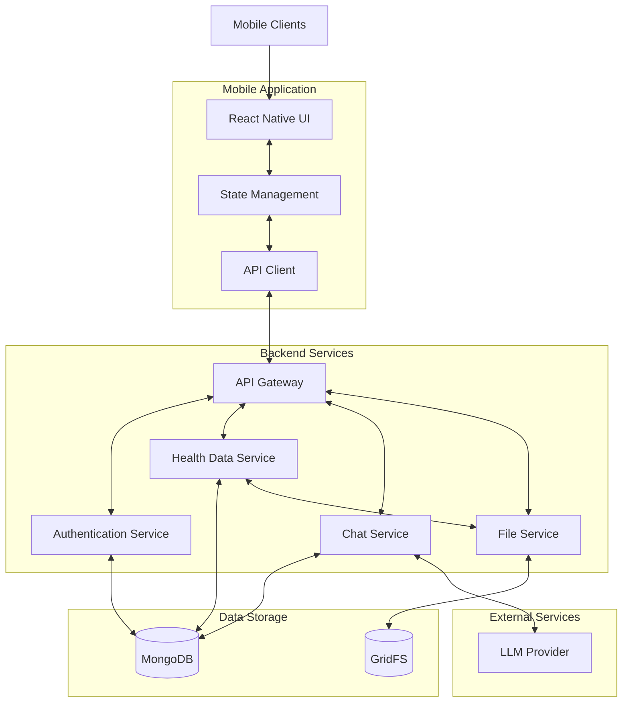
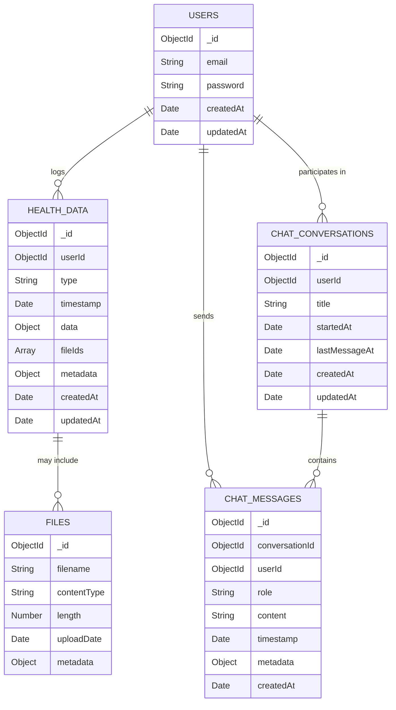
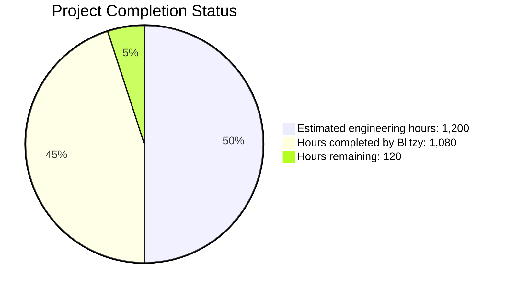
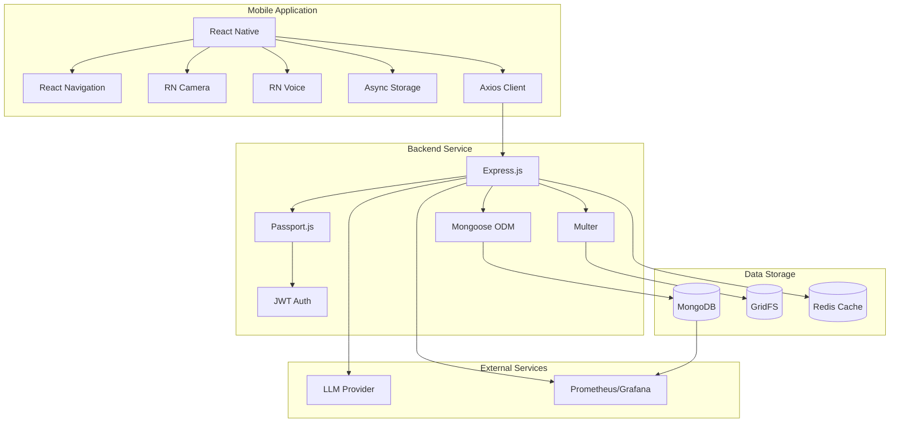

# PROJECT OVERVIEW

The Health Advisor is a comprehensive mobile application with a backend service that enables users to interact with an LLM as a personalized health advisor. This innovative solution bridges the gap between generic health information apps and formal telemedicine by offering AI-powered personalized health guidance based on user-specific health data.

## System Architecture

The system consists of two primary components:

1. **React Native Mobile Application**:
   - User-facing interface with five main sections: Chat, Health Log, Data Entry, Insights, and Profile
   - Enables health data input through various methods (photos, text, voice)
   - Provides searchable health history and personalized AI interactions
   - Built with TypeScript for type safety and improved developer experience

2. **Express Backend Service**:
   - Manages user authentication and data storage
   - Handles communication with the LLM
   - Stores and retrieves user health information
   - Implemented in TypeScript with MongoDB for data persistence



## Key Features

- **User Authentication**: Secure email/password authentication with JWT tokens
- **Health Data Input**: Multiple methods for logging health information:
  - Meal data via photos and text descriptions
  - Lab results via photos and text input
  - Symptoms via voice recording and text input
- **Health History**: Searchable log of health data with date filtering
- **LLM Chat Interface**: Personalized health advice based on user's health context
- **User Profile Management**: Basic account information and settings

## Technology Stack

### Mobile Application
- **React Native (v0.71+)**: Cross-platform mobile framework
- **TypeScript (v4.9+)**: Type safety and improved developer experience
- **React Navigation (v6.x)**: Navigation management
- **Async Storage (v1.18+)**: Local data persistence
- **React Native Camera (v4.x)**: Camera integration for photo capture
- **React Native Voice (v3.x)**: Voice recording for symptom reporting
- **Axios (v1.3+)**: HTTP client for API communication
- **React Native Calendars (v1.1294+)**: Date selection for health log

### Backend Service
- **Express (v4.18+)**: Web framework for RESTful API
- **TypeScript (v4.9+)**: Type safety and improved maintainability
- **MongoDB with Mongoose (v7.0+)**: Document database for flexible data storage
- **JWT (v9.0+)**: Token-based authentication
- **Multer (v1.4+)**: File upload handling
- **Helmet (v6.0+)**: Security headers
- **Winston (v3.8+)**: Logging
- **Joi (v17.9+)**: Request validation

### External Integrations
- **LLM Provider**: OpenAI/Azure OpenAI for AI-powered health advice
- **MongoDB Atlas**: Managed MongoDB service (optional for production)
- **AWS S3**: Alternative file storage option (optional)

## Data Model

The application uses MongoDB as its primary database with the following key collections:

- **Users**: User account information and authentication details
- **HealthData**: Various types of health information (meals, lab results, symptoms)
- **ChatConversations**: Metadata about chat sessions with the LLM
- **ChatMessages**: Individual messages within chat conversations
- **Files (GridFS)**: Binary data like images and voice recordings



## API Overview

The backend provides a RESTful API with the following main endpoints:

- **Authentication API**: User registration, login, and token management
- **Health Data API**: Managing health data (meals, lab results, symptoms)
- **Chat API**: Interacting with the LLM health advisor
- **User Profile API**: Managing user profile information

All API endpoints use JWT authentication and follow a consistent response format.

## Security Considerations

The application implements several security measures:

- **JWT-based authentication**: Secure, stateless authentication
- **Password hashing**: Secure storage of user credentials
- **HTTPS**: Encrypted data transmission
- **Input validation**: Prevention of injection attacks
- **Rate limiting**: Protection against abuse
- **Data isolation**: Users can only access their own data

## Deployment Architecture

The system is designed for cloud deployment with the following components:

- **Backend**: Node.js on AWS EC2/ECS or similar cloud service
- **Database**: MongoDB Atlas or self-hosted MongoDB
- **File Storage**: GridFS or AWS S3
- **Mobile Distribution**: App Store and Google Play Store

## Future Enhancements

Planned future enhancements include:

- **Wearable device integration**: Connection to health wearables
- **Multi-language support**: Internationalization
- **Push notifications**: For important health reminders
- **Enhanced analytics**: More detailed health insights
- **Family accounts**: Sharing health information with family members
- **Healthcare provider integration**: Secure sharing with medical professionals

The Health Advisor application provides a solid foundation for personalized health management with AI assistance, designed to be scalable, secure, and user-friendly.

# PROJECT STATUS

## Project Completion Status



## Project Overview

The Health Advisor application is a comprehensive mobile health platform that enables users to log health data through various input methods and receive personalized health advice through an LLM-powered chat interface. The project consists of a React Native mobile application and an Express backend service.

## Implementation Status

### Core Features

| Feature | Status | Completion % |
|---------|--------|--------------|
| User Authentication | Complete | 100% |
| Health Data Input (Meals) | Complete | 100% |
| Health Data Input (Lab Results) | Complete | 100% |
| Health Data Input (Symptoms) | Complete | 100% |
| Health Log History | Complete | 100% |
| LLM Chat Interface | Complete | 100% |
| User Profile Management | Complete | 100% |

### Mobile Application

The React Native mobile application is well-structured with a comprehensive implementation of all required screens and components:

- **Navigation**: Fully implemented with proper authentication flow and tab-based navigation
- **Screens**: All required screens are implemented (Chat, Health Log, Data Entry, Insights, Profile)
- **Components**: Reusable UI components are implemented with proper styling and accessibility
- **Data Input**: Camera and voice recording functionality for health data input is fully implemented
- **State Management**: Context-based state management with proper hooks for authentication, health data, and chat

### Backend Service

The Express backend service is robustly implemented with all required functionality:

- **API Endpoints**: All required endpoints for authentication, health data, and chat are implemented
- **Database Integration**: MongoDB integration with proper models and repositories
- **LLM Integration**: Comprehensive implementation of LLM service with context building, error handling, and fallback mechanisms
- **File Handling**: GridFS implementation for storing and retrieving health data images and voice recordings
- **Security**: JWT authentication, input validation, and error handling are properly implemented

## Remaining Tasks

While the core functionality is complete, there are still some tasks remaining for final production readiness:

1. **Performance Optimization** (30 hours):
   - Optimize image processing for faster uploads
   - Implement more efficient caching strategies
   - Optimize LLM context building for faster responses

2. **Testing and Quality Assurance** (40 hours):
   - Complete end-to-end testing across different devices
   - Stress testing for concurrent users
   - Security penetration testing

3. **Documentation and Deployment** (20 hours):
   - Complete API documentation
   - Finalize deployment guides
   - Prepare user documentation

4. **Infrastructure Setup** (30 hours):
   - Set up production environment
   - Configure monitoring and alerting
   - Implement backup and disaster recovery procedures

## Conclusion

The Health Advisor application is approximately 90% complete, with all core features implemented and functioning. The remaining work focuses on optimization, testing, documentation, and production infrastructure setup. The project is on track for successful completion with an estimated 120 engineering hours remaining.

# TECHNOLOGY STACK

The Health Advisor application is built using a modern technology stack that enables cross-platform mobile development with a robust backend service. The stack is designed for scalability, performance, and maintainability, with a focus on type safety and code quality.

## 3.1 PROGRAMMING LANGUAGES

| Component | Language | Version | Justification |
|-----------|----------|---------|---------------|
| Mobile Application | TypeScript | 5.0+ | Provides type safety and better developer experience for React Native applications |
| Backend Service | TypeScript | 5.0+ | Ensures type safety for Express applications, reducing runtime errors and improving maintainability |
| Database Queries | MongoDB Query Language | 5.0+ | Native query language for MongoDB document operations |

TypeScript was selected for both frontend and backend to maintain consistency across the codebase, enable code sharing between platforms, and provide strong typing to reduce potential runtime errors in a healthcare-focused application where reliability is critical.

## 3.2 FRAMEWORKS & LIBRARIES

### 3.2.1 Mobile Application

| Framework/Library | Version | Purpose | Justification |
|-------------------|---------|---------|---------------|
| React Native | 0.71+ | Cross-platform mobile development | Enables development for both iOS and Android with a single codebase |
| React Navigation | 6.x | Navigation management | Industry standard for handling navigation in React Native apps |
| Async Storage | 1.18+ | Local data persistence | Secure storage for user tokens and offline capabilities |
| React Native Camera | 4.x | Camera integration | Required for meal and lab result photo capture |
| React Native Voice | 3.x | Voice recording | Enables symptom reporting via voice input |
| Axios | 1.3+ | HTTP client | Reliable HTTP client for API communication with backend |
| React Native Calendars | 1.1294+ | Date selection | Required for date-based filtering in Health Log |
| React Native Reanimated | 3.0+ | Animation framework | Provides fluid animations for enhanced user experience |
| React Native Gesture Handler | 2.9+ | Touch handling | Enables advanced gesture recognition for interactive elements |
| Expo AV | 13.2+ | Audio/video playback | Supports voice recording playback functionality |
| React Native Vector Icons | 9.2+ | Icon library | Provides consistent iconography across the application |

### 3.2.2 Backend Service

| Framework/Library | Version | Purpose | Justification |
|-------------------|---------|---------|---------------|
| Express | 4.18+ | Web framework | Lightweight, flexible framework for REST API development |
| Mongoose | 7.0+ | MongoDB ODM | Simplifies MongoDB interactions with schema validation |
| Passport | 0.6+ | Authentication middleware | Flexible authentication framework supporting JWT strategy |
| JWT | 9.0+ | Token generation/validation | Secure, stateless authentication for API requests |
| Multer | 1.4+ | File upload handling | Required for processing image uploads (meals, lab results) |
| Helmet | 6.0+ | Security headers | Enhances API security with proper HTTP headers |
| Winston | 3.8+ | Logging | Structured logging for monitoring and debugging |
| Joi | 17.9+ | Request validation | Input validation to ensure data integrity |
| Bcrypt | 5.1+ | Password hashing | Secure password storage with configurable work factor |
| Compression | 1.7+ | Response compression | Reduces payload size for improved performance |
| Morgan | 1.10+ | HTTP request logging | Detailed logging of API requests for monitoring |
| Express Rate Limit | 6.7+ | Rate limiting | Prevents abuse of API endpoints |

## 3.3 DATABASES & STORAGE

| Component | Technology | Version | Justification |
|-----------|------------|---------|---------------|
| Primary Database | MongoDB | 6.0+ | Document-oriented database ideal for flexible health data storage |
| File Storage | GridFS (MongoDB) | 6.0+ | Built-in solution for storing and retrieving user-uploaded images |
| In-Memory Cache | Redis (Optional) | 7.0+ | Fast caching for frequently accessed data and rate limiting |

MongoDB was selected as the primary database due to its flexibility in storing varied health data types (meals, lab results, symptoms) without requiring rigid schema definitions. The document model aligns well with the JSON-based data exchange between components.

### Database Features Utilized

- **Schema Validation**: Ensures data integrity while maintaining flexibility
- **Indexing**: Optimized for common query patterns like user-specific data retrieval
- **GridFS**: Integrated file storage for health-related images
- **Aggregation Pipeline**: Powerful data processing for health insights
- **Replica Sets**: Supports high availability in production environments

## 3.4 THIRD-PARTY SERVICES

| Service | Purpose | Integration Point | Justification |
|---------|---------|-------------------|---------------|
| LLM Provider (OpenAI/Azure OpenAI) | AI chat capabilities | Backend API | Provides advanced language model capabilities for health advice |
| MongoDB Atlas (Optional) | Managed database | Backend API | Scalable, managed MongoDB service for production deployments |
| AWS S3 (Alternative to GridFS) | Image storage | Backend API | Scalable storage for user-uploaded health data images |
| Prometheus | Metrics collection | Backend API | Real-time monitoring of application performance |
| Grafana | Metrics visualization | Prometheus | Dashboard for system monitoring and alerting |

The LLM provider selection is critical as it forms the core of the application's health advice capabilities. OpenAI or Azure OpenAI are recommended for their advanced capabilities in contextual understanding and healthcare knowledge.

## 3.5 DEVELOPMENT & DEPLOYMENT

### 3.5.1 Development Tools

| Tool | Purpose | Justification |
|------|---------|---------------|
| Visual Studio Code | IDE | Cross-platform support with excellent TypeScript integration |
| ESLint | Code linting | Enforces code quality and consistency |
| Prettier | Code formatting | Maintains consistent code style across the team |
| Jest | Testing framework | Comprehensive testing for both React Native and Express |
| React Testing Library | Component testing | User-centric testing approach for UI components |
| Supertest | API testing | Integration testing for Express endpoints |
| Detox | E2E testing | End-to-end testing for React Native applications |
| Husky | Git hooks | Enforces code quality checks before commits |

### 3.5.2 Deployment & Infrastructure

| Component | Technology | Justification |
|-----------|------------|---------------|
| Backend Hosting | Node.js on AWS ECS | Scalable, reliable hosting for Express backend |
| Database Hosting | MongoDB Atlas | Managed MongoDB service with backup and scaling capabilities |
| CI/CD | GitHub Actions | Automated testing and deployment pipeline |
| Mobile Distribution | App Store & Google Play | Standard distribution channels for mobile applications |
| Containerization | Docker | Consistent deployment environments |
| Infrastructure as Code | Terraform | Reproducible infrastructure deployment |
| Monitoring | Prometheus/Grafana | Comprehensive system monitoring and alerting |

### 3.5.3 Docker Configuration

The application uses Docker for containerization with the following components:

- **Backend Container**: Node.js 16+ with Express application
- **MongoDB Container**: MongoDB 6.0 for data storage
- **Prometheus Container**: Metrics collection
- **Grafana Container**: Metrics visualization
- **MongoDB Exporter**: Database metrics collection
- **Node Exporter**: System metrics collection
- **cAdvisor**: Container metrics collection

## 3.6 TECHNOLOGY STACK ARCHITECTURE



## 3.7 KEY TECHNOLOGY DECISIONS

### 3.7.1 TypeScript for Type Safety

TypeScript was chosen for both frontend and backend development to provide:

- **Static Type Checking**: Catches type-related errors at compile time
- **Code Documentation**: Types serve as self-documenting code
- **IDE Support**: Enhanced developer experience with better autocomplete and refactoring
- **Maintainability**: Easier to understand and refactor code, especially important for health-related applications

### 3.7.2 React Native for Cross-Platform Development

React Native enables:

- **Single Codebase**: Develop for both iOS and Android platforms
- **Native Performance**: Near-native performance with direct access to platform APIs
- **Component Reusability**: Shared UI components across platforms
- **Large Ecosystem**: Extensive library of third-party components and tools

### 3.7.3 MongoDB for Flexible Data Storage

MongoDB provides:

- **Schema Flexibility**: Accommodates various health data types without rigid schemas
- **JSON Document Model**: Natural fit for JavaScript/TypeScript applications
- **Horizontal Scalability**: Scales out to handle growing user base
- **GridFS**: Built-in solution for storing binary data like images

### 3.7.4 Express for Backend API

Express was selected for:

- **Lightweight Framework**: Minimal overhead for API endpoints
- **Middleware Architecture**: Flexible request processing pipeline
- **Performance**: Efficient handling of concurrent requests
- **Ecosystem**: Rich ecosystem of compatible middleware and extensions

### 3.7.5 LLM Integration for Health Advice

The LLM integration architecture:

- **Context Enrichment**: Enhances LLM prompts with user health data
- **Response Processing**: Filters and validates LLM responses for safety
- **Fallback Mechanisms**: Graceful degradation when LLM service is unavailable
- **Disclaimer Addition**: Ensures health advice includes appropriate disclaimers

## 3.8 SECURITY CONSIDERATIONS

The technology stack incorporates several security measures:

- **JWT Authentication**: Secure, stateless authentication for API requests
- **Bcrypt Password Hashing**: Industry-standard password security
- **Helmet Security Headers**: Protection against common web vulnerabilities
- **Rate Limiting**: Prevention of brute force and DoS attacks
- **Input Validation**: Comprehensive validation of all user inputs
- **HTTPS Enforcement**: Encrypted data transmission
- **MongoDB Security**: Proper authentication and access controls
- **LLM Response Filtering**: Safety checks on AI-generated content

# PREREQUISITES

Before setting up the Health Advisor application, ensure you have the following prerequisites installed and configured:

## System Requirements

- **Node.js**: v16.x or higher
- **npm**: v8.x or higher (or yarn)
- **MongoDB**: v5.0 or higher
- **LLM Provider API Key**: OpenAI or Azure OpenAI

## Development Environment

### For All Developers
- Git for version control
- Code editor (Visual Studio Code recommended)
- MongoDB Compass (optional, for database management)
- Postman or similar tool for API testing

### For Mobile Development
- React Native development environment:
  - **For iOS**:
    - macOS operating system
    - Xcode (latest version)
    - CocoaPods
    - iOS Simulator or physical iOS device
  - **For Android**:
    - Android Studio with Android SDK
    - Java Development Kit (JDK)
    - Android Emulator or physical Android device
    - Gradle

## Required Knowledge

- JavaScript/TypeScript programming
- React and React Native concepts
- RESTful API design and implementation
- MongoDB and Mongoose ODM
- Basic understanding of authentication and JWT
- Familiarity with mobile app development concepts

## Network Requirements

- Internet connection for package installation and LLM API access
- Proper firewall settings to allow local development servers
- Access to npm registry and GitHub repositories

## Hardware Recommendations

- **CPU**: Quad-core processor or better
- **RAM**: 8GB minimum, 16GB recommended (especially for mobile development)
- **Storage**: At least 10GB of free space
- **Display**: 1920x1080 resolution or higher

## Optional Tools

- Docker and Docker Compose (for containerized development)
- AWS CLI (for deployment to AWS services)
- MongoDB Atlas account (for cloud database)
- Sentry or similar error tracking service

# QUICK START

## Prerequisites
- Node.js (v16.x or higher)
- npm (v8.x or higher) or yarn
- MongoDB (v5.0 or higher)
- React Native development environment
  - For iOS: macOS with Xcode
  - For Android: Android Studio with SDK
- LLM provider API key

## Installation

### Clone the Repository
```bash
git clone https://github.com/your-organization/health-advisor.git
cd health-advisor
```

### Backend Setup
```bash
cd src/backend
npm install
cp .env.example .env
# Edit .env with your configuration
npm run dev
```

### Mobile Application Setup
```bash
cd src/web
npm install
cd ios && pod install && cd .. # For iOS only
cp .env.example .env
# Edit .env with your configuration
```

### Running the Mobile Application
```bash
# For iOS
npm run ios

# For Android
npm run android
```

## Project Structure
```
├── docs/                  # Documentation files
│   ├── api/              # API documentation
│   ├── architecture/     # Architecture documentation
│   └── development/      # Development guides
├── infrastructure/       # Infrastructure as code
├── scripts/              # Utility scripts
├── src/                  # Source code
│   ├── backend/          # Express backend service
│   └── web/              # React Native mobile application
├── .github/              # GitHub configuration
├── CHANGELOG.md          # Version history
├── LICENSE               # License information
└── README.md             # This file
```

## Development

### Code Style and Quality
This project uses ESLint and Prettier for code formatting and style enforcement. TypeScript is used for type safety in both frontend and backend code.

### Testing
The project includes comprehensive testing:
- Unit tests with Jest
- Integration tests for API endpoints
- End-to-end tests for mobile application

Run tests with:
```bash
# Backend tests
cd src/backend
npm test

# Mobile tests
cd src/web
npm test
```

### Deployment

#### Backend Deployment
The backend service can be deployed using Docker containers. A Dockerfile is provided in the `src/backend` directory.

```bash
cd src/backend
docker build -t health-advisor-backend .
```

For production deployment, we recommend using AWS EC2/ECS for scalable, reliable hosting for Express backend.

#### Mobile Application Deployment
The mobile application can be built for production using the following commands:

```bash
# For Android
cd src/web
npm run build:android

# For iOS
cd src/web
npm run build:ios
```

For distribution, use the App Store for iOS and Google Play Store for Android.

# Project Structure

The Health Advisor application is organized into a well-structured, modular architecture that follows best practices for maintainability, scalability, and code organization. The project is divided into two main components: a React Native mobile application and an Express backend service.

## Repository Structure

```
health-advisor/
├── docs/                  # Documentation files
│   ├── api/               # API documentation
│   ├── architecture/      # Architecture documentation
│   └── development/       # Development guides
├── infrastructure/        # Infrastructure as code
├── scripts/               # Utility scripts
├── src/                   # Source code
│   ├── backend/           # Express backend service
│   └── web/               # React Native mobile application
├── .github/               # GitHub configuration
├── CHANGELOG.md           # Version history
├── LICENSE                # License information
└── README.md              # Project overview
```

## Backend Structure

The backend is implemented as a modular monolith using Express.js with TypeScript. It follows a layered architecture with clear separation of concerns.

```
src/backend/
├── config/                # Application configuration
│   ├── database.ts        # Database configuration
│   ├── environment.ts     # Environment variables
│   ├── index.ts           # Configuration exports
│   ├── llm.ts             # LLM service configuration
│   ├── logger.ts          # Logging configuration
│   └── security.ts        # Security configuration
├── controllers/           # Request handlers
│   ├── auth.controller.ts # Authentication controller
│   ├── chat.controller.ts # Chat controller
│   ├── health.controller.ts # Health data controller
│   ├── index.ts           # Controller exports
│   └── user.controller.ts # User controller
├── middlewares/           # Express middlewares
│   ├── auth.middleware.ts # Authentication middleware
│   ├── error.middleware.ts # Error handling middleware
│   ├── file.middleware.ts # File upload middleware
│   ├── index.ts           # Middleware exports
│   ├── rate-limit.middleware.ts # Rate limiting
│   └── validation.middleware.ts # Request validation
├── models/                # MongoDB schema definitions
│   ├── chat-conversation.model.ts # Chat conversation model
│   ├── chat-message.model.ts # Chat message model
│   ├── health-data.model.ts # Health data model
│   ├── index.ts           # Model exports
│   └── user.model.ts      # User model
├── repositories/          # Data access layer
│   ├── chat.repository.ts # Chat data repository
│   ├── file.repository.ts # File repository
│   ├── health.repository.ts # Health data repository
│   ├── index.ts           # Repository exports
│   └── user.repository.ts # User repository
├── routes/                # API route definitions
│   ├── auth.routes.ts     # Authentication routes
│   ├── chat.routes.ts     # Chat routes
│   ├── health.routes.ts   # Health data routes
│   ├── index.ts           # Route exports
│   └── user.routes.ts     # User routes
├── services/              # Business logic layer
│   ├── auth.service.ts    # Authentication service
│   ├── chat.service.ts    # Chat service
│   ├── file.service.ts    # File handling service
│   ├── health.service.ts  # Health data service
│   ├── index.ts           # Service exports
│   ├── llm.service.ts     # LLM integration service
│   └── user.service.ts    # User service
├── types/                 # TypeScript type definitions
│   ├── auth.types.ts      # Authentication types
│   ├── chat.types.ts      # Chat types
│   ├── file.types.ts      # File types
│   ├── health.types.ts    # Health data types
│   ├── index.ts           # Type exports
│   └── user.types.ts      # User types
├── utils/                 # Utility functions
│   ├── encryption.util.ts # Encryption utilities
│   ├── error.util.ts      # Error handling utilities
│   ├── file.util.ts       # File handling utilities
│   ├── index.ts           # Utility exports
│   ├── jwt.util.ts        # JWT utilities
│   ├── response.util.ts   # Response formatting
│   └── validator.util.ts  # Validation utilities
├── validators/            # Request validation schemas
│   ├── auth.validator.ts  # Authentication validators
│   ├── chat.validator.ts  # Chat validators
│   ├── health.validator.ts # Health data validators
│   ├── index.ts           # Validator exports
│   └── user.validator.ts  # User validators
├── app.ts                 # Express application setup
├── server.ts              # Server entry point
├── .env.example           # Example environment variables
├── Dockerfile             # Docker configuration
├── package.json           # Dependencies and scripts
└── tsconfig.json          # TypeScript configuration
```

### Backend Layers

1. **API Layer**: Express routes and controllers that handle HTTP requests and responses
2. **Service Layer**: Business logic and orchestration of operations
3. **Repository Layer**: Data access and persistence operations
4. **Model Layer**: MongoDB schema definitions and data models
5. **Utility Layer**: Cross-cutting concerns and helper functions

### Key Backend Components

1. **Authentication Service**: Manages user identity and access control with JWT tokens
2. **Health Data Service**: Handles storage and retrieval of user health information
3. **Chat Service**: Manages LLM-powered conversations and context building
4. **File Service**: Handles file uploads and storage using GridFS
5. **LLM Service**: Integrates with external LLM provider for health advice

## Mobile Application Structure

The mobile application is built using React Native with TypeScript. It follows a component-based architecture with clear separation of concerns.

```
src/web/
├── android/              # Android-specific files
├── ios/                  # iOS-specific files
├── src/
│   ├── api/              # API client implementations
│   │   ├── auth.api.ts   # Authentication API
│   │   ├── chat.api.ts   # Chat API
│   │   ├── health.api.ts # Health data API
│   │   ├── index.ts      # API exports
│   │   └── user.api.ts   # User API
│   ├── assets/           # Static assets
│   │   ├── fonts/        # Font files
│   │   ├── icons/        # Icon components
│   │   └── images/       # Image assets
│   ├── components/       # Reusable UI components
│   │   ├── buttons/      # Button components
│   │   ├── cards/        # Card components
│   │   ├── chat/         # Chat components
│   │   ├── common/       # Common UI components
│   │   ├── datainput/    # Data input components
│   │   ├── forms/        # Form components
│   │   ├── health/       # Health data components
│   │   └── modals/       # Modal components
│   ├── constants/        # Application constants
│   │   ├── api.constants.ts # API constants
│   │   ├── colors.ts     # Color constants
│   │   ├── config.ts     # Configuration constants
│   │   ├── endpoints.ts  # API endpoint constants
│   │   ├── index.ts      # Constants exports
│   │   ├── navigation.ts # Navigation constants
│   │   └── storage.ts    # Storage key constants
│   ├── contexts/         # React Context providers
│   │   ├── AuthContext.tsx # Authentication context
│   │   ├── ChatContext.tsx # Chat context
│   │   ├── HealthContext.tsx # Health data context
│   │   ├── ThemeContext.tsx # Theme context
│   │   └── index.ts      # Context exports
│   ├── hooks/            # Custom React hooks
│   │   ├── useApi.ts     # API hook
│   │   ├── useAuth.ts    # Authentication hook
│   │   ├── useCamera.ts  # Camera hook
│   │   ├── useChat.ts    # Chat hook
│   │   ├── useForm.ts    # Form hook
│   │   ├── useHealthData.ts # Health data hook
│   │   ├── useKeyboard.ts # Keyboard hook
│   │   ├── useLocalStorage.ts # Storage hook
│   │   └── useVoiceRecorder.ts # Voice recorder hook
│   ├── navigation/       # Navigation configuration
│   │   ├── AppNavigator.tsx # Root navigator
│   │   ├── AuthNavigator.tsx # Authentication navigator
│   │   ├── MainNavigator.tsx # Main app navigator
│   │   ├── NavigationService.ts # Navigation utilities
│   │   └── index.ts      # Navigation exports
│   ├── screens/          # Screen components
│   │   ├── auth/         # Authentication screens
│   │   ├── chat/         # Chat screens
│   │   ├── datainput/    # Data input screens
│   │   ├── health/       # Health data screens
│   │   ├── insights/     # Insights screens
│   │   └── profile/      # Profile screens
│   ├── services/         # Service layer
│   │   ├── api.service.ts # API service
│   │   ├── auth.service.ts # Authentication service
│   │   ├── camera.service.ts # Camera service
│   │   ├── chat.service.ts # Chat service
│   │   ├── health.service.ts # Health data service
│   │   ├── index.ts      # Service exports
│   │   ├── storage.service.ts # Storage service
│   │   └── voice.service.ts # Voice service
│   ├── theme/            # Theming and styling
│   │   ├── darkTheme.ts  # Dark theme
│   │   ├── index.ts      # Theme exports
│   │   ├── lightTheme.ts # Light theme
│   │   ├── metrics.ts    # Layout metrics
│   │   └── typography.ts # Typography styles
│   ├── types/            # TypeScript type definitions
│   │   ├── api.types.ts  # API types
│   │   ├── auth.types.ts # Authentication types
│   │   ├── chat.types.ts # Chat types
│   │   ├── components.types.ts # Component types
│   │   ├── health.types.ts # Health data types
│   │   ├── index.ts      # Type exports
│   │   ├── navigation.types.ts # Navigation types
│   │   ├── theme.types.ts # Theme types
│   │   └── user.types.ts # User types
│   ├── utils/            # Utility functions
│   │   ├── date.utils.ts # Date utilities
│   │   ├── error.utils.ts # Error handling utilities
│   │   ├── format.utils.ts # Formatting utilities
│   │   ├── index.ts      # Utility exports
│   │   ├── permissions.utils.ts # Permission utilities
│   │   └── validation.utils.ts # Validation utilities
│   ├── App.tsx           # Root component
│   └── index.js          # Entry point
├── __tests__/            # Test files
├── e2e/                  # End-to-end tests
├── app.json              # React Native app configuration
├── babel.config.js       # Babel configuration
├── index.js              # Entry point
├── metro.config.js       # Metro bundler configuration
├── package.json          # Dependencies and scripts
└── tsconfig.json         # TypeScript configuration
```

### Mobile Application Architecture

1. **Component-Based Architecture**: UI is composed of reusable components
2. **Context API for State Management**: Global state is managed using React Context
3. **Custom Hooks**: Encapsulate and reuse stateful logic
4. **Service Layer**: Abstracts API communication and device interactions
5. **Navigation Structure**: Organized navigation with authentication flow

### Key Mobile Components

1. **Navigation Structure**:
   - AppNavigator: Root navigator that conditionally renders AuthNavigator or MainNavigator
   - AuthNavigator: Stack navigator for authentication screens (Login, Signup)
   - MainNavigator: Bottom tab navigator for main app screens (Chat, Health Log, Data Entry, Insights, Profile)

2. **Screen Components**:
   - Authentication Screens: Login and signup
   - Main Screens: Chat, Health Log, Insights, Profile
   - Data Entry Screens: Meal, Lab Result, Symptom
   - Detail Screens: Health data details

3. **Context Providers**:
   - AuthContext: Authentication state and operations
   - ChatContext: Chat state and LLM interactions
   - HealthContext: Health data state and operations
   - ThemeContext: Theme settings and switching

4. **Service Layer**:
   - api.service.ts: Centralized API client
   - auth.service.ts: Authentication operations
   - chat.service.ts: Chat and LLM interactions
   - health.service.ts: Health data operations
   - camera.service.ts: Camera access and photo capture
   - voice.service.ts: Voice recording and transcription

## Data Model

The application uses MongoDB as its primary database, with the following collections:

1. **Users Collection**: Stores user account information
   ```typescript
   {
     _id: ObjectId,
     email: String,        // Unique email address
     password: String,     // Hashed password
     role: String,         // User role (default: 'user')
     createdAt: Date,
     updatedAt: Date
   }
   ```

2. **HealthData Collection**: Stores various types of health information
   ```typescript
   {
     _id: ObjectId,
     userId: ObjectId,     // Reference to user
     type: String,         // 'meal', 'labResult', or 'symptom'
     timestamp: Date,      // When the data was recorded
     data: {               // Type-specific data
       // For meal:
       description: String,
       mealType: String,
       // For labResult:
       testType: String,
       testDate: Date,
       results: Object,
       // For symptom:
       description: String,
       severity: String,
       duration: String
     },
     fileIds: [ObjectId],  // References to files
     metadata: {
       source: String,     // 'photo', 'voice', or 'text'
       tags: [String],
       location: Object    // Optional geolocation
     },
     createdAt: Date,
     updatedAt: Date
   }
   ```

3. **ChatConversations Collection**: Stores metadata about chat sessions
   ```typescript
   {
     _id: ObjectId,
     userId: ObjectId,     // Reference to user
     title: String,
     startedAt: Date,
     lastMessageAt: Date,
     createdAt: Date,
     updatedAt: Date
   }
   ```

4. **ChatMessages Collection**: Stores individual messages within conversations
   ```typescript
   {
     _id: ObjectId,
     conversationId: ObjectId, // Reference to conversation
     userId: ObjectId,     // Reference to user
     role: String,         // 'user' or 'assistant'
     content: String,      // Message text
     timestamp: Date,
     metadata: Object,     // Additional message metadata
     createdAt: Date
   }
   ```

5. **Files Collection (GridFS)**: Stores binary data like images and audio recordings
   ```typescript
   // fs.files collection
   {
     _id: ObjectId,
     length: Number,       // Size in bytes
     chunkSize: Number,
     uploadDate: Date,
     filename: String,
     contentType: String,
     metadata: {
       userId: ObjectId,
       healthDataId: ObjectId,
       originalname: String,
       fileType: String,   // 'image' or 'audio'
       tags: [String]
     }
   }
   
   // fs.chunks collection
   {
     _id: ObjectId,
     files_id: ObjectId,   // Reference to file document
     n: Number,            // Chunk sequence number
     data: Binary          // Binary data chunk
   }
   ```

## API Endpoints

The backend exposes the following RESTful API endpoints:

### Authentication Endpoints

| Method | Endpoint | Description | Request Body | Response |
|--------|----------|-------------|--------------|----------|
| POST | /api/authz/signup | Create a new user account | { email, password } | { token, user } |
| POST | /api/authz/login | Authenticate user and get token | { email, password } | { token, user } |
| POST | /api/authz/refresh | Refresh authentication token | { refreshToken } | { token } |

### Health Data Endpoints

| Method | Endpoint | Description | Request Body/Params | Response |
|--------|----------|-------------|---------------------|----------|
| GET | /api/health | Get user health data with filtering | query: date, search, page, limit | { items, total, page } |
| POST | /api/health | Add new health data entry | { type, data, metadata } + files | { id, success } |
| GET | /api/health/:id | Get specific health data entry | path: id | { item } |
| DELETE | /api/health/:id | Delete health data entry | path: id | { success } |

### Chat Endpoints

| Method | Endpoint | Description | Request Body/Params | Response |
|--------|----------|-------------|---------------------|----------|
| GET | /api/chat | Get chat history | query: page, limit | { messages, total, page } |
| POST | /api/chat | Send message to LLM | { message, conversationId } | { response, conversationId } |
| GET | /api/chat/:id | Get specific conversation | path: id | { conversation } |

### User Endpoints

| Method | Endpoint | Description | Request Body | Response |
|--------|----------|-------------|--------------|----------|
| GET | /api/user/profile | Get user profile information | - | { user } |

## Key Features Implementation

### Authentication

Authentication is implemented using JWT tokens:

1. User registers or logs in with email and password
2. Backend validates credentials and issues a JWT token
3. Token is stored in AsyncStorage on the mobile device
4. Token is included in Authorization header for subsequent requests
5. Backend validates token for protected endpoints
6. Token expiration is handled with refresh token mechanism

### Health Data Management

Health data management allows users to log and retrieve health information:

1. Users can input health data through photos, text, or voice
2. Data is categorized as meals, lab results, or symptoms
3. Images are captured using the device camera and uploaded to the server
4. Voice recordings are transcribed for symptom reporting
5. Health data is stored in MongoDB with references to files in GridFS
6. Users can view their health history with date filtering and search

### Chat with LLM

The chat feature enables interaction with an LLM health advisor:

1. User sends a message through the chat interface
2. Backend retrieves relevant health context from the user's health data
3. Context is added to the prompt sent to the LLM provider
4. LLM generates a personalized response based on the user's health context
5. Response is returned to the user and stored in the conversation history
6. Chat history is preserved for future reference

## Development Workflow

The project follows a structured development workflow:

1. **Local Development**:
   - Backend: `npm run dev` in the `src/backend` directory
   - Mobile: `npm run ios` or `npm run android` in the `src/web` directory

2. **Testing**:
   - Unit tests: `npm test`
   - Integration tests: Included in the test suite
   - End-to-end tests: `npm run test:e2e`

3. **Continuous Integration**:
   - GitHub Actions workflows for automated testing
   - Linting and type checking
   - Test execution
   - Build verification

4. **Deployment**:
   - Backend: Docker containerization for deployment to cloud services
   - Mobile: Build for App Store and Google Play distribution

## Conclusion

The Health Advisor project follows a well-structured architecture that separates concerns and promotes maintainability. The backend uses a layered architecture with clear service boundaries, while the mobile application follows a component-based architecture with context-based state management. This structure allows for efficient development, testing, and future enhancements.

# CODE GUIDE: Health Advisor

## Introduction

The Health Advisor is a mobile application built with React Native and an Express backend that enables users to interact with a Large Language Model (LLM) as a personalized health advisor. The application allows users to log health data through various input methods (photos, text, voice), view their health history, and receive personalized health advice through a chat interface.

This guide provides a detailed explanation of the codebase structure, key components, and implementation details to help developers understand and contribute to the project.

## Project Structure

The project is organized into two main directories:

```
/src
  /backend        # Express TypeScript backend service
  /web            # React Native mobile application
```

## Backend Architecture

The backend is built with Express.js and TypeScript, following a modular architecture with clear separation of concerns.

### /src/backend

#### /config

This directory contains configuration files for various aspects of the application:

- **environment.ts**: Manages environment variables and application configuration
- **logger.ts**: Configures Winston logger for application-wide logging
- **llm.ts**: Configuration for LLM provider integration
- **security.ts**: Security-related configurations (CORS, JWT, etc.)
- **database.ts**: MongoDB connection and configuration
- **index.ts**: Exports all configuration modules

#### /models

Contains Mongoose schema definitions and models for database collections:

- **user.model.ts**: User schema with authentication methods
- **health-data.model.ts**: Schema for health data (meals, lab results, symptoms)
- **chat-conversation.model.ts**: Schema for chat conversations
- **chat-message.model.ts**: Schema for individual chat messages
- **index.ts**: Exports all models

#### /types

TypeScript type definitions for the application:

- **user.types.ts**: User-related interfaces and types
- **auth.types.ts**: Authentication-related types (tokens, requests, responses)
- **health.types.ts**: Health data types and interfaces
- **chat.types.ts**: Chat and LLM interaction types
- **file.types.ts**: File handling types
- **index.ts**: Exports all types

#### /controllers

Request handlers that process HTTP requests and return responses:

- **auth.controller.ts**: Handles authentication requests (login, signup)
- **health.controller.ts**: Manages health data CRUD operations
- **chat.controller.ts**: Processes chat interactions with LLM
- **user.controller.ts**: Handles user profile operations
- **index.ts**: Exports all controllers

#### /services

Contains business logic for the application:

- **auth.service.ts**: Authentication logic (user creation, token generation)
- **health.service.ts**: Health data processing and management
- **chat.service.ts**: Chat conversation management
- **llm.service.ts**: LLM integration and context building
- **file.service.ts**: File handling for health data images
- **user.service.ts**: User profile management
- **index.ts**: Exports all services

#### /repositories

Data access layer that interacts with the database:

- **user.repository.ts**: User data operations
- **health.repository.ts**: Health data operations
- **chat.repository.ts**: Chat data operations
- **file.repository.ts**: File storage operations
- **index.ts**: Exports all repositories

#### /middlewares

Express middleware functions:

- **auth.middleware.ts**: JWT authentication middleware
- **validation.middleware.ts**: Request validation middleware
- **error.middleware.ts**: Error handling middleware
- **file.middleware.ts**: File upload middleware
- **rate-limit.middleware.ts**: Rate limiting middleware
- **index.ts**: Exports all middlewares

#### /validators

Request validation schemas:

- **auth.validator.ts**: Authentication request validation
- **health.validator.ts**: Health data request validation
- **chat.validator.ts**: Chat request validation
- **user.validator.ts**: User request validation
- **index.ts**: Exports all validators

#### /utils

Utility functions:

- **error.util.ts**: Custom error classes and error handling
- **jwt.util.ts**: JWT token generation and validation
- **encryption.util.ts**: Password hashing and verification
- **file.util.ts**: File processing utilities
- **validator.util.ts**: Common validation functions
- **response.util.ts**: Response formatting utilities
- **index.ts**: Exports all utilities

#### /routes

API route definitions:

- **auth.routes.ts**: Authentication routes
- **health.routes.ts**: Health data routes
- **chat.routes.ts**: Chat interaction routes
- **user.routes.ts**: User profile routes
- **index.ts**: Exports all routes

#### Root Files

- **app.ts**: Express application setup and middleware configuration
- **server.ts**: Server initialization and startup
- **tsconfig.json**: TypeScript configuration
- **package.json**: Project dependencies and scripts

### Key Backend Components

#### Authentication Flow

The authentication system uses JWT tokens for secure, stateless authentication:

1. User registers or logs in via `auth.controller.ts`
2. `auth.service.ts` validates credentials and generates JWT token
3. Token is returned to client and stored
4. Subsequent requests include token in Authorization header
5. `auth.middleware.ts` validates token for protected routes

#### Health Data Management

Health data management handles various types of health information:

1. User submits health data via `health.controller.ts`
2. `health.service.ts` processes data based on type (meal, lab result, symptom)
3. If files are included, `file.service.ts` handles storage
4. Data is stored in MongoDB via `health.repository.ts`
5. Users can retrieve, search, and filter their health data

#### Chat with LLM

The chat system integrates with an LLM to provide personalized health advice:

1. User sends message via `chat.controller.ts`
2. `chat.service.ts` manages conversation state
3. `llm.service.ts` builds context from user's health data
4. LLM request is sent with context and conversation history
5. Response is processed, stored, and returned to user

## Mobile Application Architecture

The mobile application is built with React Native and follows a component-based architecture with context-based state management.

### /src/web

#### /api

API client functions for backend communication:

- **auth.api.ts**: Authentication API calls
- **health.api.ts**: Health data API calls
- **chat.api.ts**: Chat API calls
- **user.api.ts**: User profile API calls
- **index.ts**: Exports all API modules

#### /assets

Static assets for the application:

- **/icons**: SVG icon components
- **/images**: Image assets
- **/fonts**: Custom fonts

#### /components

Reusable UI components organized by category:

- **/buttons**: Button components
- **/cards**: Card components for displaying data
- **/chat**: Chat-related components
- **/common**: Common UI components (Header, SearchBar, etc.)
- **/datainput**: Data input components (Camera, Voice Recorder)
- **/forms**: Form input components
- **/health**: Health data display components
- **/modals**: Modal components

#### /constants

Application constants:

- **api.constants.ts**: API-related constants
- **colors.ts**: Color definitions
- **config.ts**: Application configuration
- **endpoints.ts**: API endpoint URLs
- **navigation.ts**: Navigation route names
- **storage.ts**: AsyncStorage keys
- **index.ts**: Exports all constants

#### /contexts

React Context providers for state management:

- **AuthContext.tsx**: Authentication state management
- **ChatContext.tsx**: Chat state management
- **HealthContext.tsx**: Health data state management
- **ThemeContext.tsx**: Theme state management
- **index.ts**: Exports all contexts

#### /hooks

Custom React hooks:

- **useAuth.ts**: Authentication hook
- **useChat.ts**: Chat functionality hook
- **useHealthData.ts**: Health data hook
- **useCamera.ts**: Camera functionality hook
- **useVoiceRecorder.ts**: Voice recording hook
- **useForm.ts**: Form handling hook
- **useKeyboard.ts**: Keyboard visibility hook
- **useApi.ts**: API request hook
- **index.ts**: Exports all hooks

#### /navigation

Navigation configuration:

- **AppNavigator.tsx**: Root navigator
- **AuthNavigator.tsx**: Authentication flow navigator
- **MainNavigator.tsx**: Main app tab navigator
- **NavigationService.ts**: Navigation utility functions
- **index.ts**: Exports all navigation components

#### /screens

Screen components for each view:

- **/auth**: Authentication screens (Login, Signup)
- **/chat**: Chat screen
- **/datainput**: Data entry screens (Meal, Lab Result, Symptom)
- **/health**: Health log screens
- **/insights**: Insights screen
- **/profile**: Profile screen
- **index.ts**: Exports all screens

#### /services

Service modules for business logic:

- **api.service.ts**: Base API service
- **auth.service.ts**: Authentication service
- **health.service.ts**: Health data service
- **chat.service.ts**: Chat service
- **camera.service.ts**: Camera service
- **voice.service.ts**: Voice recording service
- **storage.service.ts**: Local storage service
- **index.ts**: Exports all services

#### /theme

Theming configuration:

- **index.ts**: Theme exports
- **lightTheme.ts**: Light theme definition
- **darkTheme.ts**: Dark theme definition
- **metrics.ts**: UI metrics and dimensions
- **typography.ts**: Typography styles

#### /types

TypeScript type definitions:

- **api.types.ts**: API-related types
- **auth.types.ts**: Authentication types
- **chat.types.ts**: Chat and LLM types
- **components.types.ts**: Component prop types
- **health.types.ts**: Health data types
- **navigation.types.ts**: Navigation types
- **theme.types.ts**: Theme-related types
- **user.types.ts**: User-related types
- **index.ts**: Exports all types

#### /utils

Utility functions:

- **date.utils.ts**: Date formatting and manipulation
- **error.utils.ts**: Error handling utilities
- **format.utils.ts**: Data formatting utilities
- **validation.utils.ts**: Form validation utilities
- **permissions.utils.ts**: Permission handling utilities
- **index.ts**: Exports all utilities

#### Root Files

- **App.tsx**: Root component
- **index.js**: Application entry point
- **package.json**: Project dependencies and scripts
- **tsconfig.json**: TypeScript configuration

### Key Mobile Components

#### Navigation Structure

The application uses React Navigation with the following structure:

1. **AppNavigator**: Root navigator that conditionally renders AuthNavigator or MainNavigator based on authentication state
2. **AuthNavigator**: Stack navigator for Login and Signup screens
3. **MainNavigator**: Bottom tab navigator for main app screens (Chat, Health Log, Data Entry, Insights, Profile)

#### State Management

State is managed using React Context API with custom hooks:

1. **AuthContext**: Manages authentication state (login, signup, logout)
2. **HealthContext**: Manages health data state (fetch, create, delete)
3. **ChatContext**: Manages chat state (conversations, messages)
4. **ThemeContext**: Manages theme state (light/dark mode)

#### Data Flow

Data flows through the application as follows:

1. User interacts with UI components
2. Components call custom hooks (useAuth, useHealthData, useChat)
3. Hooks use context actions to update state
4. Context providers make API calls via services
5. API responses update context state
6. Components re-render with updated state

## Key Features Implementation

### User Authentication (F-001)

Authentication is implemented using JWT tokens:

1. **Backend**: `auth.service.ts` handles user creation, credential validation, and token generation
2. **Mobile**: `AuthContext.tsx` manages authentication state and token storage
3. **API**: `auth.api.ts` provides functions for login, signup, and token refresh
4. **Storage**: Tokens are stored securely using AsyncStorage

### Health Data Input (F-002)

Health data input supports multiple methods:

1. **Meal Data (F-002-RQ-001)**:
   - `MealEntryScreen.tsx` provides UI for capturing meal photos
   - `CameraView.tsx` handles camera interaction
   - `health.service.ts` processes and stores meal data

2. **Lab Result (F-002-RQ-002)**:
   - `LabResultEntryScreen.tsx` provides UI for capturing lab result photos
   - Uses same camera components as meal entry
   - `health.service.ts` processes and stores lab result data

3. **Symptom Reporting (F-002-RQ-003)**:
   - `SymptomEntryScreen.tsx` provides UI for recording symptoms
   - `VoiceRecorder.tsx` handles voice recording and transcription
   - `health.service.ts` processes and stores symptom data

### Health History Log (F-003)

Health history log provides searchable access to health data:

1. **HealthLogScreen.tsx**: Main UI for viewing health history
2. **CalendarView.tsx**: Date-based filtering
3. **SearchBar.tsx**: Text-based searching
4. **HealthItemList.tsx**: Displays health data items
5. **HealthDataCard.tsx**: Individual health data item display

### LLM Health Chat (F-004)

Chat interface for interacting with the LLM health advisor:

1. **ChatScreen.tsx**: Main UI for chat interaction
2. **ChatList.tsx**: Displays chat messages
3. **ChatInput.tsx**: Input field for sending messages
4. **ChatBubble.tsx**: Individual message display
5. **llm.service.ts**: Handles LLM integration and context building

### User Profile (F-005)

Basic user profile management:

1. **ProfileScreen.tsx**: Displays user information and logout button
2. **user.service.ts**: Handles user profile operations
3. **user.controller.ts**: API endpoints for user profile

## Data Models

### User Model

```typescript
{
  _id: ObjectId,
  email: String,          // Unique, indexed
  password: String,       // Bcrypt hashed
  role: String,           // Enum: "user", "admin"
  createdAt: Date,
  updatedAt: Date
}
```

### Health Data Model

```typescript
{
  _id: ObjectId,
  userId: ObjectId,       // References users._id
  type: String,           // Enum: "meal", "labResult", "symptom"
  timestamp: Date,
  data: {                 // Varies based on type
    // For meal:
    description: String,
    mealType: String,
    // For labResult:
    testType: String,
    testDate: Date,
    results: Object,
    notes: String,
    // For symptom:
    description: String,
    severity: String,     // Enum: "mild", "moderate", "severe"
    duration: String
  },
  fileIds: [ObjectId],    // References to fs.files
  metadata: {
    source: String,       // "photo", "voice", "text"
    tags: [String],
    location: Object
  },
  createdAt: Date,
  updatedAt: Date
}
```

### Chat Conversation Model

```typescript
{
  _id: ObjectId,
  userId: ObjectId,       // References users._id
  title: String,
  startedAt: Date,
  lastMessageAt: Date,
  createdAt: Date,
  updatedAt: Date
}
```

### Chat Message Model

```typescript
{
  _id: ObjectId,
  conversationId: ObjectId, // References chatConversations._id
  userId: ObjectId,         // References users._id
  role: String,             // "user" or "assistant"
  content: String,
  timestamp: Date,
  metadata: Object,
  createdAt: Date
}
```

## API Endpoints

### Authentication

- `POST /api/authz/signup`: Create a new user account
- `POST /api/authz/login`: Authenticate user and get token

### Health Data

- `GET /api/health`: Get user health data with filtering
- `POST /api/health`: Add new health data entry
- `GET /api/health/:id`: Get specific health data entry
- `DELETE /api/health/:id`: Delete health data entry

### Chat

- `GET /api/chat`: Get chat history
- `POST /api/chat`: Send message to LLM
- `GET /api/chat/:id`: Get specific conversation

### User

- `GET /api/user/profile`: Get user profile information

## Development Workflow

### Backend Development

1. Run MongoDB locally or use MongoDB Atlas
2. Set up environment variables in `.env`
3. Install dependencies: `npm install`
4. Start development server: `npm run dev`
5. Test API endpoints with Postman or similar tool

### Mobile Development

1. Install dependencies: `npm install`
2. Install iOS dependencies: `cd ios && pod install && cd ..`
3. Set up environment variables in `.env`
4. Start Metro bundler: `npm start`
5. Run on iOS: `npm run ios`
6. Run on Android: `npm run android`

### Testing

1. Backend tests: `cd src/backend && npm test`
2. Mobile tests: `cd src/web && npm test`
3. E2E tests: `cd src/web && npm run test:e2e`

## Deployment

### Backend Deployment

1. Build the backend: `cd src/backend && npm run build`
2. Deploy using Docker or directly to a Node.js hosting service
3. Set up environment variables in production environment
4. Configure MongoDB connection

### Mobile Deployment

1. Build for iOS: `cd src/web && npm run build:ios`
2. Build for Android: `cd src/web && npm run build:android`
3. Submit to App Store and Google Play

## Conclusion

The Health Advisor application provides a comprehensive solution for personalized health guidance through LLM integration and health data tracking. The codebase follows modern best practices for React Native and Express development, with clear separation of concerns and modular architecture.

This guide should help developers understand the structure and implementation details of the project, making it easier to contribute to its development and maintenance.

# DEVELOPMENT GUIDELINES

## 1. DEVELOPMENT ENVIRONMENT SETUP

### 1.1 Prerequisites

Before starting development on the Health Advisor project, ensure you have the following prerequisites installed:

#### Common Requirements
- **Git**: Latest version
- **Node.js**: v16.x or higher
- **npm**: v8.x or higher (comes with Node.js)
- **Docker**: Latest version (recommended for consistent development)
- **Docker Compose**: Latest version

#### Mobile Development Requirements
- **React Native CLI**: Latest version (`npm install -g react-native-cli`)

**For iOS Development (macOS only):**
- **Xcode**: Latest version from the Mac App Store
- **CocoaPods**: Latest version (`sudo gem install cocoapods`)

**For Android Development:**
- **Android Studio**: Latest version
- **Java Development Kit (JDK)**: Version 11
- **Android SDK**: API level 33 (Android 13)
- **Android SDK Build Tools**: Latest version
- **Android Virtual Device (AVD)**: For emulation

### 1.2 Setting Up the Development Environment

#### Using Docker (Recommended)
```bash
# Clone the repository
git clone https://github.com/organization/health-advisor.git
cd health-advisor

# Start the development environment
docker-compose -f infrastructure/docker-compose.dev.yml up -d

# View logs
docker-compose -f infrastructure/docker-compose.dev.yml logs -f
```

This will start:
- Backend API server (Express) at http://localhost:5000
- MongoDB database at localhost:27017
- React Native development server at http://localhost:8081

#### Manual Setup (Alternative)

**Backend Setup:**
```bash
# Navigate to the backend directory
cd src/backend

# Install dependencies
npm install

# Create environment file
cp .env.example .env

# Start the development server
npm run dev
```

**Mobile App Setup:**
```bash
# Navigate to the web (mobile app) directory
cd src/web

# Install dependencies
npm install

# For iOS (macOS only)
cd ios && pod install && cd ..

# Start the development server
npm start

# In a new terminal, run the app on iOS (macOS only)
npm run ios

# Or run on Android
npm run android
```

### 1.3 Configuration

#### Backend Configuration
Copy `.env.example` to `.env` in the `src/backend` directory and update the values:

```
# Server settings
NODE_ENV=development
PORT=5000
API_PREFIX=/api

# Database settings
MONGODB_URI=mongodb://localhost:27017/health-advisor

# Authentication settings
JWT_SECRET=your-jwt-secret-key-here
JWT_EXPIRATION=1h
REFRESH_TOKEN_EXPIRATION=7d

# LLM Provider settings
LLM_PROVIDER_API_KEY=your-llm-provider-api-key-here
LLM_PROVIDER_URL=https://api.openai.com/v1
LLM_MODEL=gpt-4

# Security settings
CORS_ORIGIN=*
RATE_LIMIT_WINDOW_MS=60000
RATE_LIMIT_MAX=100

# Logging settings
LOG_LEVEL=debug
```

**Important:** You will need to obtain an API key from the LLM provider (e.g., OpenAI) to use the chat functionality.

#### Mobile App Configuration
Update the API URL in `src/web/src/constants/config.ts`:

```typescript
// For Docker setup
export const API_URL = 'http://localhost:5000/api';

// For device testing (use your machine's IP address)
// export const API_URL = 'http://192.168.1.100:5000/api';
```

## 2. PROJECT STRUCTURE

### 2.1 Repository Structure
```
health-advisor/
├── .github/            # GitHub Actions workflows and templates
├── docs/               # Documentation
├── infrastructure/     # Infrastructure as Code and deployment configs
├── scripts/            # Utility scripts
├── src/
│   ├── backend/        # Express backend service
│   └── web/            # React Native mobile application
└── README.md
```

### 2.2 Backend Structure
```
src/backend/
├── src/
│   ├── config/         # Configuration files
│   ├── controllers/    # Request handlers
│   ├── middlewares/    # Express middlewares
│   ├── models/         # MongoDB schemas
│   ├── repositories/   # Data access layer
│   ├── routes/         # API route definitions
│   ├── services/       # Business logic
│   ├── types/          # TypeScript type definitions
│   ├── utils/          # Utility functions
│   ├── validators/     # Request validation
│   ├── app.ts          # Express application setup
│   └── server.ts       # Server entry point
├── tests/              # Test files
├── .env.example        # Example environment variables
├── package.json        # Dependencies and scripts
└── tsconfig.json       # TypeScript configuration
```

### 2.3 Mobile App Structure
```
src/web/
├── android/            # Android-specific files
├── ios/                # iOS-specific files
├── src/
│   ├── api/            # API client functions
│   ├── assets/         # Images, fonts, and other assets
│   ├── components/     # Reusable UI components
│   ├── constants/      # Application constants
│   ├── contexts/       # React context providers
│   ├── hooks/          # Custom React hooks
│   ├── navigation/     # Navigation configuration
│   ├── screens/        # Screen components
│   ├── services/       # API and device services
│   ├── theme/          # Styling and theming
│   ├── types/          # TypeScript type definitions
│   └── utils/          # Utility functions
├── __tests__/          # Test files
├── e2e/                # End-to-end tests
├── package.json        # Dependencies and scripts
└── tsconfig.json       # TypeScript configuration
```

## 3. CODING STANDARDS

### 3.1 General Guidelines
- Write clean, self-documenting code
- Follow the DRY (Don't Repeat Yourself) principle
- Keep functions and components small and focused
- Use meaningful variable and function names
- Add comments for complex logic, but prefer readable code
- Follow SOLID principles where applicable

### 3.2 TypeScript Guidelines
- Use strong typing and avoid `any` type when possible
- Define interfaces and types for all data structures
- Use type guards for runtime type checking
- Leverage TypeScript's advanced features (generics, unions, etc.)
- Export types and interfaces for reuse

### 3.3 Backend Guidelines
- Follow RESTful API design principles
- Implement proper error handling and validation
- Use async/await for asynchronous operations
- Implement proper logging for debugging and monitoring
- Keep controllers thin, with business logic in services
- Use dependency injection for testability

### 3.4 Mobile App Guidelines
- Follow React Native best practices
- Use functional components with hooks
- Keep UI components pure and presentational
- Separate business logic from UI components
- Implement proper error handling and loading states
- Optimize for performance (memoization, virtualization, etc.)
- Ensure accessibility compliance

### 3.5 Code Formatting
The project uses ESLint and Prettier for code formatting:

- ESLint enforces code quality rules
- Prettier ensures consistent formatting
- Configuration files are in the root of each project

Run linting:
```bash
# Backend
cd src/backend
npm run lint

# Mobile App
cd src/web
npm run lint
```

## 4. GIT WORKFLOW

### 4.1 Branching Strategy
We follow a feature branch workflow:

- `main`: Production-ready code, always deployable
- `develop`: Integration branch for feature development (optional)
- `feature/*`: Feature branches for new development
- `bugfix/*`: Bug fix branches
- `hotfix/*`: Emergency fixes for production
- `release/*`: Release preparation branches

### 4.2 Branch Naming Convention
Branch names should follow this pattern:

- `feature/short-description`: For new features
- `bugfix/issue-number-short-description`: For bug fixes
- `hotfix/issue-number-short-description`: For critical production fixes
- `release/version-number`: For release preparation

Example: `feature/health-data-input` or `bugfix/123-fix-auth-token-expiration`

### 4.3 Commit Guidelines
- Use the imperative mood ("Add feature" not "Added feature")
- First line should be 50 characters or less
- Optionally followed by a blank line and a more detailed explanation
- Reference issue numbers when applicable: "Fix #123: Resolve token expiration bug"

### 4.4 Pull Request Process
1. Create a feature branch from `main` (or `develop`)
2. Make your changes with appropriate commits
3. Push your branch to GitHub
4. Create a pull request (PR) to merge into `main` (or `develop`)
5. Fill out the PR template with details about your changes
6. Request reviews from appropriate team members
7. Address any feedback from code reviews
8. Ensure all CI checks pass
9. Merge the PR once approved

### 4.5 Code Review Guidelines
When reviewing code, focus on:

- Functionality: Does the code work as intended?
- Architecture: Does the code follow our design patterns?
- Performance: Are there any performance concerns?
- Security: Are there any security vulnerabilities?
- Maintainability: Is the code clear and well-documented?
- Test coverage: Are there sufficient tests?

## 5. TESTING GUIDELINES

### 5.1 Testing Requirements
All code changes must include appropriate tests:

- **Backend**: Unit tests for utilities, services, and controllers; integration tests for API endpoints
- **Mobile**: Unit tests for components, hooks, and utilities; UI tests for critical flows

Minimum test coverage requirements:
- Backend: 85% line coverage, 85% function coverage, 80% branch coverage
- Mobile: 80% line coverage, 80% function coverage, 75% branch coverage

### 5.2 Backend Testing
The backend uses Jest for testing:

```bash
# Run all tests
npm test

# Run tests in watch mode
npm run test:watch

# Run tests with coverage
npm run test:coverage

# Run integration tests
npm run test:integration
```

Test files are located in the `src/backend/tests` directory, organized into:
- `unit`: Unit tests for individual functions and components
- `integration`: Tests for API endpoints and service interactions

### 5.3 Mobile App Testing
The mobile app uses Jest and React Testing Library:

```bash
# Run all tests
npm test

# Run tests in watch mode
npm test -- --watch

# Run tests with coverage
npm test -- --coverage

# Run end-to-end tests (requires Detox setup)
npm run e2e:test
```

Test files are located in:
- `src/web/__tests__`: Unit and component tests
- `src/web/e2e`: End-to-end tests

### 5.4 Test Best Practices
- Write tests before or alongside code (TDD/BDD approach)
- Test both success and failure cases
- Mock external dependencies
- Keep tests independent and isolated
- Use descriptive test names
- Follow the AAA pattern (Arrange, Act, Assert)
- Test edge cases and boundary conditions

## 6. DOCUMENTATION GUIDELINES

### 6.1 Code Documentation
- Use JSDoc comments for functions, classes, and interfaces
- Document parameters, return values, and thrown exceptions
- Include examples for complex functions
- Document public APIs thoroughly

Example:
```typescript
/**
 * Authenticates a user with email and password
 * 
 * @param email - The user's email address
 * @param password - The user's password
 * @returns A promise that resolves to an authentication result
 * @throws AuthenticationError if credentials are invalid
 * 
 * @example
 * const result = await authenticateUser('user@example.com', 'password123');
 */
async function authenticateUser(email: string, password: string): Promise<AuthResult> {
  // Implementation
}
```

### 6.2 API Documentation
- Document all API endpoints in the `docs/api` directory
- Include request/response formats, status codes, and examples
- Document authentication requirements
- Keep documentation in sync with implementation

### 6.3 Architecture Documentation
- Update architecture diagrams for significant changes
- Document design decisions and trade-offs
- Keep high-level documentation up-to-date

### 6.4 README Files
- Maintain README files in key directories
- Include purpose, usage instructions, and examples
- Update when adding new features or changing behavior

## 7. PERFORMANCE GUIDELINES

### 7.1 Backend Performance
- Optimize database queries (indexing, projection, pagination)
- Implement caching for expensive operations
- Use connection pooling for database connections
- Monitor and optimize API response times
- Implement proper error handling and timeouts

### 7.2 Mobile App Performance
- Minimize component re-renders (React.memo, useMemo, useCallback)
- Optimize list rendering (FlatList, virtualization)
- Lazy load components and assets
- Optimize images and assets
- Monitor and reduce bundle size
- Implement proper loading states and error handling

### 7.3 Performance Testing
- Measure API response times
- Profile component rendering performance
- Test on low-end devices
- Monitor memory usage
- Implement performance regression tests

## 8. SECURITY GUIDELINES

### 8.1 Authentication and Authorization
- Use JWT tokens with appropriate expiration
- Implement refresh token rotation
- Validate user permissions for all operations
- Protect sensitive routes with authentication middleware
- Implement rate limiting for authentication endpoints

### 8.2 Data Security
- Sanitize and validate all user input
- Implement proper error handling without exposing sensitive information
- Use parameterized queries to prevent injection attacks
- Encrypt sensitive data at rest and in transit
- Implement proper access controls for user data

### 8.3 Mobile Security
- Securely store tokens and sensitive data
- Implement certificate pinning for API communication
- Clear sensitive data when the app is backgrounded
- Implement app transport security
- Protect against common mobile vulnerabilities

### 8.4 Security Testing
- Perform regular security audits
- Use static analysis tools to identify vulnerabilities
- Keep dependencies updated to address security issues
- Implement security regression tests

## 9. DEPLOYMENT GUIDELINES

### 9.1 Backend Deployment
The backend service is deployed using Docker containers:

```bash
# Build the Docker image
cd src/backend
docker build -t health-advisor-backend .
```

For production deployment, we use AWS ECS with the following process:
1. Code is merged to `main` via PR
2. CI pipeline builds and tests the code
3. Docker image is built and pushed to ECR
4. ECS service is updated with the new image
5. Blue/green deployment ensures zero downtime

### 9.2 Mobile App Deployment
The mobile app is deployed to the App Store and Google Play:

```bash
# Build for Android
cd src/web
npm run build:android

# Build for iOS
cd src/web
npm run build:ios
```

The deployment process includes:
1. Code is merged to `main` via PR
2. CI pipeline builds and tests the code
3. Android and iOS builds are generated
4. Builds are deployed to TestFlight and Google Play Beta
5. After testing, builds are promoted to production

### 9.3 Environment Configuration
- Use environment-specific configuration files
- Store secrets in secure parameter stores
- Implement feature flags for controlled rollouts
- Document environment variables and configuration options

## 10. TROUBLESHOOTING

### 10.1 Common Issues and Solutions

#### Docker Issues
- **Container fails to start**: Check Docker logs with `docker-compose logs`
- **Port conflicts**: Change port mappings if ports are already in use
- **Volume mounting issues**: Ensure Docker has permission to access the project directory

#### Backend Issues
- **MongoDB connection errors**: Verify MongoDB is running and the connection string is correct
- **TypeScript compilation errors**: Run `npm run lint` to identify and fix issues
- **Missing environment variables**: Ensure all required variables are defined in the `.env` file

#### Mobile App Issues
- **Metro bundler errors**: Clear Metro cache with `npm start -- --reset-cache`
- **iOS build fails**: Verify CocoaPods is installed and run `pod install` in the `ios` directory
- **Android build fails**: Check Android SDK setup and ensure JAVA_HOME is correctly set
- **Cannot connect to development server**: Ensure the correct IP address is used in the API configuration

#### LLM Integration Issues
- **LLM API errors**: Verify the API key is correct and has sufficient permissions
- **Rate limiting**: Be aware of rate limits on the LLM provider's free tier

### 10.2 Debugging Tools
- Use the React Native Debugger for mobile app debugging
- Use Postman or similar tools for API testing
- Use MongoDB Compass for database inspection
- Use Chrome DevTools for backend debugging (with --inspect flag)

## 11. RESOURCES AND REFERENCES

### 11.1 Project Documentation
- [Backend Documentation](src/backend/README.md)
- [Mobile Documentation](src/web/README.md)
- [Architecture Documentation](docs/architecture/README.md)
- [API Documentation](docs/api/README.md)
- [Development Setup](docs/development/setup.md)
- [Development Workflow](docs/development/workflow.md)

### 11.2 External Resources
- [Express.js Documentation](https://expressjs.com/)
- [React Native Documentation](https://reactnative.dev/docs/getting-started)
- [MongoDB Documentation](https://docs.mongodb.com/)
- [TypeScript Documentation](https://www.typescriptlang.org/docs/)
- [Jest Documentation](https://jestjs.io/docs/getting-started)
- [React Testing Library Documentation](https://testing-library.com/docs/react-testing-library/intro/)

# HUMAN INPUTS NEEDED

| Task | Description | Priority | Estimated Hours |
|------|-------------|----------|----------------|
| QA/Bug Fixes | Examine the generated code and fix compilation and package dependency issues in the codebase | High | 16 |
| LLM Provider Configuration | Set up LLM provider API key, URL, and model selection in environment variables | High | 2 |
| MongoDB Setup | Configure MongoDB connection string and ensure proper database setup | High | 3 |
| JWT Secret Configuration | Generate and configure secure JWT secret for authentication | High | 1 |
| API Endpoint Configuration | Update API endpoint URLs for production environment | High | 1 |
| Mobile App Environment Setup | Configure the mobile app to connect to the correct backend API endpoint | High | 2 |
| File Storage Configuration | Set up file storage solution (GridFS or S3) for health data images | Medium | 4 |
| CORS Configuration | Configure CORS settings for production environment | Medium | 1 |
| Rate Limiting Configuration | Adjust rate limiting settings based on expected traffic | Medium | 1 |
| Logging Configuration | Set up proper logging levels and storage for production | Medium | 2 |
| Security Headers | Configure security headers for production environment | Medium | 1 |
| Performance Testing | Test and optimize API response times and resource usage | Medium | 8 |
| CI/CD Pipeline Setup | Configure GitHub Actions workflows for automated testing and deployment | Medium | 6 |
| Docker Configuration | Finalize Docker configuration for production deployment | Medium | 3 |
| SSL Certificate Setup | Obtain and configure SSL certificates for secure communication | High | 2 |
| Error Monitoring Integration | Set up error monitoring service (e.g., Sentry) | Medium | 3 |
| Analytics Integration | Implement analytics tracking for user engagement metrics | Low | 4 |
| Documentation Updates | Update documentation with production deployment instructions | Medium | 4 |
| App Store Submission Preparation | Prepare app for submission to iOS App Store and Google Play Store | High | 8 |
| User Testing | Conduct user testing to identify usability issues | High | 12 |