# Technical Specifications

## 1. INTRODUCTION

### 1.1 EXECUTIVE SUMMARY

| Aspect | Description |
|--------|-------------|
| Project Overview | A React Native mobile application with an Express backend that enables users to interact with an LLM as a personalized health advisor |
| Business Problem | Traditional health advice lacks personalization based on individual health data, creating a gap in accessible, contextualized healthcare guidance |
| Key Stakeholders | End users seeking personalized health advice, healthcare professionals, app developers, LLM providers |
| Value Proposition | Provides personalized health insights by combining user-specific health data with AI capabilities, empowering users to make better-informed health decisions |

### 1.2 SYSTEM OVERVIEW

#### 1.2.1 Project Context

| Context Element | Description |
|-----------------|-------------|
| Business Context | Growing demand for personalized digital health solutions that provide convenient access to health insights without requiring in-person medical visits |
| Market Positioning | Bridges the gap between generic health information apps and formal telemedicine by offering AI-powered personalized health guidance |
| Current Limitations | Existing health apps typically lack personalization based on comprehensive user health data or provide limited interaction capabilities |
| Enterprise Integration | Standalone system with potential for future integration with healthcare providers and electronic health record systems |

#### 1.2.2 High-Level Description

The system consists of two primary components:

1. **React Native Mobile Application**:
   - User-facing interface with five main sections: Chat, Health Log, Data Entry, Insights, and Profile
   - Enables health data input through various methods (photos, text, voice)
   - Provides searchable health history and personalized AI interactions

2. **Express Backend Service**:
   - Manages user authentication and data storage
   - Handles communication with the LLM
   - Stores and retrieves user health information
   - Implemented in TypeScript with MongoDB for data persistence

#### 1.2.3 Success Criteria

| Criteria Type | Metrics |
|---------------|---------|
| Measurable Objectives | User retention rate, frequency of app usage, volume of health data logged, chat interaction completion rate |
| Critical Success Factors | Accuracy of LLM health insights, ease of data input, system reliability, data privacy compliance |
| Key Performance Indicators | User growth rate, average session duration, health data entries per user, user satisfaction ratings |

### 1.3 SCOPE

#### 1.3.1 In-Scope

**Core Features and Functionalities:**
- User authentication via email/password
- Health data input (meals, lab results, symptoms)
- Searchable health history with date filtering
- LLM-powered chat interface for health advice
- Basic user profile management

**Implementation Boundaries:**
- Mobile application for iOS and Android platforms
- Single-user accounts (no family or group accounts)
- Text and image-based data input
- Voice input for symptom reporting
- English language support only

#### 1.3.2 Out-of-Scope

- Direct integration with healthcare providers or EHR systems
- Medical diagnosis or treatment prescriptions
- Emergency medical response capabilities
- Multi-language support
- Wearable device integration
- Telehealth video consultations with human healthcare providers
- Insurance processing or medical billing
- Medication management or reminders
- Complex health analytics and predictive modeling
- Regulatory compliance for formal medical devices (FDA approval)

## 2. PRODUCT REQUIREMENTS

### 2.1 FEATURE CATALOG

#### Authentication Features

| Feature Metadata | Details |
|------------------|---------|
| ID | F-001 |
| Name | User Authentication |
| Category | Security |
| Priority | Critical |
| Status | Approved |

**Description**:
- **Overview**: Email and password-based authentication system with JWT token implementation
- **Business Value**: Secures user data and provides personalized experience
- **User Benefits**: Secure access to personal health information
- **Technical Context**: Implemented via Express backend with JWT tokens

**Dependencies**:
- **Prerequisite Features**: None
- **System Dependencies**: MongoDB for user storage
- **External Dependencies**: None
- **Integration Requirements**: JWT token validation across all protected endpoints

#### Health Data Management Features

| Feature Metadata | Details |
|------------------|---------|
| ID | F-002 |
| Name | Health Data Input |
| Category | Data Collection |
| Priority | Critical |
| Status | Approved |

**Description**:
- **Overview**: Multiple methods for users to input health data including meals, lab results, and symptoms
- **Business Value**: Creates valuable user health context for personalized insights
- **User Benefits**: Convenient logging of health information through various input methods
- **Technical Context**: Supports text, image, and voice input methods

**Dependencies**:
- **Prerequisite Features**: User Authentication (F-001)
- **System Dependencies**: MongoDB for data storage
- **External Dependencies**: Camera and microphone access
- **Integration Requirements**: Data must be properly tagged and associated with user accounts

| Feature Metadata | Details |
|------------------|---------|
| ID | F-003 |
| Name | Health History Log |
| Category | Data Retrieval |
| Priority | High |
| Status | Approved |

**Description**:
- **Overview**: Searchable history of user health data with date filtering
- **Business Value**: Provides users with historical context of their health journey
- **User Benefits**: Easy access to previously logged health information
- **Technical Context**: Requires efficient data retrieval and filtering capabilities

**Dependencies**:
- **Prerequisite Features**: Health Data Input (F-002)
- **System Dependencies**: MongoDB query capabilities
- **External Dependencies**: None
- **Integration Requirements**: Must integrate with data input systems for consistent display

#### AI Interaction Features

| Feature Metadata | Details |
|------------------|---------|
| ID | F-004 |
| Name | LLM Health Chat |
| Category | AI Interaction |
| Priority | Critical |
| Status | Approved |

**Description**:
- **Overview**: Chat interface allowing users to interact with an LLM for personalized health advice
- **Business Value**: Core differentiator providing AI-powered health guidance
- **User Benefits**: Personalized health insights based on user's specific health data
- **Technical Context**: Requires integration with LLM and access to user health data

**Dependencies**:
- **Prerequisite Features**: User Authentication (F-001), Health Data Input (F-002)
- **System Dependencies**: Express backend for LLM communication
- **External Dependencies**: LLM service
- **Integration Requirements**: Must access user health data to provide contextualized responses

#### User Profile Features

| Feature Metadata | Details |
|------------------|---------|
| ID | F-005 |
| Name | User Profile Management |
| Category | User Management |
| Priority | Medium |
| Status | Approved |

**Description**:
- **Overview**: Basic user profile information management and logout functionality
- **Business Value**: Provides user identity management
- **User Benefits**: Ability to view and manage account information
- **Technical Context**: Requires secure user data management

**Dependencies**:
- **Prerequisite Features**: User Authentication (F-001)
- **System Dependencies**: MongoDB for profile storage
- **External Dependencies**: None
- **Integration Requirements**: Must integrate with authentication system

### 2.2 FUNCTIONAL REQUIREMENTS TABLE

#### Authentication Requirements

| Requirement Details | Specifications |
|---------------------|----------------|
| ID | F-001-RQ-001 |
| Description | User signup with email and password |
| Acceptance Criteria | - User can create account with valid email and password<br>- System prevents duplicate email registrations<br>- Password meets security requirements<br>- User receives confirmation of successful registration |
| Priority | Must-Have |
| Complexity | Medium |

**Technical Specifications**:
- **Input Parameters**: Email, password
- **Output/Response**: JWT token, user ID, success/error message
- **Performance Criteria**: Response time < 2 seconds
- **Data Requirements**: Valid email format, password minimum 8 characters with complexity requirements

**Validation Rules**:
- **Business Rules**: Email must be unique in system
- **Data Validation**: Email format validation, password strength validation
- **Security Requirements**: Passwords must be hashed, not stored in plaintext
- **Compliance Requirements**: GDPR compliance for EU users

| Requirement Details | Specifications |
|---------------------|----------------|
| ID | F-001-RQ-002 |
| Description | User login with email and password |
| Acceptance Criteria | - User can login with correct credentials<br>- System provides appropriate error messages for invalid attempts<br>- System issues JWT token upon successful authentication |
| Priority | Must-Have |
| Complexity | Medium |

**Technical Specifications**:
- **Input Parameters**: Email, password
- **Output/Response**: JWT token, user ID, success/error message
- **Performance Criteria**: Response time < 2 seconds
- **Data Requirements**: Valid credentials matching stored user data

**Validation Rules**:
- **Business Rules**: Account lockout after multiple failed attempts
- **Data Validation**: Credential validation against stored data
- **Security Requirements**: Secure token transmission, token expiration
- **Compliance Requirements**: Audit logging of authentication attempts

#### Health Data Management Requirements

| Requirement Details | Specifications |
|---------------------|----------------|
| ID | F-002-RQ-001 |
| Description | Meal data input via photo |
| Acceptance Criteria | - User can take photo of meal<br>- System stores image with timestamp<br>- Data is associated with user account<br>- Confirmation of successful data entry |
| Priority | Must-Have |
| Complexity | Medium |

**Technical Specifications**:
- **Input Parameters**: Image file, optional text description, timestamp
- **Output/Response**: Confirmation message, data ID
- **Performance Criteria**: Upload time < 5 seconds on standard connection
- **Data Requirements**: Image file in supported format (JPEG, PNG)

**Validation Rules**:
- **Business Rules**: Image must be of reasonable quality and size
- **Data Validation**: File type validation, size limits
- **Security Requirements**: Secure storage of user health data
- **Compliance Requirements**: Health data privacy standards

| Requirement Details | Specifications |
|---------------------|----------------|
| ID | F-002-RQ-002 |
| Description | Lab result input via photo |
| Acceptance Criteria | - User can take photo of lab results<br>- System stores image with timestamp<br>- Data is associated with user account<br>- Confirmation of successful data entry |
| Priority | Must-Have |
| Complexity | Medium |

**Technical Specifications**:
- **Input Parameters**: Image file, optional text description, timestamp
- **Output/Response**: Confirmation message, data ID
- **Performance Criteria**: Upload time < 5 seconds on standard connection
- **Data Requirements**: Image file in supported format (JPEG, PNG)

**Validation Rules**:
- **Business Rules**: Image must be of reasonable quality and size
- **Data Validation**: File type validation, size limits
- **Security Requirements**: Secure storage of sensitive health data
- **Compliance Requirements**: Health data privacy standards

| Requirement Details | Specifications |
|---------------------|----------------|
| ID | F-002-RQ-003 |
| Description | Symptom reporting via voice input |
| Acceptance Criteria | - User can record voice description of symptoms<br>- System converts voice to text<br>- Data is associated with user account<br>- Confirmation of successful data entry |
| Priority | Must-Have |
| Complexity | High |

**Technical Specifications**:
- **Input Parameters**: Voice recording, timestamp
- **Output/Response**: Text transcription, confirmation message, data ID
- **Performance Criteria**: Processing time < 5 seconds
- **Data Requirements**: Audio file in supported format

**Validation Rules**:
- **Business Rules**: Recording length limits
- **Data Validation**: Audio quality validation
- **Security Requirements**: Secure storage of health data
- **Compliance Requirements**: Health data privacy standards

| Requirement Details | Specifications |
|---------------------|----------------|
| ID | F-003-RQ-001 |
| Description | Health data search and retrieval |
| Acceptance Criteria | - User can search health history by date<br>- User can filter results<br>- System displays relevant health data entries<br>- Data is presented in chronological order |
| Priority | Must-Have |
| Complexity | Medium |

**Technical Specifications**:
- **Input Parameters**: Date range, search terms, filter criteria
- **Output/Response**: List of matching health data entries
- **Performance Criteria**: Query response time < 3 seconds
- **Data Requirements**: Valid date formats, indexed search fields

**Validation Rules**:
- **Business Rules**: Users can only access their own data
- **Data Validation**: Date range validation
- **Security Requirements**: Authenticated access to personal data only
- **Compliance Requirements**: Health data privacy standards

#### AI Interaction Requirements

| Requirement Details | Specifications |
|---------------------|----------------|
| ID | F-004-RQ-001 |
| Description | LLM chat interaction for health advice |
| Acceptance Criteria | - User can send messages to LLM<br>- LLM responds with contextually relevant health information<br>- Chat history is preserved within session<br>- LLM references user's health data in responses |
| Priority | Must-Have |
| Complexity | High |

**Technical Specifications**:
- **Input Parameters**: User message text, user ID, chat context
- **Output/Response**: LLM response text
- **Performance Criteria**: Response time < 5 seconds
- **Data Requirements**: Access to user health data for context

**Validation Rules**:
- **Business Rules**: LLM must not provide medical diagnosis
- **Data Validation**: Input text validation
- **Security Requirements**: Secure transmission of health data
- **Compliance Requirements**: Clear disclaimer about AI-generated advice

#### User Profile Requirements

| Requirement Details | Specifications |
|---------------------|----------------|
| ID | F-005-RQ-001 |
| Description | User profile management |
| Acceptance Criteria | - User can view profile information<br>- User can log out of application<br>- Profile displays basic user information |
| Priority | Must-Have |
| Complexity | Low |

**Technical Specifications**:
- **Input Parameters**: User ID
- **Output/Response**: Profile information, logout confirmation
- **Performance Criteria**: Response time < 2 seconds
- **Data Requirements**: Basic user profile data

**Validation Rules**:
- **Business Rules**: Users can only access their own profile
- **Data Validation**: N/A
- **Security Requirements**: Secure session termination on logout
- **Compliance Requirements**: User data privacy standards

### 2.3 FEATURE RELATIONSHIPS

#### Feature Dependencies Map

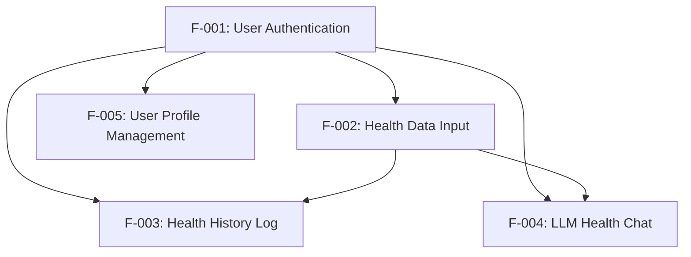
```mermaid
graph TD
    F001[F-001: User Authentication] --> F002[F-002: Health Data Input]
    F001 --> F003[F-003: Health History Log]
    F001 --> F004[F-004: LLM Health Chat]
    F001 --> F005[F-005: User Profile Management]
    F002 --> F003
    F002 --> F004
```

#### Integration Points

| Feature | Integration Points |
|---------|-------------------|
| User Authentication | - Express backend authentication endpoints<br>- JWT token validation middleware<br>- MongoDB user storage |
| Health Data Input | - Device camera and microphone<br>- Data storage API<br>- User authentication system |
| Health History Log | - Data retrieval API<br>- Search and filter functionality<br>- Date picker component |
| LLM Health Chat | - LLM service API<br>- User health data context<br>- Chat history management |
| User Profile Management | - User data API<br>- Authentication system<br>- Logout functionality |

#### Shared Components

| Component | Used By Features |
|-----------|-----------------|
| JWT Authentication | F-001, F-002, F-003, F-004, F-005 |
| MongoDB Data Store | F-001, F-002, F-003, F-004, F-005 |
| Bottom Navigation | F-003, F-004, F-005 |
| Camera Interface | F-002 |
| Voice Recording | F-002 |
| Date Picker | F-003 |

### 2.4 IMPLEMENTATION CONSIDERATIONS

#### Technical Constraints

| Feature | Technical Constraints |
|---------|----------------------|
| User Authentication | - Must use JWT tokens<br>- Must securely store passwords<br>- Must handle token expiration |
| Health Data Input | - Must support multiple input methods (photo, text, voice)<br>- Must handle various file formats<br>- Must work with limited device storage |
| Health History Log | - Must efficiently query potentially large datasets<br>- Must support date-based filtering<br>- Must handle pagination for performance |
| LLM Health Chat | - Must integrate with external LLM service<br>- Must provide context from user health data<br>- Must handle potential service disruptions |
| User Profile Management | - Must securely manage user data<br>- Must handle session management<br>- Must support secure logout |

#### Performance Requirements

| Feature | Performance Requirements |
|---------|--------------------------|
| User Authentication | - Authentication response < 2 seconds<br>- Token validation < 500ms |
| Health Data Input | - Photo upload < 5 seconds on standard connection<br>- Voice processing < 5 seconds |
| Health History Log | - Initial load < 3 seconds<br>- Search results < 3 seconds |
| LLM Health Chat | - Message response < 5 seconds<br>- Chat history loading < 3 seconds |
| User Profile Management | - Profile load < 2 seconds<br>- Logout response < 1 second |

#### Security Implications

| Feature | Security Implications |
|---------|----------------------|
| User Authentication | - Password storage security<br>- Token management<br>- Protection against brute force attacks |
| Health Data Input | - Secure transmission of health data<br>- Privacy of health information<br>- Secure storage of sensitive data |
| Health History Log | - Access control to personal health data<br>- Secure querying of health information |
| LLM Health Chat | - Secure transmission of chat data<br>- Privacy of health discussions<br>- Limitations on health advice |
| User Profile Management | - Protection of personal information<br>- Secure session management |

## 3. TECHNOLOGY STACK

### 3.1 PROGRAMMING LANGUAGES

| Component | Language | Version | Justification |
|-----------|----------|---------|---------------|
| Mobile Application | JavaScript/TypeScript | TypeScript 4.9+ | TypeScript provides type safety and better developer experience for React Native applications |
| Backend Service | TypeScript | 4.9+ | Provides type safety for Express applications, reducing runtime errors and improving maintainability |
| Database Queries | MongoDB Query Language | 4.4+ | Native query language for MongoDB document operations |

TypeScript was selected for both frontend and backend to maintain consistency across the codebase, enable code sharing between platforms, and provide strong typing to reduce potential runtime errors in a healthcare-focused application where reliability is critical.

### 3.2 FRAMEWORKS & LIBRARIES

#### 3.2.1 Mobile Application

| Framework/Library | Version | Purpose | Justification |
|-------------------|---------|---------|---------------|
| React Native | 0.71+ | Cross-platform mobile development | Enables development for both iOS and Android with a single codebase |
| React Navigation | 6.x | Navigation management | Industry standard for handling navigation in React Native apps |
| Async Storage | 1.18+ | Local data persistence | Secure storage for user tokens and offline capabilities |
| React Native Camera | 4.x | Camera integration | Required for meal and lab result photo capture |
| React Native Voice | 3.x | Voice recording | Enables symptom reporting via voice input |
| Axios | 1.3+ | HTTP client | Reliable HTTP client for API communication with backend |
| JWT Decode | 3.1+ | Token handling | Secure handling of authentication tokens |
| React Native Calendars | 1.1294+ | Date selection | Required for date-based filtering in Health Log |

#### 3.2.2 Backend Service

| Framework/Library | Version | Purpose | Justification |
|-------------------|---------|---------|---------------|
| Express | 4.18+ | Web framework | Lightweight, flexible framework for REST API development |
| Mongoose | 7.0+ | MongoDB ODM | Simplifies MongoDB interactions with schema validation |
| Passport | 0.6+ | Authentication middleware | Flexible authentication framework supporting JWT strategy |
| JWT | 9.0+ | Token generation/validation | Secure, stateless authentication for API requests |
| Multer | 1.4+ | File upload handling | Required for processing image uploads (meals, lab results) |
| Helmet | 6.0+ | Security headers | Enhances API security with proper HTTP headers |
| Winston | 3.8+ | Logging | Structured logging for monitoring and debugging |
| Joi | 17.9+ | Request validation | Input validation to ensure data integrity |

### 3.3 DATABASES & STORAGE

| Component | Technology | Version | Justification |
|-----------|------------|---------|---------------|
| Primary Database | MongoDB | 6.0+ | Document-oriented database ideal for flexible health data storage |
| File Storage | GridFS (MongoDB) | 6.0+ | Built-in solution for storing and retrieving user-uploaded images |
| In-Memory Cache | Redis | 7.0+ | Fast caching for frequently accessed data and rate limiting |

MongoDB was selected as the primary database due to its flexibility in storing varied health data types (meals, lab results, symptoms) without requiring rigid schema definitions. The document model aligns well with the JSON-based data exchange between components.

### 3.4 THIRD-PARTY SERVICES

| Service | Purpose | Integration Point | Justification |
|---------|---------|-------------------|---------------|
| LLM Provider (OpenAI/Azure OpenAI) | AI chat capabilities | Backend API | Provides advanced language model capabilities for health advice |
| AWS S3 (Alternative to GridFS) | Image storage | Backend API | Scalable storage for user-uploaded health data images |
| SendGrid | Email notifications | Backend API | Reliable email delivery for authentication and notifications |
| Sentry | Error tracking | Both frontend and backend | Real-time error monitoring for health-critical application |

The LLM provider selection is critical as it forms the core of the application's health advice capabilities. OpenAI or Azure OpenAI are recommended for their advanced capabilities in contextual understanding and healthcare knowledge.

### 3.5 DEVELOPMENT & DEPLOYMENT

#### 3.5.1 Development Tools

| Tool | Purpose | Justification |
|------|---------|---------------|
| Visual Studio Code | IDE | Cross-platform support with excellent TypeScript integration |
| ESLint | Code linting | Enforces code quality and consistency |
| Prettier | Code formatting | Maintains consistent code style across the team |
| Jest | Testing framework | Comprehensive testing for both React Native and Express |
| Postman | API testing | Manual testing and documentation of backend endpoints |
| React Native Debugger | Mobile debugging | Enhanced debugging experience for React Native |

#### 3.5.2 Deployment & Infrastructure

| Component | Technology | Justification |
|-----------|------------|---------------|
| Backend Hosting | Node.js on AWS EC2/ECS | Scalable, reliable hosting for Express backend |
| Database Hosting | MongoDB Atlas | Managed MongoDB service with backup and scaling capabilities |
| CI/CD | GitHub Actions | Automated testing and deployment pipeline |
| Mobile Distribution | App Store & Google Play | Standard distribution channels for mobile applications |
| Containerization | Docker | Consistent deployment environments |
| API Documentation | Swagger/OpenAPI | Self-documenting API for frontend-backend integration |

### 3.6 TECHNOLOGY STACK ARCHITECTURE

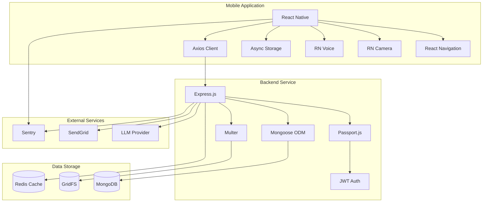
```mermaid
graph TD
    subgraph "Mobile Application"
        RN[React Native]
        RNav[React Navigation]
        RNCam[RN Camera]
        RNVoice[RN Voice]
        AsyncStore[Async Storage]
        Axios[Axios Client]
    end
    
    subgraph "Backend Service"
        Express[Express.js]
        Passport[Passport.js]
        JWT[JWT Auth]
        Mongoose[Mongoose ODM]
        Multer[Multer]
    end
    
    subgraph "Data Storage"
        MongoDB[(MongoDB)]
        GridFS[(GridFS)]
        Redis[(Redis Cache)]
    end
    
    subgraph "External Services"
        LLM[LLM Provider]
        Email[SendGrid]
        ErrorTrack[Sentry]
    end
    
    RN --> RNav
    RN --> RNCam
    RN --> RNVoice
    RN --> AsyncStore
    RN --> Axios
    
    Axios --> Express
    Express --> Passport
    Passport --> JWT
    Express --> Mongoose
    Express --> Multer
    
    Mongoose --> MongoDB
    Multer --> GridFS
    Express --> Redis
    
    Express --> LLM
    Express --> Email
    Express --> ErrorTrack
    RN --> ErrorTrack
```

## 4. PROCESS FLOWCHART

### 4.1 SYSTEM WORKFLOWS

#### 4.1.1 Core Business Processes

##### User Authentication Flow

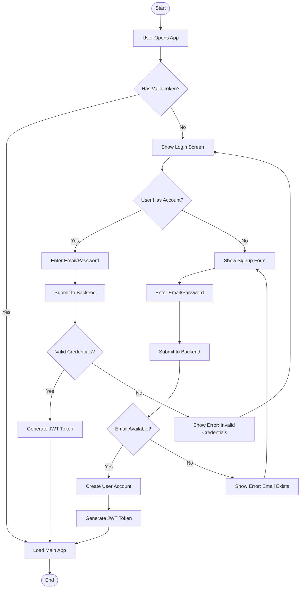
```mermaid
flowchart TD
    Start([Start]) --> A[User Opens App]
    A --> B{Has Valid Token?}
    B -->|Yes| C[Load Main App]
    B -->|No| D[Show Login Screen]
    D --> E{User Has Account?}
    E -->|Yes| F[Enter Email/Password]
    E -->|No| G[Show Signup Form]
    G --> H[Enter Email/Password]
    H --> I[Submit to Backend]
    I --> J{Email Available?}
    J -->|Yes| K[Create User Account]
    J -->|No| L[Show Error: Email Exists]
    L --> G
    K --> M[Generate JWT Token]
    M --> C
    F --> N[Submit to Backend]
    N --> O{Valid Credentials?}
    O -->|Yes| P[Generate JWT Token]
    P --> C
    O -->|No| Q[Show Error: Invalid Credentials]
    Q --> D
    C --> End([End])
```

##### Health Data Input Flow

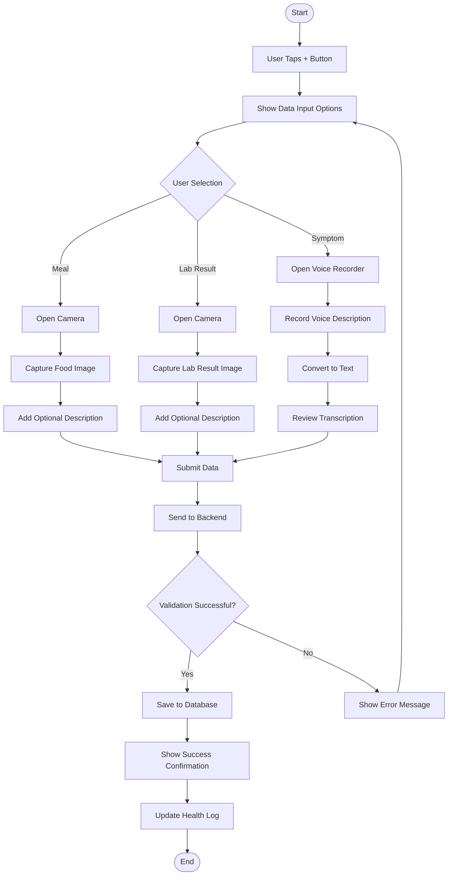
```mermaid
flowchart TD
    Start([Start]) --> A[User Taps + Button]
    A --> B[Show Data Input Options]
    B --> C{User Selection}
    C -->|Meal| D[Open Camera]
    C -->|Lab Result| E[Open Camera]
    C -->|Symptom| F[Open Voice Recorder]
    
    D --> G[Capture Food Image]
    G --> H[Add Optional Description]
    H --> I[Submit Data]
    
    E --> J[Capture Lab Result Image]
    J --> K[Add Optional Description]
    K --> I
    
    F --> L[Record Voice Description]
    L --> M[Convert to Text]
    M --> N[Review Transcription]
    N --> I
    
    I --> O[Send to Backend]
    O --> P{Validation Successful?}
    P -->|Yes| Q[Save to Database]
    P -->|No| R[Show Error Message]
    R --> B
    
    Q --> S[Show Success Confirmation]
    S --> T[Update Health Log]
    T --> End([End])
```

##### Chat Interaction Flow

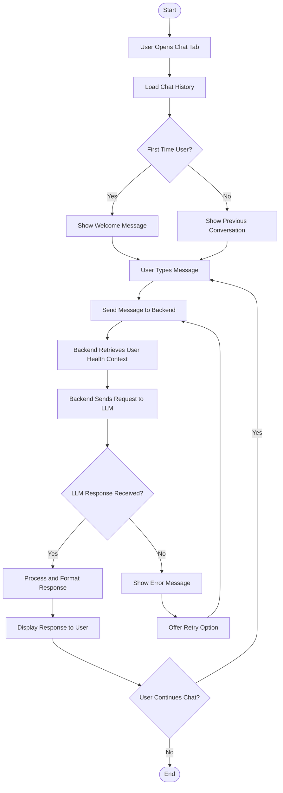
```mermaid
flowchart TD
    Start([Start]) --> A[User Opens Chat Tab]
    A --> B[Load Chat History]
    B --> C{First Time User?}
    C -->|Yes| D[Show Welcome Message]
    C -->|No| E[Show Previous Conversation]
    D --> F[User Types Message]
    E --> F
    F --> G[Send Message to Backend]
    G --> H[Backend Retrieves User Health Context]
    H --> I[Backend Sends Request to LLM]
    I --> J{LLM Response Received?}
    J -->|Yes| K[Process and Format Response]
    J -->|No| L[Show Error Message]
    L --> M[Offer Retry Option]
    M --> G
    K --> N[Display Response to User]
    N --> O{User Continues Chat?}
    O -->|Yes| F
    O -->|No| End([End])
```

##### Health Log Retrieval Flow

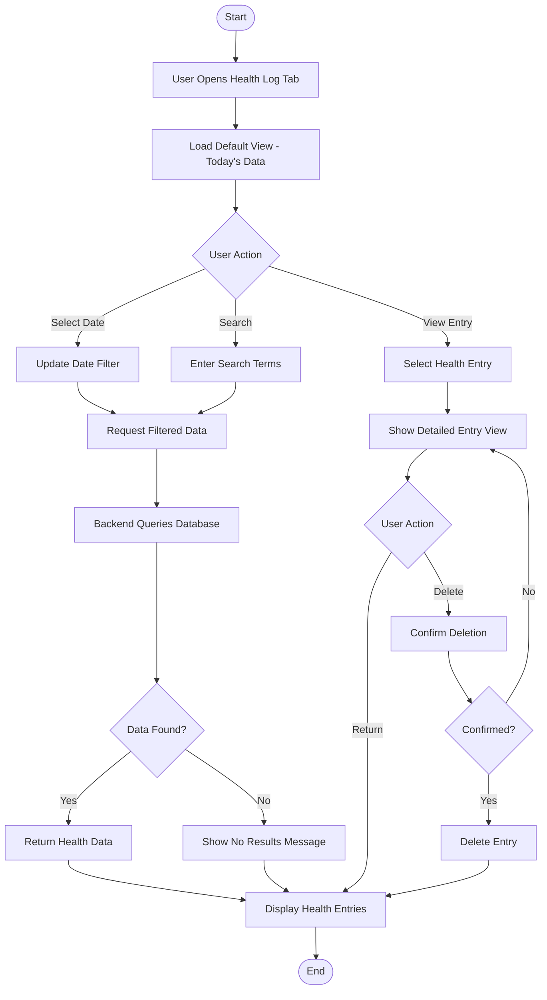
```mermaid
flowchart TD
    Start([Start]) --> A[User Opens Health Log Tab]
    A --> B[Load Default View - Today's Data]
    B --> C{User Action}
    C -->|Select Date| D[Update Date Filter]
    C -->|Search| E[Enter Search Terms]
    C -->|View Entry| F[Select Health Entry]
    
    D --> G[Request Filtered Data]
    E --> G
    G --> H[Backend Queries Database]
    H --> I{Data Found?}
    I -->|Yes| J[Return Health Data]
    I -->|No| K[Show No Results Message]
    
    J --> L[Display Health Entries]
    K --> L
    
    F --> M[Show Detailed Entry View]
    M --> N{User Action}
    N -->|Return| L
    N -->|Delete| O[Confirm Deletion]
    O --> P{Confirmed?}
    P -->|Yes| Q[Delete Entry]
    P -->|No| M
    Q --> L
    
    L --> End([End])
```

#### 4.1.2 Integration Workflows

##### Backend-LLM Integration Flow

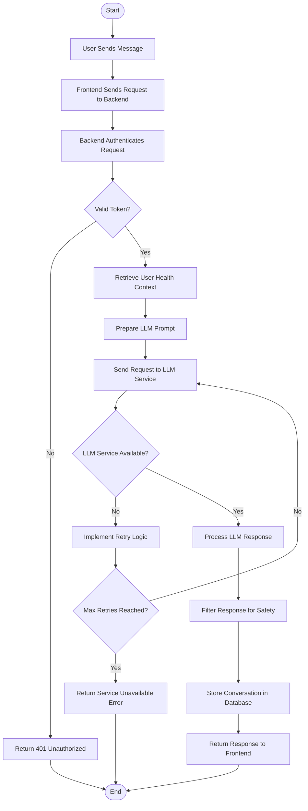
```mermaid
flowchart TD
    Start([Start]) --> A[User Sends Message]
    A --> B[Frontend Sends Request to Backend]
    B --> C[Backend Authenticates Request]
    C --> D{Valid Token?}
    D -->|No| E[Return 401 Unauthorized]
    D -->|Yes| F[Retrieve User Health Context]
    F --> G[Prepare LLM Prompt]
    G --> H[Send Request to LLM Service]
    H --> I{LLM Service Available?}
    I -->|No| J[Implement Retry Logic]
    J --> K{Max Retries Reached?}
    K -->|Yes| L[Return Service Unavailable Error]
    K -->|No| H
    I -->|Yes| M[Process LLM Response]
    M --> N[Filter Response for Safety]
    N --> O[Store Conversation in Database]
    O --> P[Return Response to Frontend]
    P --> End([End])
    E --> End
    L --> End
```

##### Health Data Storage Flow

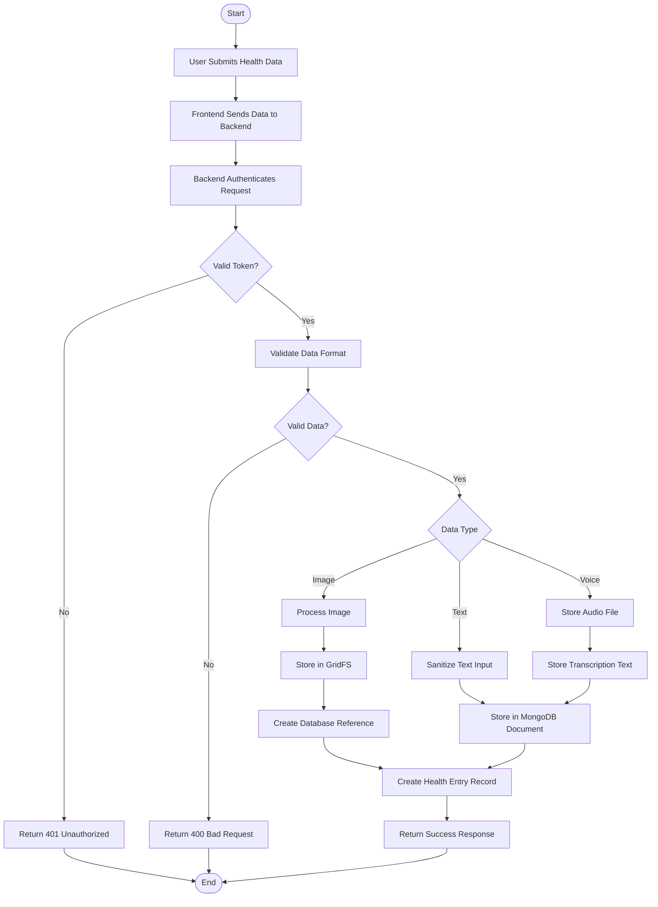
```mermaid
flowchart TD
    Start([Start]) --> A[User Submits Health Data]
    A --> B[Frontend Sends Data to Backend]
    B --> C[Backend Authenticates Request]
    C --> D{Valid Token?}
    D -->|No| E[Return 401 Unauthorized]
    D -->|Yes| F[Validate Data Format]
    F --> G{Valid Data?}
    G -->|No| H[Return 400 Bad Request]
    G -->|Yes| I{Data Type}
    
    I -->|Image| J[Process Image]
    J --> K[Store in GridFS]
    K --> L[Create Database Reference]
    
    I -->|Text| M[Sanitize Text Input]
    M --> N[Store in MongoDB Document]
    
    I -->|Voice| O[Store Audio File]
    O --> P[Store Transcription Text]
    P --> N
    
    L --> Q[Create Health Entry Record]
    N --> Q
    
    Q --> R[Return Success Response]
    R --> End([End])
    E --> End
    H --> End
```

### 4.2 FLOWCHART REQUIREMENTS

#### 4.2.1 User Registration and Authentication

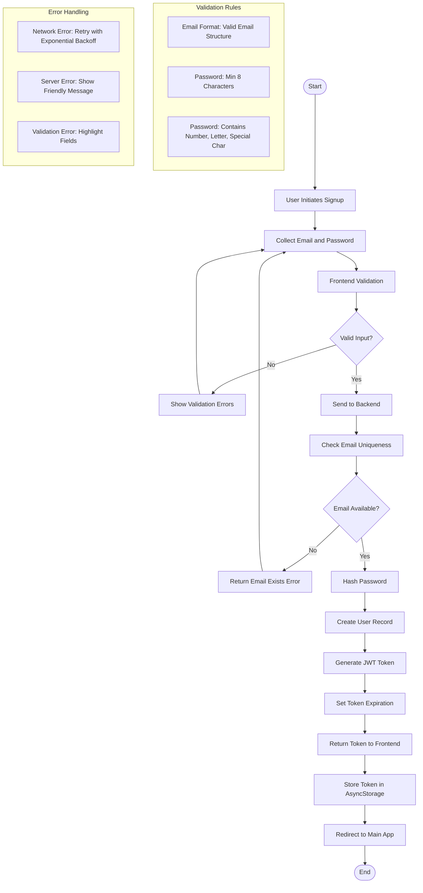
```mermaid
flowchart TD
    Start([Start]) --> A[User Initiates Signup]
    A --> B[Collect Email and Password]
    B --> C[Frontend Validation]
    C --> D{Valid Input?}
    D -->|No| E[Show Validation Errors]
    E --> B
    D -->|Yes| F[Send to Backend]
    F --> G[Check Email Uniqueness]
    G --> H{Email Available?}
    H -->|No| I[Return Email Exists Error]
    I --> B
    H -->|Yes| J[Hash Password]
    J --> K[Create User Record]
    K --> L[Generate JWT Token]
    L --> M[Set Token Expiration]
    M --> N[Return Token to Frontend]
    N --> O[Store Token in AsyncStorage]
    O --> P[Redirect to Main App]
    P --> End([End])
    
    subgraph "Validation Rules"
    VR1[Email Format: Valid Email Structure]
    VR2[Password: Min 8 Characters]
    VR3[Password: Contains Number, Letter, Special Char]
    end
    
    subgraph "Error Handling"
    EH1[Network Error: Retry with Exponential Backoff]
    EH2[Server Error: Show Friendly Message]
    EH3[Validation Error: Highlight Fields]
    end
```

#### 4.2.2 Health Data Input and Processing

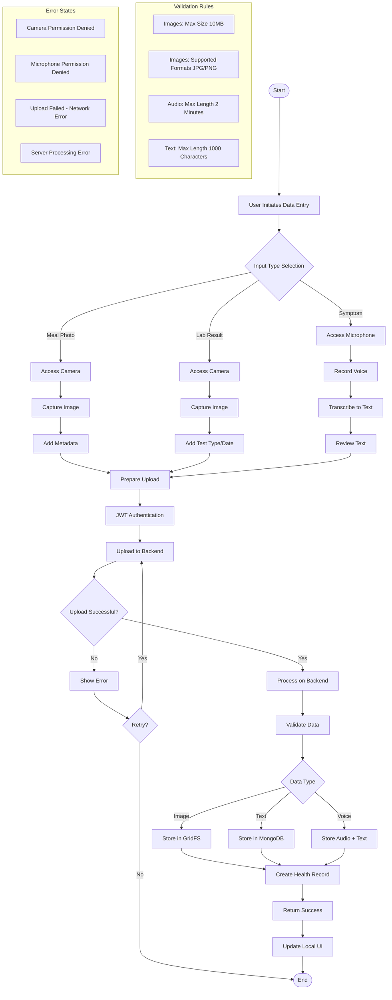
```mermaid
flowchart TD
    Start([Start]) --> A[User Initiates Data Entry]
    A --> B{Input Type Selection}
    
    B -->|Meal Photo| C[Access Camera]
    C --> D[Capture Image]
    D --> E[Add Metadata]
    E --> F[Prepare Upload]
    
    B -->|Lab Result| G[Access Camera]
    G --> H[Capture Image]
    H --> I[Add Test Type/Date]
    I --> F
    
    B -->|Symptom| J[Access Microphone]
    J --> K[Record Voice]
    K --> L[Transcribe to Text]
    L --> M[Review Text]
    M --> F
    
    F --> N[JWT Authentication]
    N --> O[Upload to Backend]
    O --> P{Upload Successful?}
    P -->|No| Q[Show Error]
    Q --> R{Retry?}
    R -->|Yes| O
    R -->|No| End
    P -->|Yes| S[Process on Backend]
    
    S --> T[Validate Data]
    T --> U{Data Type}
    U -->|Image| V[Store in GridFS]
    U -->|Text| W[Store in MongoDB]
    U -->|Voice| X[Store Audio + Text]
    
    V --> Y[Create Health Record]
    W --> Y
    X --> Y
    
    Y --> Z[Return Success]
    Z --> AA[Update Local UI]
    AA --> End([End])
    
    subgraph "Validation Rules"
    VR1[Images: Max Size 10MB]
    VR2[Images: Supported Formats JPG/PNG]
    VR3[Audio: Max Length 2 Minutes]
    VR4[Text: Max Length 1000 Characters]
    end
    
    subgraph "Error States"
    ES1[Camera Permission Denied]
    ES2[Microphone Permission Denied]
    ES3[Upload Failed - Network Error]
    ES4[Server Processing Error]
    end
```

#### 4.2.3 LLM Chat Interaction

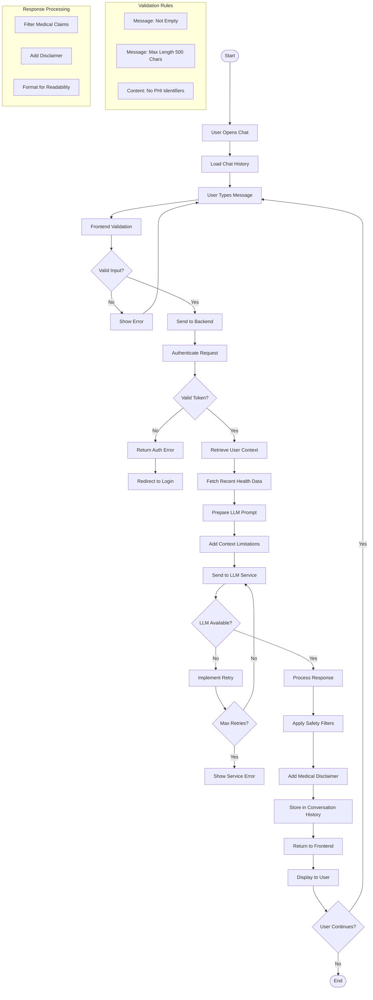
```mermaid
flowchart TD
    Start([Start]) --> A[User Opens Chat]
    A --> B[Load Chat History]
    B --> C[User Types Message]
    C --> D[Frontend Validation]
    D --> E{Valid Input?}
    E -->|No| F[Show Error]
    F --> C
    E -->|Yes| G[Send to Backend]
    
    G --> H[Authenticate Request]
    H --> I{Valid Token?}
    I -->|No| J[Return Auth Error]
    J --> K[Redirect to Login]
    I -->|Yes| L[Retrieve User Context]
    
    L --> M[Fetch Recent Health Data]
    M --> N[Prepare LLM Prompt]
    N --> O[Add Context Limitations]
    O --> P[Send to LLM Service]
    
    P --> Q{LLM Available?}
    Q -->|No| R[Implement Retry]
    R --> S{Max Retries?}
    S -->|Yes| T[Show Service Error]
    S -->|No| P
    Q -->|Yes| U[Process Response]
    
    U --> V[Apply Safety Filters]
    V --> W[Add Medical Disclaimer]
    W --> X[Store in Conversation History]
    X --> Y[Return to Frontend]
    Y --> Z[Display to User]
    Z --> AA{User Continues?}
    AA -->|Yes| C
    AA -->|No| End([End])
    
    subgraph "Validation Rules"
    VR1[Message: Not Empty]
    VR2[Message: Max Length 500 Chars]
    VR3[Content: No PHI Identifiers]
    end
    
    subgraph "Response Processing"
    RP1[Filter Medical Claims]
    RP2[Add Disclaimer]
    RP3[Format for Readability]
    end
```

### 4.3 TECHNICAL IMPLEMENTATION

#### 4.3.1 State Management

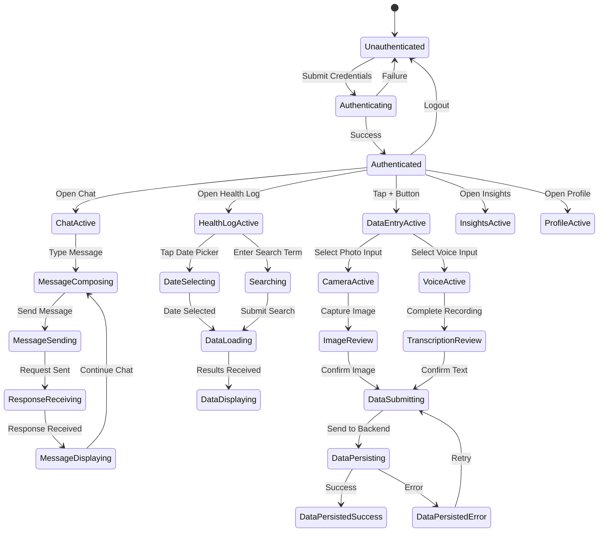
```mermaid
stateDiagram-v2
    [*] --> Unauthenticated
    
    Unauthenticated --> Authenticating: Submit Credentials
    Authenticating --> Authenticated: Success
    Authenticating --> Unauthenticated: Failure
    
    Authenticated --> ChatActive: Open Chat
    Authenticated --> HealthLogActive: Open Health Log
    Authenticated --> DataEntryActive: Tap + Button
    Authenticated --> InsightsActive: Open Insights
    Authenticated --> ProfileActive: Open Profile
    
    ChatActive --> MessageComposing: Type Message
    MessageComposing --> MessageSending: Send Message
    MessageSending --> ResponseReceiving: Request Sent
    ResponseReceiving --> MessageDisplaying: Response Received
    MessageDisplaying --> MessageComposing: Continue Chat
    
    DataEntryActive --> CameraActive: Select Photo Input
    DataEntryActive --> VoiceActive: Select Voice Input
    CameraActive --> ImageReview: Capture Image
    ImageReview --> DataSubmitting: Confirm Image
    VoiceActive --> TranscriptionReview: Complete Recording
    TranscriptionReview --> DataSubmitting: Confirm Text
    
    DataSubmitting --> DataPersisting: Send to Backend
    DataPersisting --> DataPersistedSuccess: Success
    DataPersisting --> DataPersistedError: Error
    DataPersistedError --> DataSubmitting: Retry
    
    HealthLogActive --> DateSelecting: Tap Date Picker
    HealthLogActive --> Searching: Enter Search Term
    DateSelecting --> DataLoading: Date Selected
    Searching --> DataLoading: Submit Search
    DataLoading --> DataDisplaying: Results Received
    
    Authenticated --> Unauthenticated: Logout
```

#### 4.3.2 Error Handling

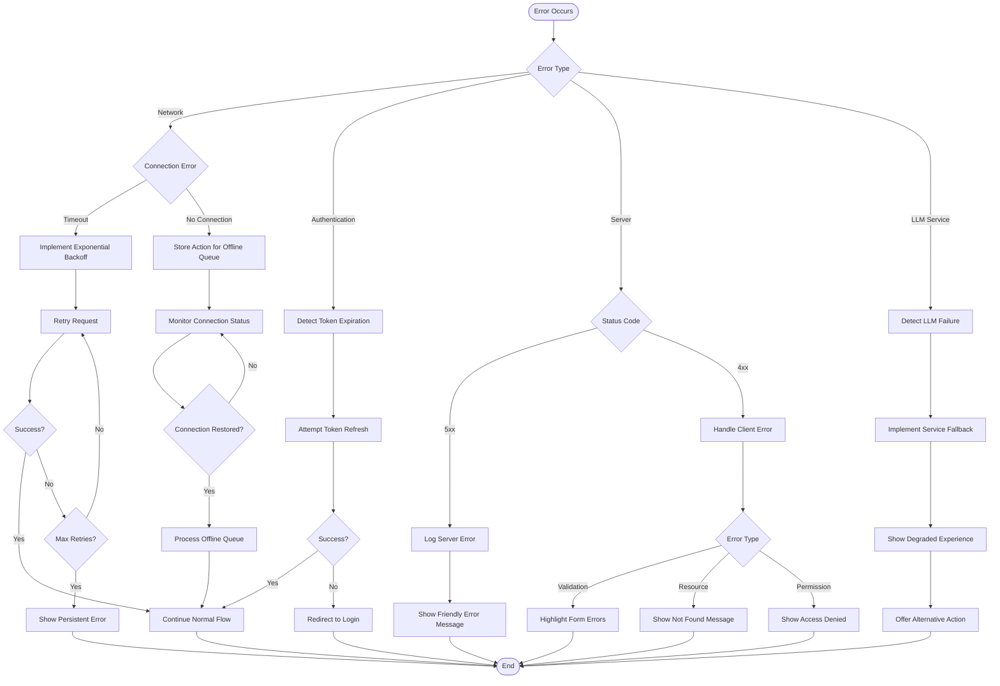
```mermaid
flowchart TD
    Start([Error Occurs]) --> A{Error Type}
    
    A -->|Network| B{Connection Error}
    B -->|Timeout| C[Implement Exponential Backoff]
    B -->|No Connection| D[Store Action for Offline Queue]
    C --> E[Retry Request]
    E --> F{Success?}
    F -->|Yes| G[Continue Normal Flow]
    F -->|No| H{Max Retries?}
    H -->|No| E
    H -->|Yes| I[Show Persistent Error]
    D --> J[Monitor Connection Status]
    J --> K{Connection Restored?}
    K -->|Yes| L[Process Offline Queue]
    K -->|No| J
    L --> G
    
    A -->|Authentication| M[Detect Token Expiration]
    M --> N[Attempt Token Refresh]
    N --> O{Success?}
    O -->|Yes| G
    O -->|No| P[Redirect to Login]
    
    A -->|Server| Q{Status Code}
    Q -->|5xx| R[Log Server Error]
    Q -->|4xx| S[Handle Client Error]
    R --> T[Show Friendly Error Message]
    S --> U{Error Type}
    U -->|Validation| V[Highlight Form Errors]
    U -->|Resource| W[Show Not Found Message]
    U -->|Permission| X[Show Access Denied]
    
    A -->|LLM Service| Y[Detect LLM Failure]
    Y --> Z[Implement Service Fallback]
    Z --> AA[Show Degraded Experience]
    AA --> AB[Offer Alternative Action]
    
    I --> End([End])
    P --> End
    T --> End
    V --> End
    W --> End
    X --> End
    AB --> End
    G --> End
```

### 4.4 INTEGRATION SEQUENCE DIAGRAMS

#### 4.4.1 Authentication Sequence

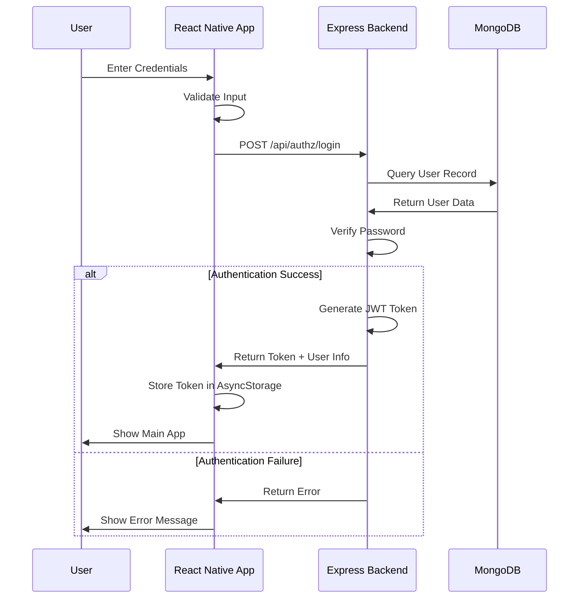
```mermaid
sequenceDiagram
    participant User
    participant Mobile as React Native App
    participant Backend as Express Backend
    participant DB as MongoDB
    
    User->>Mobile: Enter Credentials
    Mobile->>Mobile: Validate Input
    Mobile->>Backend: POST /api/authz/login
    Backend->>DB: Query User Record
    DB->>Backend: Return User Data
    Backend->>Backend: Verify Password
    alt Authentication Success
        Backend->>Backend: Generate JWT Token
        Backend->>Mobile: Return Token + User Info
        Mobile->>Mobile: Store Token in AsyncStorage
        Mobile->>User: Show Main App
    else Authentication Failure
        Backend->>Mobile: Return Error
        Mobile->>User: Show Error Message
    end
```

#### 4.4.2 Health Data Input Sequence

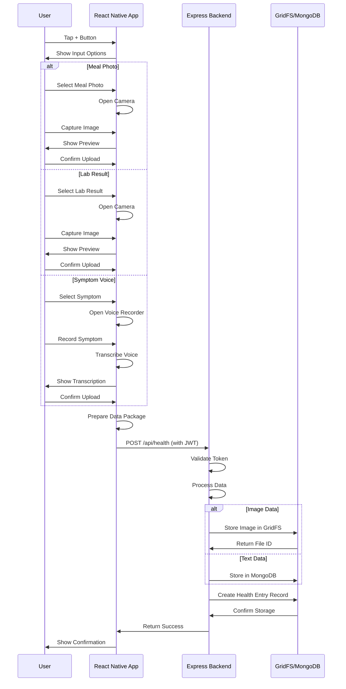
```mermaid
sequenceDiagram
    participant User
    participant Mobile as React Native App
    participant Backend as Express Backend
    participant Storage as GridFS/MongoDB
    
    User->>Mobile: Tap + Button
    Mobile->>User: Show Input Options
    
    alt Meal Photo
        User->>Mobile: Select Meal Photo
        Mobile->>Mobile: Open Camera
        User->>Mobile: Capture Image
        Mobile->>User: Show Preview
        User->>Mobile: Confirm Upload
    else Lab Result
        User->>Mobile: Select Lab Result
        Mobile->>Mobile: Open Camera
        User->>Mobile: Capture Image
        Mobile->>User: Show Preview
        User->>Mobile: Confirm Upload
    else Symptom Voice
        User->>Mobile: Select Symptom
        Mobile->>Mobile: Open Voice Recorder
        User->>Mobile: Record Symptom
        Mobile->>Mobile: Transcribe Voice
        Mobile->>User: Show Transcription
        User->>Mobile: Confirm Upload
    end
    
    Mobile->>Mobile: Prepare Data Package
    Mobile->>Backend: POST /api/health (with JWT)
    Backend->>Backend: Validate Token
    Backend->>Backend: Process Data
    
    alt Image Data
        Backend->>Storage: Store Image in GridFS
        Storage->>Backend: Return File ID
    else Text Data
        Backend->>Storage: Store in MongoDB
    end
    
    Backend->>Storage: Create Health Entry Record
    Storage->>Backend: Confirm Storage
    Backend->>Mobile: Return Success
    Mobile->>User: Show Confirmation
```

#### 4.4.3 LLM Chat Sequence

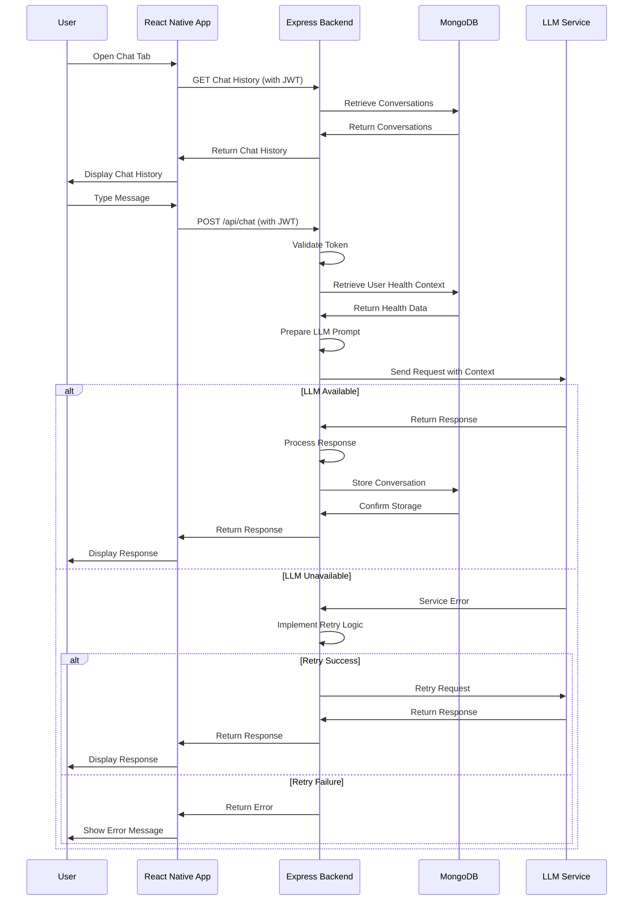
```mermaid
sequenceDiagram
    participant User
    participant Mobile as React Native App
    participant Backend as Express Backend
    participant DB as MongoDB
    participant LLM as LLM Service
    
    User->>Mobile: Open Chat Tab
    Mobile->>Backend: GET Chat History (with JWT)
    Backend->>DB: Retrieve Conversations
    DB->>Backend: Return Conversations
    Backend->>Mobile: Return Chat History
    Mobile->>User: Display Chat History
    
    User->>Mobile: Type Message
    Mobile->>Backend: POST /api/chat (with JWT)
    Backend->>Backend: Validate Token
    Backend->>DB: Retrieve User Health Context
    DB->>Backend: Return Health Data
    
    Backend->>Backend: Prepare LLM Prompt
    Backend->>LLM: Send Request with Context
    
    alt LLM Available
        LLM->>Backend: Return Response
        Backend->>Backend: Process Response
        Backend->>DB: Store Conversation
        DB->>Backend: Confirm Storage
        Backend->>Mobile: Return Response
        Mobile->>User: Display Response
    else LLM Unavailable
        LLM->>Backend: Service Error
        Backend->>Backend: Implement Retry Logic
        alt Retry Success
            Backend->>LLM: Retry Request
            LLM->>Backend: Return Response
            Backend->>Mobile: Return Response
            Mobile->>User: Display Response
        else Retry Failure
            Backend->>Mobile: Return Error
            Mobile->>User: Show Error Message
        end
    end
```

#### 4.4.4 Health Log Retrieval Sequence

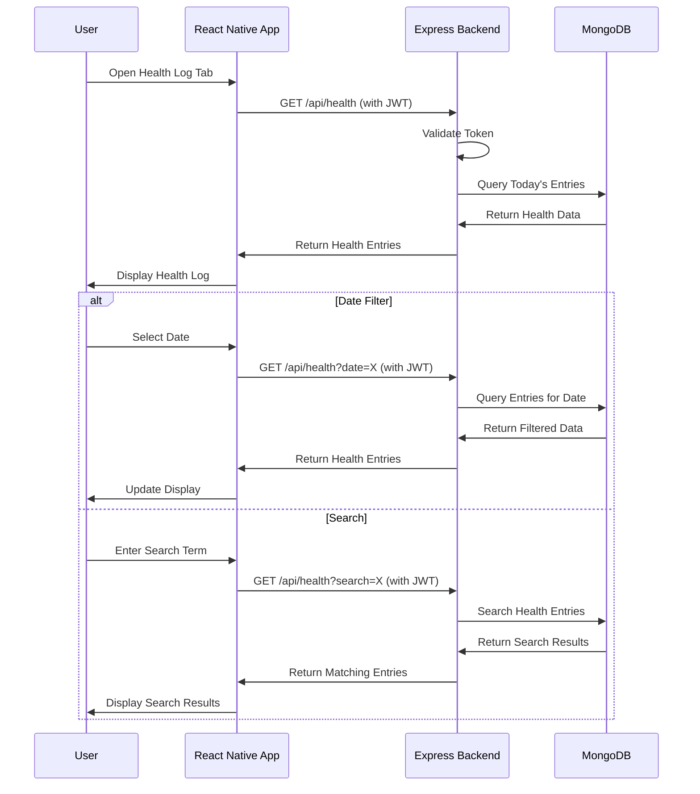
```mermaid
sequenceDiagram
    participant User
    participant Mobile as React Native App
    participant Backend as Express Backend
    participant DB as MongoDB
    
    User->>Mobile: Open Health Log Tab
    Mobile->>Backend: GET /api/health (with JWT)
    Backend->>Backend: Validate Token
    Backend->>DB: Query Today's Entries
    DB->>Backend: Return Health Data
    Backend->>Mobile: Return Health Entries
    Mobile->>User: Display Health Log
    
    alt Date Filter
        User->>Mobile: Select Date
        Mobile->>Backend: GET /api/health?date=X (with JWT)
        Backend->>DB: Query Entries for Date
        DB->>Backend: Return Filtered Data
        Backend->>Mobile: Return Health Entries
        Mobile->>User: Update Display
    else Search
        User->>Mobile: Enter Search Term
        Mobile->>Backend: GET /api/health?search=X (with JWT)
        Backend->>DB: Search Health Entries
        DB->>Backend: Return Search Results
        Backend->>Mobile: Return Matching Entries
        Mobile->>User: Display Search Results
    end
```

## 5. SYSTEM ARCHITECTURE

### 5.1 HIGH-LEVEL ARCHITECTURE

#### 5.1.1 System Overview

The system follows a client-server architecture with a mobile frontend and RESTful backend service. This architecture was selected to provide a clear separation of concerns while enabling real-time interactions between users and the LLM-powered health advisor.

**Key Architectural Principles:**
- Separation of presentation, business logic, and data persistence layers
- RESTful API design for stateless communication between client and server
- JWT-based authentication for secure, stateless user sessions
- Event-driven interactions for real-time chat functionality
- Domain-driven design for health data management

**System Boundaries:**
- Mobile application boundary: User interface and local data caching
- Backend service boundary: Business logic, data persistence, and LLM integration
- External service boundary: LLM provider API integration

**Major Interfaces:**
- Mobile-to-Backend: RESTful API with JSON payloads
- Backend-to-LLM: API integration with context enrichment
- Backend-to-Database: MongoDB driver interface

#### 5.1.2 Core Components Table

| Component Name | Primary Responsibility | Key Dependencies | Critical Considerations |
|----------------|------------------------|------------------|-------------------------|
| Mobile UI | User interaction, data capture, and display | React Navigation, Camera/Voice APIs, AsyncStorage | Offline capability, responsive design, device compatibility |
| Authentication Service | User identity management and session control | JWT, MongoDB | Token security, expiration handling, refresh mechanisms |
| Health Data Service | Health information storage and retrieval | MongoDB, File storage | Data privacy, efficient querying, schema flexibility |
| Chat Service | LLM interaction and conversation management | LLM Provider API, Health Data Service | Context management, response quality, latency |
| API Gateway | Request routing, validation, and response formatting | Express, Middleware stack | Rate limiting, request validation, error handling |

#### 5.1.3 Data Flow Description

The primary data flow begins with user interactions in the mobile application. Authentication data flows through the API Gateway to the Authentication Service, which issues JWT tokens for subsequent requests. Health data captured via camera or voice is processed on the device, then transmitted to the Health Data Service through the API Gateway.

For chat interactions, user messages flow from the mobile UI to the Chat Service, which enriches the context with relevant health data from the Health Data Service before forwarding the request to the LLM Provider. The LLM response flows back through the Chat Service, which may apply additional processing before returning it to the mobile UI.

Health data queries flow from the mobile UI to the Health Data Service, which retrieves the requested information from MongoDB and returns it through the API Gateway. All data exchanges between components use JSON format, with binary data (images) transmitted using multipart form data.

Key data stores include the MongoDB database for structured data and GridFS for binary data storage. The system employs minimal caching at the API Gateway level for frequently accessed, non-sensitive data to improve performance.

#### 5.1.4 External Integration Points

| System Name | Integration Type | Data Exchange Pattern | Protocol/Format | SLA Requirements |
|-------------|------------------|------------------------|-----------------|------------------|
| LLM Provider | API | Request-Response | HTTPS/JSON | Response time < 5s, 99.9% availability |
| MongoDB Atlas | Database | CRUD Operations | MongoDB Wire Protocol | Query response < 100ms, 99.99% availability |
| File Storage | Service API | Upload/Download | HTTPS/Multipart | Upload time < 3s, 99.9% availability |
| Email Service | API | Fire-and-Forget | HTTPS/JSON | Delivery time < 1min, 99.5% availability |

### 5.2 COMPONENT DETAILS

#### 5.2.1 Mobile Application

**Purpose and Responsibilities:**
- Provide intuitive user interface for health data input and retrieval
- Enable natural language chat with the LLM health advisor
- Capture and process health data (images, voice, text)
- Manage local authentication state and token storage
- Cache relevant data for offline access

**Technologies and Frameworks:**
- React Native for cross-platform mobile development
- React Navigation for screen management
- Async Storage for local data persistence
- React Native Camera and Voice for data capture
- Axios for API communication

**Key Interfaces:**
- Authentication API: Login, signup, token refresh
- Health Data API: Create, read, update, delete health records
- Chat API: Send messages, retrieve conversation history

**Data Persistence Requirements:**
- JWT token storage in secure Async Storage
- Limited caching of health data for offline viewing
- Chat history persistence for session continuity

**Scaling Considerations:**
- Efficient memory management for large health datasets
- Optimized image processing to reduce bandwidth usage
- Progressive loading of chat history and health records

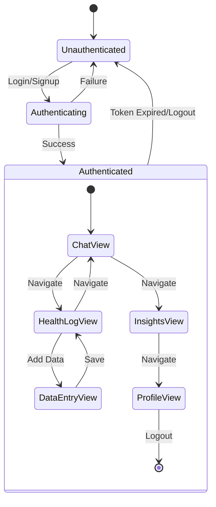
```mermaid
stateDiagram-v2
    [*] --> Unauthenticated
    Unauthenticated --> Authenticating: Login/Signup
    Authenticating --> Authenticated: Success
    Authenticating --> Unauthenticated: Failure
    
    state Authenticated {
        [*] --> ChatView
        ChatView --> HealthLogView: Navigate
        HealthLogView --> DataEntryView: Add Data
        DataEntryView --> HealthLogView: Save
        HealthLogView --> ChatView: Navigate
        ChatView --> InsightsView: Navigate
        InsightsView --> ProfileView: Navigate
        ProfileView --> [*]: Logout
    }
    
    Authenticated --> Unauthenticated: Token Expired/Logout
```

#### 5.2.2 Authentication Service

**Purpose and Responsibilities:**
- Manage user registration and authentication
- Issue and validate JWT tokens
- Handle password hashing and verification
- Enforce security policies

**Technologies and Frameworks:**
- Express.js for API endpoints
- Passport.js for authentication strategies
- JWT for token generation and validation
- Bcrypt for password hashing

**Key Interfaces:**
- POST /api/authz/signup: Create new user accounts
- POST /api/authz/login: Authenticate users and issue tokens
- Middleware for token validation on protected routes

**Data Persistence Requirements:**
- User credentials stored in MongoDB
- Password hashing with appropriate salt rounds
- No storage of plaintext passwords

**Scaling Considerations:**
- Stateless authentication to support horizontal scaling
- Token validation without database lookups
- Rate limiting to prevent brute force attacks

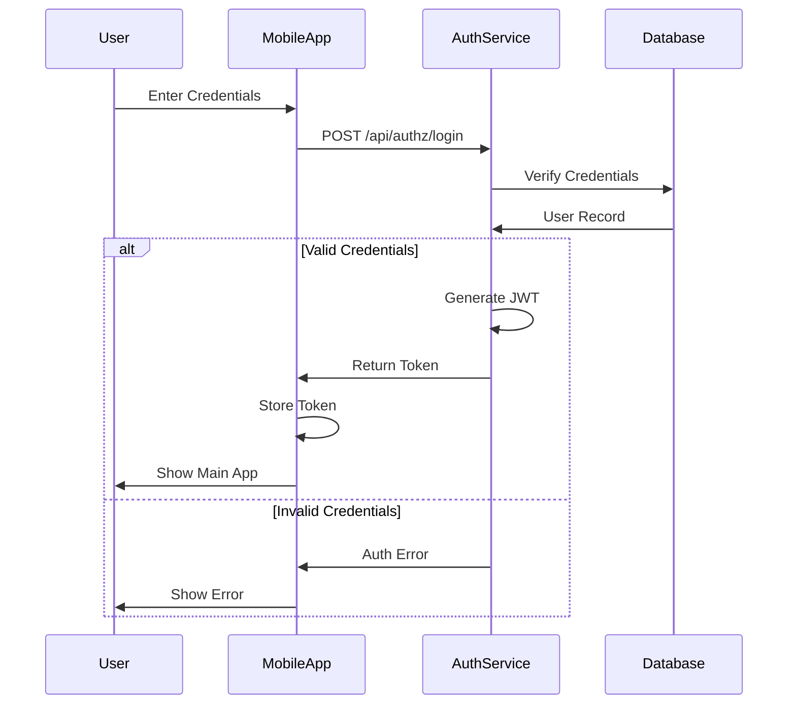
```mermaid
sequenceDiagram
    participant User
    participant MobileApp
    participant AuthService
    participant Database
    
    User->>MobileApp: Enter Credentials
    MobileApp->>AuthService: POST /api/authz/login
    AuthService->>Database: Verify Credentials
    Database->>AuthService: User Record
    
    alt Valid Credentials
        AuthService->>AuthService: Generate JWT
        AuthService->>MobileApp: Return Token
        MobileApp->>MobileApp: Store Token
        MobileApp->>User: Show Main App
    else Invalid Credentials
        AuthService->>MobileApp: Auth Error
        MobileApp->>User: Show Error
    end
```

#### 5.2.3 Health Data Service

**Purpose and Responsibilities:**
- Store and retrieve user health information
- Process and validate health data inputs
- Manage different types of health records (meals, lab results, symptoms)
- Support date-based and keyword search

**Technologies and Frameworks:**
- Express.js for API endpoints
- Mongoose for MongoDB object modeling
- Multer for file upload handling
- GridFS for image storage

**Key Interfaces:**
- POST /api/health: Create new health records
- GET /api/health: Retrieve health records with filtering
- GET /api/health/:id: Retrieve specific health record

**Data Persistence Requirements:**
- Structured health data stored in MongoDB collections
- Images stored in GridFS
- Indexing for efficient date and keyword searches
- Data partitioning by user ID

**Scaling Considerations:**
- Pagination for large result sets
- Efficient binary data storage and retrieval
- Query optimization for frequent access patterns

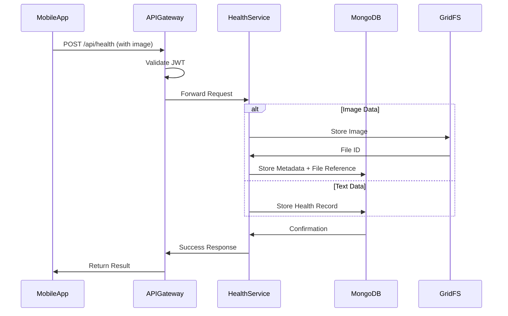
```mermaid
sequenceDiagram
    participant MobileApp
    participant APIGateway
    participant HealthService
    participant MongoDB
    participant GridFS
    
    MobileApp->>APIGateway: POST /api/health (with image)
    APIGateway->>APIGateway: Validate JWT
    APIGateway->>HealthService: Forward Request
    
    alt Image Data
        HealthService->>GridFS: Store Image
        GridFS->>HealthService: File ID
        HealthService->>MongoDB: Store Metadata + File Reference
    else Text Data
        HealthService->>MongoDB: Store Health Record
    end
    
    MongoDB->>HealthService: Confirmation
    HealthService->>APIGateway: Success Response
    APIGateway->>MobileApp: Return Result
```

#### 5.2.4 Chat Service

**Purpose and Responsibilities:**
- Manage conversations between users and the LLM
- Enrich LLM requests with user health context
- Process and filter LLM responses
- Store conversation history

**Technologies and Frameworks:**
- Express.js for API endpoints
- LLM provider client library
- Context management utilities
- Response processing middleware

**Key Interfaces:**
- POST /api/chat: Send message to LLM
- GET /api/chat: Retrieve conversation history

**Data Persistence Requirements:**
- Conversation history stored in MongoDB
- User messages and LLM responses linked to user ID
- Metadata for context tracking

**Scaling Considerations:**
- Asynchronous processing for long-running LLM requests
- Caching of frequent health context data
- Optimized prompt construction to reduce token usage

```mermaid
sequenceDiagram
    participant MobileApp
    participant ChatService
    participant HealthService
    participant LLMProvider
    participant MongoDB
    
    MobileApp->>ChatService: POST /api/chat (message)
    ChatService->>HealthService: Get User Health Context
    HealthService->>ChatService: Return Health Data
    
    ChatService->>ChatService: Construct Prompt with Context
    ChatService->>LLMProvider: Send Enhanced Prompt
    LLMProvider->>ChatService: Return Response
    
    ChatService->>ChatService: Process Response
    ChatService->>MongoDB: Store Conversation
    ChatService->>MobileApp: Return Processed Response
```

#### 5.2.5 API Gateway

**Purpose and Responsibilities:**
- Route requests to appropriate service components
- Validate request authentication and authorization
- Handle cross-cutting concerns (logging, error handling)
- Implement rate limiting and request validation

**Technologies and Frameworks:**
- Express.js middleware stack
- JWT validation middleware
- Request validation with Joi
- Helmet for security headers

**Key Interfaces:**
- All API endpoints (/api/*)
- Authentication middleware
- Error handling middleware

**Data Persistence Requirements:**
- Minimal - primarily stateless
- Rate limiting counters (potentially in Redis)
- Request logs

**Scaling Considerations:**
- Stateless design for horizontal scaling
- Efficient middleware execution
- Response compression

```mermaid
flowchart TD
    A[Client Request] --> B[API Gateway]
    B --> C{JWT Valid?}
    C -->|No| D[Return 401]
    C -->|Yes| E{Route Type}
    
    E -->|Auth| F[Auth Service]
    E -->|Health| G[Health Service]
    E -->|Chat| H[Chat Service]
    
    F --> I[Process Response]
    G --> I
    H --> I
    
    I --> J[Return to Client]
```

### 5.3 TECHNICAL DECISIONS

#### 5.3.1 Architecture Style Decisions

| Decision Area | Selected Approach | Alternatives Considered | Rationale |
|---------------|-------------------|-------------------------|-----------|
| Overall Architecture | Client-Server with RESTful API | GraphQL, WebSockets | REST provides simplicity, wide tooling support, and stateless scaling; WebSockets considered for chat but deemed unnecessary for current requirements |
| Mobile Architecture | Component-based with React Navigation | Native navigation, single-page | React Navigation provides cross-platform consistency and familiar navigation patterns while supporting the tab-based design requirement |
| Backend Architecture | Microservice-inspired modular monolith | True microservices, serverless | A modular monolith offers simplicity in development and deployment while maintaining logical separation of concerns; can evolve to microservices if needed |
| Data Storage | Document-oriented (MongoDB) | Relational, graph | Document model aligns with varied health data types and schema flexibility requirements; supports JSON natively for seamless API integration |

The system architecture prioritizes developer productivity and time-to-market while maintaining scalability options for future growth. The modular monolith approach for the backend allows for clear separation of concerns without the operational complexity of true microservices, with the option to extract high-growth components into separate services later if needed.

#### 5.3.2 Communication Pattern Choices

| Pattern | Application | Benefits | Considerations |
|---------|-------------|----------|----------------|
| Request-Response | Primary API communication | Simplicity, familiar to developers, stateless | Higher latency for complex operations |
| Asynchronous Processing | LLM interactions | Better user experience for long-running operations | Requires client-side handling of pending states |
| Bulk Data Transfer | Health data retrieval | Efficient for large datasets, reduces round trips | Must implement pagination and filtering |
| Caching | Frequently accessed data | Reduces latency, decreases backend load | Cache invalidation complexity, memory usage |

The system primarily uses synchronous request-response patterns for simplicity and developer familiarity. For potentially long-running operations like LLM interactions, asynchronous processing is employed to maintain responsiveness. The mobile application implements optimistic UI updates where appropriate to enhance perceived performance.

```mermaid
flowchart TD
    A[Client Request] --> B{Request Type}
    
    B -->|Standard Data| C[Synchronous Request-Response]
    B -->|LLM Chat| D[Asynchronous Processing]
    B -->|Large Dataset| E[Paginated Bulk Transfer]
    
    C --> F[Immediate Response]
    D --> G[Acknowledge Receipt]
    G --> H[Background Processing]
    H --> I[Push or Poll for Result]
    E --> J[Initial Page]
    J --> K[Load More as Needed]
```

#### 5.3.3 Data Storage Solution Rationale

MongoDB was selected as the primary data store based on several key factors:

1. **Schema Flexibility**: Health data varies significantly in structure (meals, lab results, symptoms), making a document model ideal for accommodating different data shapes without complex migrations.

2. **JSON Native Format**: MongoDB's BSON format aligns perfectly with the JSON-based API, reducing serialization/deserialization overhead.

3. **GridFS Support**: Built-in solution for storing and retrieving binary data (images) without requiring a separate storage system.

4. **Query Capabilities**: Rich query language supports the complex filtering and search requirements for health data retrieval.

5. **Scaling Model**: Horizontal scaling through sharding supports future growth without major architectural changes.

The decision to use MongoDB's GridFS for image storage (rather than a dedicated object storage service like S3) was made to simplify the initial architecture and reduce external dependencies. This can be revisited if image storage requirements grow significantly.

#### 5.3.4 Caching Strategy Justification

| Cache Type | Application | Implementation | Invalidation Strategy |
|------------|-------------|----------------|------------------------|
| Authentication Token | Client-side | AsyncStorage | Time-based expiration |
| Health Data | Server-side | In-memory LRU | Time-based + write-through |
| LLM Context | Server-side | In-memory | Session-based |
| API Responses | Client-side | In-memory | TTL + manual refresh |

The caching strategy focuses on improving perceived performance while maintaining data freshness. Authentication tokens are cached client-side to reduce login frequency. Health data is cached server-side with time-based expiration to accelerate frequent queries. LLM context is cached during active chat sessions to reduce context-building overhead. API responses are cached client-side with appropriate TTLs based on data volatility.

#### 5.3.5 Security Mechanism Selection

| Security Concern | Selected Mechanism | Rationale |
|------------------|---------------------|-----------|
| Authentication | JWT with refresh tokens | Stateless scaling, reduced database lookups, secure session management |
| Password Storage | Bcrypt hashing | Industry-standard approach with configurable work factor |
| API Protection | HTTPS + CORS | Encrypted data transmission, origin verification |
| Input Validation | Server-side validation with Joi | Prevents malicious inputs, consistent validation logic |
| Health Data Privacy | User-partitioned data | Strict isolation of user health information |

Security mechanisms were selected based on industry best practices and the sensitive nature of health data. JWT authentication provides secure, stateless sessions while bcrypt ensures password security. All API communications use HTTPS, and strict CORS policies prevent unauthorized cross-origin requests. Server-side validation ensures data integrity regardless of client implementation.

### 5.4 CROSS-CUTTING CONCERNS

#### 5.4.1 Monitoring and Observability Approach

The system implements a comprehensive monitoring strategy to ensure reliability and performance:

- **Application Metrics**: Response times, error rates, and request volumes tracked via Prometheus-compatible metrics
- **System Metrics**: CPU, memory, and network utilization monitored for capacity planning
- **Business Metrics**: User engagement, health data volume, and chat completion rates for product insights
- **Alerting**: Threshold-based alerts for critical metrics with escalation paths
- **Dashboards**: Real-time visualization of system health and performance

Key monitoring points include API gateway request handling, LLM service integration, database operations, and authentication flows. Custom metrics track health data input frequency and chat interaction patterns to identify usage trends.

#### 5.4.2 Logging and Tracing Strategy

| Log Category | Information Captured | Retention Period | Access Control |
|--------------|----------------------|------------------|----------------|
| Application Logs | Request paths, response codes, performance metrics | 30 days | Development team |
| Error Logs | Stack traces, error contexts, user IDs (not PII) | 90 days | Development team |
| Audit Logs | Authentication events, health data access | 1 year | Security team |
| LLM Interaction Logs | Prompts, response quality metrics (not user messages) | 60 days | AI team |

The logging strategy employs structured logging with consistent formats across all system components. Request tracing with correlation IDs enables end-to-end visibility of user interactions. Sensitive health information is explicitly excluded from logs, with only metadata (timestamps, record types) captured for diagnostic purposes.

#### 5.4.3 Error Handling Patterns

The system implements a layered error handling approach:

1. **Validation Errors**: Caught at API boundaries, return 400-level responses with specific error details
2. **Authentication Errors**: Handled by auth middleware, return 401/403 with appropriate messages
3. **Business Logic Errors**: Managed within service components, return 400-level responses
4. **External Service Errors**: Implement retry with exponential backoff, fallback mechanisms
5. **Unexpected Errors**: Caught by global error handler, log details, return generic 500 response

```mermaid
flowchart TD
    A[Error Occurs] --> B{Error Type}
    
    B -->|Validation| C[Return 400 with Details]
    B -->|Authentication| D[Return 401/403]
    B -->|Business Logic| E[Return 422 with Context]
    B -->|External Service| F{Retryable?}
    B -->|Unexpected| G[Log Error]
    
    F -->|Yes| H[Implement Backoff Retry]
    F -->|No| I[Return 503 Service Unavailable]
    
    H -->|Success| J[Continue Processing]
    H -->|Failure| K[Execute Fallback]
    
    G --> L[Return Generic 500]
    
    C --> M[Client Handles Error]
    D --> M
    E --> M
    I --> M
    K --> M
    L --> M
```

#### 5.4.4 Authentication and Authorization Framework

The authentication framework is built around JWT tokens with the following characteristics:

- **Token Structure**: Contains user ID, role, and expiration time
- **Token Lifetime**: Access tokens valid for 1 hour, refresh tokens for 7 days
- **Token Storage**: Client-side in secure AsyncStorage
- **Token Validation**: Server-side middleware validates all protected endpoints
- **Authorization Model**: Role-based access control with initial "user" role

The authorization model is currently simple, with all authenticated users having the same permissions. The framework is designed to support more granular permissions in future iterations, potentially including healthcare provider roles or family access controls.

#### 5.4.5 Performance Requirements and SLAs

| Component | Metric | Target | Critical Threshold |
|-----------|--------|--------|-------------------|
| API Response Time | 95th percentile | < 500ms | > 2000ms |
| LLM Chat Response | Average | < 3s | > 10s |
| Image Upload | 90th percentile | < 5s | > 15s |
| Search Query | 95th percentile | < 1s | > 5s |
| System Availability | Uptime | 99.9% | < 99.5% |

Performance requirements are designed to ensure a responsive user experience while acknowledging the constraints of mobile networks and external service dependencies. The LLM integration has more lenient response time targets due to the inherent latency of complex language model processing.

#### 5.4.6 Disaster Recovery Procedures

The disaster recovery strategy focuses on data preservation and service restoration:

- **Data Backup**: MongoDB data backed up daily with 30-day retention
- **Point-in-Time Recovery**: Ability to restore to any point within the last 7 days
- **Service Redundancy**: Multi-region deployment capability for critical outages
- **Recovery Time Objective (RTO)**: 4 hours for full system restoration
- **Recovery Point Objective (RPO)**: Maximum 1 hour of data loss in catastrophic failure

The disaster recovery plan includes documented procedures for database restoration, service redeployment, and data validation. Regular disaster recovery drills ensure team readiness and validate recovery procedures.

## 6. SYSTEM COMPONENTS DESIGN

### 6.1 MOBILE APPLICATION COMPONENTS

#### 6.1.1 Screen Components

| Component | Purpose | Key Features | Dependencies |
|-----------|---------|--------------|-------------|
| AuthScreen | User authentication | Login/signup forms, validation, error handling | AsyncStorage, AuthService |
| ChatScreen | LLM interaction | Message list, input field, typing indicators | ChatService, HealthContext |
| HealthLogScreen | View health history | Date picker, search, filterable list | HealthService, DatePicker |
| DataEntryScreen | Add health data | Camera access, voice recording, form inputs | CameraService, VoiceService |
| InsightsScreen | Future health insights | Placeholder for future functionality | None |
| ProfileScreen | User information | Display user info, logout functionality | AuthService, UserContext |

#### 6.1.2 Navigation Structure

```mermaid
flowchart TD
    A[App Entry] --> B{Authenticated?}
    B -->|No| C[AuthStack]
    B -->|Yes| D[MainStack]
    
    subgraph C[AuthStack]
        C1[Login Screen]
        C2[Signup Screen]
        C1 <--> C2
    end
    
    subgraph D[MainStack]
        D1[Bottom Tab Navigator]
        D1 --> E[ChatScreen]
        D1 --> F[HealthLogScreen]
        D1 --> G[DataEntryScreen]
        D1 --> H[InsightsScreen]
        D1 --> I[ProfileScreen]
        
        F --> F1[HealthDetailScreen]
        G --> G1[MealEntryScreen]
        G --> G2[LabResultEntryScreen]
        G --> G3[SymptomEntryScreen]
    end
```

#### 6.1.3 Component Hierarchy

```mermaid
flowchart TD
    A[App] --> B[AuthProvider]
    B --> C[NavigationContainer]
    C --> D{Authenticated?}
    D -->|No| E[AuthStack]
    D -->|Yes| F[MainStack]
    
    F --> G[BottomTabNavigator]
    G --> H[ChatScreen]
    G --> I[HealthLogScreen]
    G --> J[DataEntryScreen]
    G --> K[InsightsScreen]
    G --> L[ProfileScreen]
    
    H --> H1[ChatHeader]
    H --> H2[MessageList]
    H --> H3[MessageInput]
    H2 --> H2a[MessageBubble]
    
    I --> I1[DatePicker]
    I --> I2[SearchBar]
    I --> I3[HealthItemList]
    I3 --> I3a[HealthItem]
    
    J --> J1[EntryTypeSelector]
    J1 --> J1a[MealEntry]
    J1 --> J1b[LabResultEntry]
    J1 --> J1c[SymptomEntry]
    J1a --> J1a1[CameraComponent]
    J1b --> J1b1[CameraComponent]
    J1c --> J1c1[VoiceRecorder]
    
    L --> L1[UserInfo]
    L --> L2[LogoutButton]
```

#### 6.1.4 Reusable Components

| Component | Purpose | Props | Usage Locations |
|-----------|---------|-------|----------------|
| Button | Standard button | label, onPress, variant, disabled | Throughout app |
| TextInput | Text input field | value, onChangeText, placeholder, secureTextEntry | Auth forms, search |
| Card | Container for content | children, style, onPress | Health items, chat bubbles |
| DatePicker | Date selection | selectedDate, onDateChange, format | Health log filtering |
| LoadingIndicator | Loading state | size, color | API requests, transitions |
| ErrorMessage | Display errors | message, onRetry | Form validation, API errors |
| Avatar | User profile image | uri, size, placeholder | Profile, chat messages |
| SearchBar | Search input | value, onChangeText, onSubmit | Health log search |
| CameraView | Camera access | onCapture, flashMode, cameraType | Meal/lab result entry |
| VoiceRecorder | Voice recording | onRecordComplete, maxDuration | Symptom reporting |

#### 6.1.5 State Management

| State Category | Management Approach | Key State Elements | Persistence |
|----------------|---------------------|-------------------|-------------|
| Authentication | Context API + AsyncStorage | authToken, user, isAuthenticated | AsyncStorage |
| Chat | Local state + Context | messages, isTyping, conversationId | Context (session) |
| Health Data | Context + API | healthItems, filters, searchQuery | API-driven |
| UI State | Local component state | form values, validation errors, loading states | None |
| App Settings | Context + AsyncStorage | theme, notifications, preferences | AsyncStorage |

```mermaid
flowchart TD
    A[App State] --> B[Authentication State]
    A --> C[Health Data State]
    A --> D[Chat State]
    A --> E[UI State]
    
    B --> B1[AuthContext]
    B1 --> B1a[Login/Signup]
    B1 --> B1b[Token Management]
    B1 --> B1c[User Profile]
    
    C --> C1[HealthContext]
    C1 --> C1a[Health Items]
    C1 --> C1b[Filters/Search]
    C1 --> C1c[Data Entry]
    
    D --> D1[ChatContext]
    D1 --> D1a[Messages]
    D1 --> D1b[Conversation State]
    
    E --> E1[Loading States]
    E --> E2[Error States]
    E --> E3[Navigation State]
```

### 6.2 BACKEND SERVICE COMPONENTS

#### 6.2.1 API Endpoints

| Endpoint | Method | Purpose | Request Body | Response | Status Codes |
|----------|--------|---------|-------------|----------|--------------|
| /api/authz/signup | POST | Create new user | { email, password } | { token, user } | 201, 400, 409 |
| /api/authz/login | POST | Authenticate user | { email, password } | { token, user } | 200, 401 |
| /api/health | POST | Add health data | { type, data, metadata } + files | { id, success } | 201, 400, 401 |
| /api/health | GET | Get health data | query params: date, search, page | { items, total, page } | 200, 401 |
| /api/health/:id | GET | Get specific health item | - | { item } | 200, 401, 404 |
| /api/chat | POST | Send message to LLM | { message } | { response, conversationId } | 200, 401, 500 |
| /api/chat | GET | Get chat history | query params: page | { messages, total, page } | 200, 401 |

#### 6.2.2 Middleware Components

| Middleware | Purpose | Implementation | Usage Points |
|------------|---------|----------------|-------------|
| Authentication | Validate JWT tokens | Passport JWT strategy | Protected routes |
| Request Validation | Validate request bodies | Joi schemas | All endpoints |
| Error Handling | Centralized error processing | Express error middleware | Global |
| Logging | Request/response logging | Winston logger | Global |
| File Upload | Process multipart form data | Multer | /api/health POST |
| CORS | Cross-origin resource sharing | cors package | Global |
| Rate Limiting | Prevent abuse | express-rate-limit | Auth endpoints |
| Compression | Reduce response size | compression package | Global |

#### 6.2.3 Service Layer

| Service | Responsibility | Key Methods | Dependencies |
|---------|----------------|-------------|--------------|
| AuthService | User authentication | signup, login, validateToken | UserRepository, JwtUtil |
| HealthService | Health data management | addHealthData, getHealthData, searchHealth | HealthRepository, FileService |
| ChatService | LLM interaction | sendMessage, getHistory, createContext | LLMClient, HealthService |
| FileService | File handling | storeFile, retrieveFile, deleteFile | GridFS, S3Client |
| UserService | User management | getProfile, updateProfile | UserRepository |

```mermaid
flowchart TD
    A[API Layer] --> B[Middleware Layer]
    B --> C[Service Layer]
    C --> D[Repository Layer]
    D --> E[Database Layer]
    
    subgraph A[API Layer]
        A1[Auth Routes]
        A2[Health Routes]
        A3[Chat Routes]
    end
    
    subgraph B[Middleware Layer]
        B1[Auth Middleware]
        B2[Validation Middleware]
        B3[Error Middleware]
        B4[File Middleware]
    end
    
    subgraph C[Service Layer]
        C1[AuthService]
        C2[HealthService]
        C3[ChatService]
        C4[FileService]
        C5[UserService]
    end
    
    subgraph D[Repository Layer]
        D1[UserRepository]
        D2[HealthRepository]
        D3[ChatRepository]
    end
    
    subgraph E[Database Layer]
        E1[MongoDB]
        E2[GridFS]
    end
    
    C1 --> D1
    C2 --> D2
    C2 --> C4
    C3 --> D3
    C3 --> C2
    C4 --> E2
    D1 --> E1
    D2 --> E1
    D3 --> E1
```

#### 6.2.4 Data Models

##### User Model

| Field | Type | Description | Validation |
|-------|------|-------------|------------|
| _id | ObjectId | Unique identifier | Auto-generated |
| email | String | User email address | Required, unique, valid email format |
| password | String | Hashed password | Required, min length 8 |
| createdAt | Date | Account creation date | Auto-generated |
| updatedAt | Date | Last update timestamp | Auto-updated |

##### Health Item Model

| Field | Type | Description | Validation |
|-------|------|-------------|------------|
| _id | ObjectId | Unique identifier | Auto-generated |
| userId | ObjectId | Reference to user | Required, foreign key |
| type | String | Type of health data | Required, enum: "meal", "labResult", "symptom" |
| timestamp | Date | When data was recorded | Required |
| data | Object | Health data content | Required |
| fileIds | [ObjectId] | References to files | Optional |
| metadata | Object | Additional information | Optional |
| createdAt | Date | Record creation date | Auto-generated |
| updatedAt | Date | Last update timestamp | Auto-updated |

##### Chat Message Model

| Field | Type | Description | Validation |
|-------|------|-------------|------------|
| _id | ObjectId | Unique identifier | Auto-generated |
| userId | ObjectId | Reference to user | Required, foreign key |
| conversationId | String | Conversation identifier | Required |
| role | String | Message sender role | Required, enum: "user", "assistant" |
| content | String | Message content | Required |
| timestamp | Date | Message timestamp | Required |
| metadata | Object | Additional information | Optional |

#### 6.2.5 External Service Integrations

| Service | Integration Purpose | Integration Method | Fallback Strategy |
|---------|---------------------|-------------------|-------------------|
| LLM Provider | AI chat capabilities | REST API | Cached responses, degraded mode |
| MongoDB Atlas | Data persistence | MongoDB driver | Local caching, retry logic |
| File Storage | Binary data storage | GridFS/S3 SDK | Local temporary storage |
| Email Service | Notifications | SMTP/API | Queue for retry |

```mermaid
sequenceDiagram
    participant Client
    participant API as Backend API
    participant LLM as LLM Provider
    participant DB as MongoDB
    
    Client->>API: POST /api/chat (message)
    API->>DB: Get user health context
    DB->>API: Return health data
    API->>API: Prepare prompt with context
    API->>LLM: Send enhanced prompt
    
    alt LLM Available
        LLM->>API: Return response
        API->>DB: Store conversation
        API->>Client: Return processed response
    else LLM Unavailable
        LLM->>API: Service error
        API->>API: Implement retry (3x)
        alt Retry Success
            API->>LLM: Retry request
            LLM->>API: Return response
            API->>DB: Store conversation
            API->>Client: Return processed response
        else Retry Failure
            API->>Client: Return degraded response
        end
    end
```

### 6.3 DATABASE DESIGN

#### 6.3.1 Schema Design

##### Collections Structure

| Collection | Purpose | Key Fields | Indexes |
|------------|---------|------------|---------|
| users | Store user accounts | _id, email, password | email (unique) |
| healthItems | Store health data | _id, userId, type, timestamp | userId, type, timestamp |
| chatMessages | Store chat history | _id, userId, conversationId, timestamp | userId, conversationId, timestamp |
| files.files | GridFS file metadata | _id, filename, contentType | filename |
| files.chunks | GridFS file content | _id, files_id, n, data | files_id |

##### Relationships

```mermaid
erDiagram
    USERS ||--o{ HEALTH_ITEMS : "has many"
    USERS ||--o{ CHAT_MESSAGES : "has many"
    HEALTH_ITEMS ||--o{ FILES : "may have"
    
    USERS {
        ObjectId _id
        String email
        String password
        Date createdAt
        Date updatedAt
    }
    
    HEALTH_ITEMS {
        ObjectId _id
        ObjectId userId
        String type
        Date timestamp
        Object data
        Array fileIds
        Object metadata
        Date createdAt
        Date updatedAt
    }
    
    CHAT_MESSAGES {
        ObjectId _id
        ObjectId userId
        String conversationId
        String role
        String content
        Date timestamp
        Object metadata
    }
    
    FILES {
        ObjectId _id
        String filename
        String contentType
        Number length
        Date uploadDate
    }
```

#### 6.3.2 Data Access Patterns

| Access Pattern | Query Type | Indexing Strategy | Performance Considerations |
|----------------|------------|-------------------|---------------------------|
| User authentication | Single document lookup | Email index | High frequency, low latency |
| Health data by date | Range query | Compound index (userId, timestamp) | Pagination for large result sets |
| Health data search | Text search | Text index on relevant fields | Query optimization for performance |
| Recent chat history | Sorted limit query | Compound index (userId, conversationId, timestamp) | Limit results for performance |
| File retrieval | Single document lookup | files_id index | Streaming for large files |

#### 6.3.3 Data Migration Strategy

| Migration Type | Approach | Tools | Validation |
|----------------|----------|-------|------------|
| Schema Evolution | Schema versioning | Mongoose schemas, migration scripts | Data integrity checks |
| Data Backfill | Batch processing | Custom scripts, MongoDB aggregation | Before/after counts, sampling |
| Index Creation | Background indexing | MongoDB index commands | Query performance testing |

#### 6.3.4 Data Security

| Security Aspect | Implementation | Access Control |
|-----------------|----------------|---------------|
| User Data Isolation | Query filtering by userId | Application-level enforcement |
| Password Security | Bcrypt hashing | No direct access |
| Sensitive Health Data | Field-level encryption | Application-level decryption |
| File Access Control | Signed URLs | Time-limited access |

### 6.4 INTEGRATION COMPONENTS

#### 6.4.1 LLM Integration

| Component | Purpose | Implementation | Configuration |
|-----------|---------|----------------|--------------|
| LLMClient | Interface to LLM service | API client wrapper | Configurable provider, timeout |
| ContextBuilder | Prepare health context | Data aggregation service | Context window management |
| PromptManager | Construct effective prompts | Template system | Customizable templates |
| ResponseProcessor | Process LLM responses | Filtering pipeline | Safety rules, formatting |

```mermaid
sequenceDiagram
    participant ChatService
    participant ContextBuilder
    participant PromptManager
    participant LLMClient
    participant ResponseProcessor
    
    ChatService->>ContextBuilder: getContextForUser(userId)
    ContextBuilder->>ContextBuilder: fetchRelevantHealthData()
    ContextBuilder->>ContextBuilder: prioritizeRecentData()
    ContextBuilder->>ContextBuilder: formatForContext()
    ContextBuilder->>ChatService: Return formatted context
    
    ChatService->>PromptManager: createPrompt(userMessage, context)
    PromptManager->>PromptManager: applyTemplate()
    PromptManager->>PromptManager: addSystemInstructions()
    PromptManager->>PromptManager: optimizeTokenUsage()
    PromptManager->>ChatService: Return complete prompt
    
    ChatService->>LLMClient: sendRequest(prompt)
    LLMClient->>LLMClient: applyRequestParameters()
    LLMClient->>LLMClient: handleRetryLogic()
    LLMClient->>ChatService: Return raw response
    
    ChatService->>ResponseProcessor: processResponse(response)
    ResponseProcessor->>ResponseProcessor: applySafetyFilters()
    ResponseProcessor->>ResponseProcessor: addDisclaimers()
    ResponseProcessor->>ResponseProcessor: formatForDisplay()
    ResponseProcessor->>ChatService: Return processed response
```

#### 6.4.2 File Handling

| Component | Purpose | Implementation | Storage Options |
|-----------|---------|----------------|----------------|
| FileUploadService | Process file uploads | Multer middleware | Memory/disk buffering |
| FileStorageService | Persist files | GridFS adapter | GridFS/S3 |
| FileRetrievalService | Retrieve files | Streaming service | Direct/signed URLs |
| ImageProcessingService | Optimize images | Image processing library | Resize, compress |

```mermaid
flowchart TD
    A[Client Upload] --> B[FileUploadService]
    B --> C{File Type}
    C -->|Image| D[ImageProcessingService]
    C -->|Other| E[FileStorageService]
    D --> E
    E --> F{Storage Type}
    F -->|GridFS| G[MongoDB GridFS]
    F -->|S3| H[AWS S3]
    G --> I[Create DB Reference]
    H --> I
    I --> J[Return File ID]
    
    K[File Request] --> L[FileRetrievalService]
    L --> M{Storage Location}
    M -->|GridFS| N[Retrieve from GridFS]
    M -->|S3| O[Generate Signed URL]
    N --> P[Stream to Client]
    O --> Q[Redirect Client]
```

#### 6.4.3 Authentication Flow

| Component | Purpose | Implementation | Security Features |
|-----------|---------|----------------|------------------|
| AuthController | Handle auth requests | Express controller | Input validation |
| AuthService | Process authentication | Business logic service | Password hashing |
| JwtService | Token management | JWT utility | Expiration, signing |
| AuthMiddleware | Protect routes | Express middleware | Token validation |

```mermaid
sequenceDiagram
    participant Client
    participant AuthController
    participant AuthService
    participant UserRepository
    participant JwtService
    
    %% Signup Flow
    Client->>AuthController: POST /api/authz/signup
    AuthController->>AuthController: Validate Request
    AuthController->>AuthService: signup(email, password)
    AuthService->>UserRepository: findByEmail(email)
    UserRepository->>AuthService: Return user/null
    
    alt Email Available
        AuthService->>AuthService: hashPassword(password)
        AuthService->>UserRepository: createUser(email, hashedPassword)
        UserRepository->>AuthService: Return new user
        AuthService->>JwtService: generateToken(userId)
        JwtService->>AuthService: Return JWT
        AuthService->>AuthController: Return user and token
        AuthController->>Client: Return 201 with user and token
    else Email Exists
        AuthService->>AuthController: Throw EmailExistsError
        AuthController->>Client: Return 409 Conflict
    end
    
    %% Login Flow
    Client->>AuthController: POST /api/authz/login
    AuthController->>AuthController: Validate Request
    AuthController->>AuthService: login(email, password)
    AuthService->>UserRepository: findByEmail(email)
    UserRepository->>AuthService: Return user/null
    
    alt User Found
        AuthService->>AuthService: verifyPassword(password, user.password)
        alt Password Valid
            AuthService->>JwtService: generateToken(userId)
            JwtService->>AuthService: Return JWT
            AuthService->>AuthController: Return user and token
            AuthController->>Client: Return 200 with user and token
        else Password Invalid
            AuthService->>AuthController: Throw AuthenticationError
            AuthController->>Client: Return 401 Unauthorized
        end
    else User Not Found
        AuthService->>AuthController: Throw AuthenticationError
        AuthController->>Client: Return 401 Unauthorized
    end
```

#### 6.4.4 Health Data Flow

| Component | Purpose | Implementation | Features |
|-----------|---------|----------------|----------|
| HealthController | Handle health endpoints | Express controller | Request validation |
| HealthService | Process health data | Business logic service | Data transformation |
| HealthRepository | Data access | MongoDB interface | Query optimization |
| FileService | Handle file attachments | File processing service | Image handling |

```mermaid
sequenceDiagram
    participant Client
    participant HealthController
    participant HealthService
    participant HealthRepository
    participant FileService
    
    %% Add Health Data
    Client->>HealthController: POST /api/health (with files)
    HealthController->>HealthController: Validate Request
    HealthController->>HealthController: Process Files
    
    alt Has Files
        HealthController->>FileService: storeFiles(files)
        FileService->>FileService: Process Each File
        FileService->>HealthController: Return fileIds
    end
    
    HealthController->>HealthService: addHealthData(userId, data, fileIds)
    HealthService->>HealthService: Validate Data
    HealthService->>HealthService: Enrich with Metadata
    HealthService->>HealthRepository: createHealthItem(healthData)
    HealthRepository->>HealthService: Return saved item
    HealthService->>HealthController: Return result
    HealthController->>Client: Return 201 with item id
    
    %% Get Health Data
    Client->>HealthController: GET /api/health?date=X&search=Y
    HealthController->>HealthController: Validate Query Params
    HealthController->>HealthService: getHealthData(userId, filters)
    HealthService->>HealthRepository: findHealthItems(query)
    HealthRepository->>HealthService: Return items
    
    alt Has File References
        HealthService->>FileService: getFileUrls(fileIds)
        FileService->>HealthService: Return file URLs
        HealthService->>HealthService: Enrich items with URLs
    end
    
    HealthService->>HealthController: Return enriched items
    HealthController->>Client: Return 200 with items
```

### 6.5 CROSS-CUTTING COMPONENTS

#### 6.5.1 Logging System

| Component | Purpose | Implementation | Configuration |
|-----------|---------|----------------|--------------|
| LoggerService | Centralized logging | Winston | Configurable levels, transports |
| RequestLogger | HTTP request logging | Express middleware | Request/response details |
| ErrorLogger | Error tracking | Error handler | Stack traces, context |
| AuditLogger | Security event logging | Specialized logger | User actions, timestamps |

```mermaid
flowchart TD
    A[Application Events] --> B[LoggerService]
    C[HTTP Requests] --> D[RequestLogger]
    E[Errors] --> F[ErrorLogger]
    G[Security Events] --> H[AuditLogger]
    
    D --> B
    F --> B
    H --> B
    
    B --> I{Log Level}
    I -->|Debug| J[Console]
    I -->|Info| K[File]
    I -->|Error| L[File + Alert]
    I -->|Audit| M[Secure Storage]
```

#### 6.5.2 Error Handling

| Component | Purpose | Implementation | Features |
|-----------|---------|----------------|----------|
| ErrorHandler | Global error processing | Express middleware | Centralized handling |
| ErrorTypes | Error classification | Custom error classes | Type-specific handling |
| ErrorTransformer | Client-friendly errors | Response formatter | Security, clarity |
| ErrorMonitor | Error tracking | Integration with monitoring | Alerting, trends |

```mermaid
flowchart TD
    A[Error Occurs] --> B[ErrorHandler]
    B --> C{Error Type}
    
    C -->|ValidationError| D[Return 400]
    C -->|AuthError| E[Return 401/403]
    C -->|NotFoundError| F[Return 404]
    C -->|BusinessError| G[Return 422]
    C -->|ExternalServiceError| H[Return 503]
    C -->|UnknownError| I[Return 500]
    
    D --> J[ErrorTransformer]
    E --> J
    F --> J
    G --> J
    H --> J
    I --> J
    
    J --> K[Format Response]
    K --> L[Log Error]
    L --> M{Is Critical?}
    M -->|Yes| N[Trigger Alert]
    M -->|No| O[Standard Logging]
    
    N --> P[Return to Client]
    O --> P
```

#### 6.5.3 Configuration Management

| Component | Purpose | Implementation | Features |
|-----------|---------|----------------|----------|
| ConfigService | Manage app settings | Environment-based | Override hierarchy |
| SecretManager | Secure credentials | Vault integration | Encryption, rotation |
| FeatureFlags | Feature toggling | Flag service | A/B testing, gradual rollout |
| EnvironmentDetector | Runtime environment | Environment detection | Environment-specific behavior |

```mermaid
flowchart TD
    A[Application Start] --> B[ConfigService]
    B --> C{Environment}
    
    C -->|Development| D[Dev Config]
    C -->|Testing| E[Test Config]
    C -->|Staging| F[Staging Config]
    C -->|Production| G[Production Config]
    
    D --> H[Load Environment Variables]
    E --> H
    F --> H
    G --> H
    
    H --> I[SecretManager]
    I --> J[Decrypt Secrets]
    J --> K[Validate Configuration]
    K --> L[Initialize Services]
    
    L --> M[FeatureFlags]
    M --> N{Feature Enabled?}
    N -->|Yes| O[Enable Feature]
    N -->|No| P[Disable Feature]
```

#### 6.5.4 Security Components

| Component | Purpose | Implementation | Features |
|-----------|---------|----------------|----------|
| AuthMiddleware | Protect routes | JWT validation | Token verification |
| InputSanitizer | Prevent injection | Data cleansing | XSS protection |
| RateLimiter | Prevent abuse | Request throttling | IP-based limits |
| SecurityHeaders | HTTP security | Header middleware | HSTS, CSP, etc. |

```mermaid
flowchart TD
    A[Incoming Request] --> B[SecurityHeaders]
    B --> C[RateLimiter]
    C --> D{Rate Exceeded?}
    
    D -->|Yes| E[Return 429]
    D -->|No| F[AuthMiddleware]
    
    F --> G{Protected Route?}
    G -->|Yes| H{Valid Token?}
    G -->|No| I[Continue]
    
    H -->|Yes| J[Attach User]
    H -->|No| K[Return 401]
    
    J --> L[InputSanitizer]
    I --> L
    
    L --> M[Route Handler]
```

#### 6.5.5 Monitoring Components

| Component | Purpose | Implementation | Metrics |
|-----------|---------|----------------|---------|
| HealthCheck | System status | Endpoint + service | Component status |
| MetricsCollector | Performance data | Prometheus client | Response times, error rates |
| UsageTracker | Feature usage | Event tracking | User actions, feature adoption |
| ResourceMonitor | System resources | Resource metrics | CPU, memory, connections |

```mermaid
flowchart TD
    A[Application] --> B[MetricsCollector]
    A --> C[HealthCheck]
    A --> D[UsageTracker]
    A --> E[ResourceMonitor]
    
    B --> F[Expose Metrics Endpoint]
    C --> G[Expose Health Endpoint]
    
    F --> H[Prometheus]
    G --> I[Monitoring Service]
    D --> J[Analytics Service]
    E --> K[Resource Dashboard]
    
    H --> L[Alerting]
    I --> L
    K --> L
```

## 6.1 CORE SERVICES ARCHITECTURE

### 6.1.1 SERVICE COMPONENTS

While this system is not a full microservices architecture, it follows a modular monolith approach with clear service boundaries that could evolve into microservices if needed. The backend is organized into distinct service components with well-defined responsibilities.

| Service Component | Primary Responsibility | Key Interfaces |
|-------------------|------------------------|----------------|
| Authentication Service | User identity management and access control | Auth API endpoints, JWT validation |
| Health Data Service | Storage and retrieval of user health information | Health data API endpoints, file handling |
| Chat Service | LLM interaction and conversation management | Chat API endpoints, LLM integration |
| File Service | Management of user-uploaded images and voice recordings | File storage/retrieval, format handling |

#### Inter-service Communication Patterns

```mermaid
flowchart TD
    Client[Mobile Client]
    
    subgraph "Express Backend"
        API[API Gateway Layer]
        Auth[Authentication Service]
        Health[Health Data Service]
        Chat[Chat Service]
        File[File Service]
        DB[(MongoDB)]
        LLM[LLM Provider]
    end
    
    Client <--> API
    API --> Auth
    API --> Health
    API --> Chat
    
    Auth <--> DB
    Health <--> DB
    Health <--> File
    Chat <--> DB
    Chat <--> Health
    Chat <--> LLM
    File <--> DB
    
    classDef external fill:#f96,stroke:#333
    class LLM,Client external
```

The services communicate through direct method calls within the monolith, but are designed with clear interfaces that could be replaced with message-based communication if migrated to microservices.

| Communication Pattern | Implementation | Use Cases |
|------------------------|----------------|-----------|
| Synchronous Request | Direct method calls | Authentication, immediate data needs |
| Dependency Injection | Service references | Cross-service functionality |
| Context Sharing | Request context object | User identity, transaction tracking |

#### Service Discovery and Load Balancing

For the initial implementation, traditional load balancing is sufficient:

| Component | Implementation | Purpose |
|-----------|----------------|---------|
| API Gateway | Express Router | Routes requests to appropriate service handlers |
| Load Balancer | Nginx/Cloud LB | Distributes traffic across backend instances |
| Health Checks | Express endpoint | Monitors service availability |

#### Circuit Breaker and Resilience Patterns

```mermaid
flowchart TD
    A[Chat Service] --> B{Circuit Breaker}
    B -->|Closed| C[LLM Provider]
    B -->|Open| D[Fallback Response]
    
    C -->|Success| E[Return Response]
    C -->|Failure| F[Increment Failure Count]
    F --> G{Threshold Reached?}
    G -->|Yes| H[Open Circuit]
    G -->|No| I[Retry Request]
    
    H --> J[Start Timer]
    J --> K[Half-Open After Timeout]
    K --> L{Test Request}
    L -->|Success| M[Close Circuit]
    L -->|Failure| H
```

| Resilience Pattern | Implementation | Service Component |
|--------------------|----------------|-------------------|
| Circuit Breaker | Node circuit-breaker | LLM Provider integration |
| Retry Mechanism | Exponential backoff | External service calls |
| Fallback Responses | Cached/generic responses | Chat Service |
| Request Timeout | Configurable timeouts | All external calls |

### 6.1.2 SCALABILITY DESIGN

The system is designed to scale horizontally to handle increased load, with specific scaling strategies for different components.

| Component | Scaling Approach | Scaling Triggers |
|-----------|------------------|------------------|
| Express Backend | Horizontal (multiple instances) | CPU utilization > 70%, Memory usage > 80% |
| MongoDB | Replica sets with sharding | Storage capacity > 70%, Query latency > 100ms |
| File Storage | Distributed object storage | Storage capacity > 70% |
| LLM Integration | Request pooling and caching | Response time > 2s, Queue depth > 100 |

#### Scaling Architecture

```mermaid
flowchart TD
    Client[Mobile Clients] --> LB[Load Balancer]
    
    subgraph "Backend Cluster"
        LB --> BE1[Backend Instance 1]
        LB --> BE2[Backend Instance 2]
        LB --> BE3[Backend Instance 3]
        LB --> BEn[Backend Instance n]
    end
    
    subgraph "Database Cluster"
        BE1 --> DB[(MongoDB Replica Set)]
        BE2 --> DB
        BE3 --> DB
        BEn --> DB
        
        DB --> Primary[(Primary)]
        DB --> Secondary1[(Secondary 1)]
        DB --> Secondary2[(Secondary 2)]
    end
    
    subgraph "External Services"
        BE1 --> FS[File Storage]
        BE2 --> FS
        BE3 --> FS
        BEn --> FS
        
        BE1 --> LLM[LLM Provider]
        BE2 --> LLM
        BE3 --> LLM
        BEn --> LLM
    end
    
    classDef instance fill:#b5e7a0,stroke:#86af49
    classDef db fill:#d6e5fa,stroke:#7b8ab8
    classDef external fill:#f9c6c9,stroke:#d14d72
    
    class BE1,BE2,BE3,BEn instance
    class Primary,Secondary1,Secondary2 db
    class FS,LLM external
```

#### Resource Allocation Strategy

| Resource Type | Allocation Strategy | Optimization Technique |
|---------------|---------------------|------------------------|
| CPU | Dynamic allocation based on load | Efficient async processing |
| Memory | Fixed minimum with burst capability | Connection pooling, caching |
| Storage | Auto-expanding with monitoring | Data compression, TTL policies |
| Network | Bandwidth throttling for non-critical operations | Response compression |

#### Performance Optimization Techniques

The system employs several techniques to optimize performance:

1. **Database Query Optimization**:
   - Proper indexing on frequently queried fields
   - Projection to limit returned fields
   - Pagination for large result sets

2. **Caching Strategy**:
   - In-memory caching for frequently accessed data
   - Response caching for expensive operations
   - LLM response caching for similar queries

3. **Asynchronous Processing**:
   - Non-blocking I/O for database operations
   - Parallel processing where applicable
   - Background processing for non-critical tasks

### 6.1.3 RESILIENCE PATTERNS

The system implements several resilience patterns to ensure high availability and fault tolerance.

| Resilience Pattern | Implementation | Recovery Time Objective |
|--------------------|----------------|-------------------------|
| Data Redundancy | MongoDB replica sets | < 30 seconds |
| Service Redundancy | Multiple backend instances | < 10 seconds |
| Graceful Degradation | Feature-based fallbacks | Immediate |
| Disaster Recovery | Regular backups, restore procedures | < 4 hours |

#### Fault Tolerance Mechanisms

```mermaid
flowchart TD
    A[Client Request] --> B{Primary Backend Available?}
    B -->|Yes| C[Process Normally]
    B -->|No| D[Route to Healthy Instance]
    
    C --> E{Database Available?}
    D --> E
    
    E -->|Yes| F[Execute Database Operation]
    E -->|No| G[Use Cache if Available]
    G --> H[Queue Write Operations]
    
    F --> I{LLM Service Available?}
    H --> I
    
    I -->|Yes| J[Normal LLM Processing]
    I -->|No| K[Use Cached Responses]
    K --> L[Degrade Experience]
    
    J --> M[Complete Request]
    L --> M
```

#### Service Degradation Policies

The system implements progressive degradation to maintain core functionality during partial outages:

| Degradation Level | Triggered By | User Experience Impact |
|-------------------|--------------|------------------------|
| Level 1 (Minimal) | LLM latency increase | Slower chat responses, cached where possible |
| Level 2 (Moderate) | LLM service unavailable | Limited chat functionality, basic responses |
| Level 3 (Significant) | Database read-only mode | No new data entry, read-only access |
| Level 4 (Severe) | Database unavailable | Essential functions only, offline mode |

#### Data Redundancy Approach

1. **Database Redundancy**:
   - Primary-secondary replication
   - Automatic failover to secondary
   - Geographic distribution for disaster recovery

2. **File Storage Redundancy**:
   - Multiple storage copies
   - Cross-region replication
   - Periodic integrity verification

3. **Application State**:
   - Stateless design where possible
   - Session state externalization
   - Graceful session recovery

#### Disaster Recovery Procedures

```mermaid
sequenceDiagram
    participant Monitoring as Monitoring System
    participant Primary as Primary System
    participant Backup as Backup System
    participant DR as Disaster Recovery
    
    Monitoring->>Primary: Detect Failure
    Monitoring->>DR: Trigger Recovery Plan
    DR->>Backup: Activate Backup System
    DR->>Backup: Restore Latest Backup
    DR->>Backup: Verify Data Integrity
    DR->>Backup: Promote to Primary
    DR->>Monitoring: Update Monitoring Config
    DR->>Primary: Begin Repair Process
    
    Note over Primary,Backup: System continues operation on Backup
    
    DR->>Primary: Complete Repairs
    DR->>Primary: Sync Data from Backup
    DR->>Primary: Verify System Health
    DR->>Monitoring: Switch Back to Primary
    DR->>Backup: Return to Standby
```

The disaster recovery plan includes:

1. **Regular Backups**:
   - Daily full database backups
   - Continuous incremental backups
   - Secure off-site storage

2. **Recovery Testing**:
   - Quarterly recovery drills
   - Documented recovery procedures
   - Recovery time measurement

3. **Business Continuity**:
   - Defined RTO (Recovery Time Objective): 4 hours
   - Defined RPO (Recovery Point Objective): 1 hour
   - Communication plan for extended outages

## 6.2 DATABASE DESIGN

### 6.2.1 SCHEMA DESIGN

#### Entity Relationships

The database schema is designed around four primary entities with clear relationships between them:

```mermaid
erDiagram
    User ||--o{ HealthData : "logs"
    User ||--o{ ChatConversation : "participates in"
    User ||--o{ ChatMessage : "sends"
    ChatConversation ||--o{ ChatMessage : "contains"
    HealthData ||--o{ FileReference : "may include"
    
    User {
        ObjectId _id PK
        String email UK
        String passwordHash
        Date createdAt
        Date updatedAt
    }
    
    HealthData {
        ObjectId _id PK
        ObjectId userId FK
        String type
        Date timestamp
        Object data
        Array fileIds
        Object metadata
        Date createdAt
        Date updatedAt
    }
    
    ChatConversation {
        ObjectId _id PK
        ObjectId userId FK
        String title
        Date startedAt
        Date lastMessageAt
        Date createdAt
        Date updatedAt
    }
    
    ChatMessage {
        ObjectId _id PK
        ObjectId conversationId FK
        ObjectId userId FK
        String role
        String content
        Date timestamp
        Date createdAt
    }
    
    FileReference {
        ObjectId _id PK
        ObjectId healthDataId FK
        String filename
        String contentType
        Number size
        Date uploadDate
    }
```

#### Data Models and Collections

| Collection | Purpose | Key Fields | Relationships |
|------------|---------|------------|--------------|
| users | Store user accounts | _id, email, passwordHash | One-to-many with healthData, chatConversations |
| healthData | Store health records | _id, userId, type, timestamp, data | Many-to-one with users, one-to-many with fileReferences |
| chatConversations | Track chat sessions | _id, userId, title, startedAt | Many-to-one with users, one-to-many with chatMessages |
| chatMessages | Store chat interactions | _id, conversationId, role, content | Many-to-one with chatConversations and users |
| fs.files | GridFS file metadata | _id, filename, contentType | Referenced by healthData |
| fs.chunks | GridFS file content | _id, files_id, n, data | Linked to fs.files |

#### Detailed Collection Schemas

**Users Collection:**

```javascript
{
  _id: ObjectId,
  email: String,          // Unique, indexed
  passwordHash: String,   // Bcrypt hashed
  createdAt: Date,
  updatedAt: Date
}
```

**HealthData Collection:**

```javascript
{
  _id: ObjectId,
  userId: ObjectId,       // Indexed, references users._id
  type: String,           // Enum: "meal", "labResult", "symptom"
  timestamp: Date,        // Indexed
  data: {                 // Varies based on type
    // For meal:
    description: String,
    // For labResult:
    testType: String,
    results: Object,
    // For symptom:
    description: String,
    severity: Number,
    duration: String
  },
  fileIds: [ObjectId],    // References to fs.files
  metadata: {
    source: String,       // "photo", "voice", "text"
    tags: [String],       // For searchability
    location: Object      // Optional geolocation
  },
  createdAt: Date,
  updatedAt: Date
}
```

**ChatConversations Collection:**

```javascript
{
  _id: ObjectId,
  userId: ObjectId,       // Indexed, references users._id
  title: String,          // Generated or user-provided
  startedAt: Date,
  lastMessageAt: Date,    // For sorting
  createdAt: Date,
  updatedAt: Date
}
```

**ChatMessages Collection:**

```javascript
{
  _id: ObjectId,
  conversationId: ObjectId, // Indexed, references chatConversations._id
  userId: ObjectId,         // References users._id
  role: String,             // "user" or "assistant"
  content: String,          // Message text
  timestamp: Date,          // Indexed
  createdAt: Date
}
```

#### Indexing Strategy

| Collection | Index | Type | Purpose | Justification |
|------------|-------|------|---------|---------------|
| users | email | Unique | Lookup by email | Fast authentication and duplicate prevention |
| healthData | userId | Standard | Filter by user | Most queries filter by user first |
| healthData | userId + timestamp | Compound | Date-based queries | Efficient retrieval of health data by date |
| healthData | userId + type | Compound | Type filtering | Quick filtering by health data type |
| healthData | userId + metadata.tags | Compound | Tag-based search | Enables efficient tag searching |
| chatConversations | userId | Standard | User's conversations | List user's chat history |
| chatConversations | userId + lastMessageAt | Compound | Recent conversations | Sort conversations by recency |
| chatMessages | conversationId | Standard | Messages in conversation | Retrieve all messages in a conversation |
| chatMessages | conversationId + timestamp | Compound | Message ordering | Chronological message retrieval |

#### Partitioning Approach

MongoDB's document-oriented nature allows for natural partitioning by user:

1. **User-Based Sharding**: The primary sharding key for all collections will be `userId`, ensuring that a user's data remains co-located for efficient queries.

2. **Time-Based Sharding**: For larger deployments, additional sharding by time ranges can be implemented for the `healthData` and `chatMessages` collections.

3. **Collection Separation**: Different health data types could be separated into their own collections if volume grows significantly.

#### Replication Configuration

```mermaid
flowchart TD
    Client[Client Applications]
    
    subgraph "MongoDB Replica Set"
        Primary[(Primary Node)]
        Secondary1[(Secondary Node 1)]
        Secondary2[(Secondary Node 2)]
        
        Primary -- Replication --> Secondary1
        Primary -- Replication --> Secondary2
    end
    
    Client -- Writes --> Primary
    Client -- Reads --> Primary
    Client -- Reads --> Secondary1
    Client -- Reads --> Secondary2
```

The MongoDB deployment will use a 3-node replica set configuration:

| Node Type | Purpose | Read/Write | Failover Priority |
|-----------|---------|------------|-------------------|
| Primary | Handle all writes, primary reads | Read/Write | 1 |
| Secondary 1 | Handle read operations, failover | Read-only | 2 |
| Secondary 2 | Handle read operations, failover | Read-only | 3 |

#### Backup Architecture

```mermaid
flowchart TD
    MongoDB[(MongoDB Cluster)]
    
    MongoDB --> Daily[Daily Full Backup]
    MongoDB --> Continuous[Continuous Oplog Backup]
    
    Daily --> S3Primary[Primary S3 Bucket]
    Continuous --> S3Primary
    
    S3Primary --> S3Secondary[Secondary Region S3 Bucket]
    
    S3Primary --> RetentionPolicy[30-Day Retention]
    S3Secondary --> DisasterRecovery[Disaster Recovery]
```

The backup strategy includes:

1. **Daily Full Backups**: Complete database dumps stored in S3
2. **Continuous Oplog Backups**: Real-time operation log backups for point-in-time recovery
3. **Cross-Region Replication**: Backup data replicated to a secondary region
4. **Retention Policy**: 30-day retention for daily backups, 7-day retention for oplog

### 6.2.2 DATA MANAGEMENT

#### Migration Procedures

The database migration strategy follows these principles:

1. **Versioned Migrations**: Each schema change is versioned and applied sequentially
2. **Non-Destructive Changes**: Migrations add fields before removing old ones
3. **Backward Compatibility**: New code works with old schema during transition
4. **Rollback Support**: Each migration has a corresponding rollback procedure

Migration workflow:

```mermaid
flowchart TD
    A[Development Migration] --> B[Test in Staging]
    B --> C{Tests Pass?}
    C -->|Yes| D[Schedule Production Migration]
    C -->|No| A
    
    D --> E[Apply Migration to Production]
    E --> F[Monitor Performance]
    F --> G{Issues Detected?}
    G -->|Yes| H[Execute Rollback]
    G -->|No| I[Migration Complete]
    
    H --> J[Investigate and Fix]
    J --> A
```

#### Versioning Strategy

| Version Component | Implementation | Example |
|-------------------|----------------|---------|
| Schema Version | Document field in system collection | `{ "_id": "schemaVersion", "version": "1.2.3" }` |
| Collection Versioning | Version suffix for transitional collections | `healthData_v2` |
| Field Evolution | Deprecation flags before removal | `{ "oldField": "value", "oldField_deprecated": true }` |

#### Archival Policies

| Data Type | Active Retention | Archive Trigger | Archive Storage |
|-----------|------------------|----------------|-----------------|
| Health Data | 2 years | Age > 2 years | Cold storage collection |
| Chat Messages | 1 year | Age > 1 year | Cold storage collection |
| File Attachments | 2 years | Age > 2 years | S3 Glacier |
| System Logs | 30 days | Age > 30 days | Log archive |

The archival process runs monthly and moves data to cost-effective storage while maintaining accessibility through the API with slightly increased latency.

#### Data Storage and Retrieval Mechanisms

| Data Type | Storage Mechanism | Retrieval Pattern | Optimization |
|-----------|-------------------|-------------------|--------------|
| Structured Data | MongoDB Collections | Query by userId + filters | Indexing, projection |
| Images | GridFS | Chunked retrieval | Thumbnail generation |
| Voice Recordings | GridFS | Streaming access | Transcription caching |
| Large Result Sets | MongoDB with pagination | Cursor-based pagination | Limit + skip optimization |

#### Caching Policies

| Cache Type | Implementation | Invalidation Strategy | TTL |
|------------|----------------|------------------------|-----|
| Query Results | In-memory LRU cache | Time-based + write-through | 5 minutes |
| User Profile | Redis | Key-based on update | 15 minutes |
| Health Data Summary | Redis | Time-based + explicit | 30 minutes |
| File Metadata | In-memory cache | Write-through | 10 minutes |

### 6.2.3 COMPLIANCE CONSIDERATIONS

#### Data Retention Rules

| Data Category | Retention Period | Justification | Deletion Method |
|---------------|------------------|---------------|-----------------|
| User Accounts | Until deletion request | Service functionality | Soft delete, then purge |
| Health Data | 7 years after last activity | Health record standards | Anonymization, then deletion |
| Chat History | 2 years | Service improvement | Complete removal |
| Authentication Logs | 1 year | Security auditing | Secure deletion |
| System Logs | 90 days | Troubleshooting | Automatic purge |

#### Backup and Fault Tolerance Policies

| Policy Type | Implementation | Recovery Objective |
|-------------|----------------|---------------------|
| Backup Frequency | Daily full + continuous incremental | RPO < 1 hour |
| Backup Verification | Weekly automated restore tests | 100% integrity |
| Fault Tolerance | 3-node replica set | 99.99% availability |
| Disaster Recovery | Cross-region replication | RTO < 4 hours |
| Data Corruption | Point-in-time recovery | Minimal data loss |

#### Privacy Controls

| Control Type | Implementation | Purpose |
|--------------|----------------|---------|
| Data Encryption | AES-256 at rest | Protect stored data |
| Transport Security | TLS 1.3 | Secure data in transit |
| Field-Level Encryption | Sensitive health fields | Extra protection for PHI |
| Data Anonymization | Removal of identifiers | Research and analytics |
| Data Access Logging | Comprehensive audit trail | Track all data access |

#### Audit Mechanisms

```mermaid
flowchart TD
    A[Database Operation] --> B[Audit Middleware]
    B --> C[Execute Operation]
    B --> D[Record Audit Event]
    D --> E[Audit Collection]
    E --> F[Periodic Export]
    F --> G[Immutable Audit Storage]
```

The audit system captures:

1. **Who**: User ID, IP address, application context
2. **What**: Operation type, affected documents, before/after states
3. **When**: Timestamp with millisecond precision
4. **Where**: Service endpoint, database instance
5. **Why**: Request context, batch operation ID

#### Access Controls

| Access Level | Permissions | Implementation |
|--------------|-------------|----------------|
| User | Read/write own data only | Query filtering by userId |
| Admin | Read all data, limited write | Role-based access control |
| System | Full access | Service account with restrictions |
| Backup | Read-only | Dedicated backup user |

Database access is controlled through:

1. **Authentication**: Strong password policies and rotation
2. **Authorization**: Principle of least privilege
3. **Network Security**: VPC isolation, IP whitelisting
4. **Query Restrictions**: Parameterized queries only

### 6.2.4 PERFORMANCE OPTIMIZATION

#### Query Optimization Patterns

| Pattern | Implementation | Use Case |
|---------|----------------|----------|
| Covered Queries | Index-only queries | Frequent list operations |
| Projection | Field selection | Reduce payload size |
| Aggregation Pipeline | Multi-stage processing | Complex data transformations |
| Compound Indexes | Multi-field indexes | Common query patterns |
| Collation | Language-specific sorting | Text search functionality |

Example optimized query for health data retrieval:

```javascript
db.healthData.find(
  { userId: ObjectId("user123"), timestamp: { $gte: startDate, $lte: endDate } },
  { type: 1, timestamp: 1, data: 1, _id: 1 }
).sort({ timestamp: -1 }).limit(20)
```

#### Caching Strategy

```mermaid
flowchart TD
    A[Client Request] --> B{Cached?}
    B -->|Yes| C[Return Cached Result]
    B -->|No| D[Query Database]
    D --> E[Process Result]
    E --> F[Cache Result]
    F --> G[Return Result]
    
    H[Data Modification] --> I[Invalidate Related Cache]
```

The multi-level caching strategy includes:

1. **Application-Level Cache**: In-memory for frequent queries
2. **Redis Cache**: Distributed cache for shared data
3. **Database Query Cache**: MongoDB's built-in caching
4. **Content Delivery**: CDN for static assets

#### Connection Pooling

| Pool Type | Size | Idle Timeout | Max Lifetime |
|-----------|------|--------------|--------------|
| Write Connections | 10-20 | 60 seconds | 30 minutes |
| Read Connections | 20-40 | 60 seconds | 30 minutes |
| Admin Connections | 2-5 | 30 seconds | 15 minutes |

Connection pool management includes:

1. **Dynamic Sizing**: Adjust based on load
2. **Health Checking**: Periodic connection validation
3. **Graceful Reconnection**: Exponential backoff on failures
4. **Monitoring**: Pool utilization metrics

#### Read/Write Splitting

```mermaid
flowchart TD
    Client[Client Request]
    
    Client --> Router[Request Router]
    
    Router -->|Writes| Primary[(Primary Node)]
    Router -->|Reads| ReadPreference{Read Preference}
    
    ReadPreference -->|Analytics| Secondary1[(Secondary Node 1)]
    ReadPreference -->|Reporting| Secondary1
    ReadPreference -->|User Queries| LoadBalancer[Load Balancer]
    
    LoadBalancer --> Primary
    LoadBalancer --> Secondary1
    LoadBalancer --> Secondary2[(Secondary Node 2)]
```

Read operations are distributed based on:

1. **Operation Type**: User queries vs. analytics
2. **Consistency Requirements**: Strong vs. eventual consistency
3. **Load Distribution**: Round-robin for balanced load

#### Batch Processing Approach

| Process Type | Implementation | Scheduling |
|--------------|----------------|------------|
| Data Import | Chunked processing | On-demand |
| Analytics | Map-reduce jobs | Daily off-peak |
| Archiving | Time-windowed batches | Weekly |
| Index Rebuilds | Rolling updates | Monthly |

Batch processing optimizations include:

1. **Chunking**: Process data in manageable chunks
2. **Throttling**: Limit resource consumption
3. **Checkpointing**: Resume from failures
4. **Parallel Processing**: Distribute work across nodes

## 6.3 INTEGRATION ARCHITECTURE

### 6.3.1 API DESIGN

#### Protocol Specifications

| Aspect | Specification | Details |
|--------|--------------|---------|
| Transport Protocol | HTTPS | All API communication must use TLS 1.2+ |
| API Style | RESTful | Resource-oriented endpoints with standard HTTP methods |
| Data Format | JSON | UTF-8 encoded with content-type: application/json |
| Status Codes | Standard HTTP | 2xx for success, 4xx for client errors, 5xx for server errors |

#### Authentication Methods

| Method | Implementation | Usage |
|--------|---------------|-------|
| JWT Tokens | Bearer token in Authorization header | Primary authentication method for all protected endpoints |
| Token Refresh | Sliding expiration with refresh tokens | Maintains session without frequent re-authentication |
| Credential Auth | Email/password via HTTPS POST | Used only for initial authentication and token issuance |

The authentication flow follows this pattern:

```mermaid
sequenceDiagram
    participant Client as Mobile App
    participant Auth as Auth Service
    participant API as API Services
    
    Client->>Auth: POST /api/authz/login (credentials)
    Auth->>Auth: Validate credentials
    Auth->>Client: Return JWT token
    
    Client->>API: Request with Bearer token
    API->>API: Validate token
    API->>Client: Return protected resource
    
    Note over Client,API: When token approaches expiration
    Client->>Auth: Request token refresh
    Auth->>Client: Issue new token
```

#### Authorization Framework

| Level | Mechanism | Scope |
|-------|-----------|-------|
| Authentication | JWT validation | Verifies user identity |
| Resource Ownership | User ID filtering | Ensures users can only access their own data |
| Action Control | HTTP method restrictions | Limits operations based on endpoint |

#### Rate Limiting Strategy

| Limit Type | Threshold | Window | Response |
|------------|-----------|--------|----------|
| Authentication | 5 requests | 1 minute | 429 Too Many Requests |
| Health Data | 60 requests | 1 minute | 429 with Retry-After header |
| Chat API | 30 requests | 1 minute | 429 with exponential backoff |

Rate limiting implementation:

```mermaid
flowchart TD
    A[Incoming Request] --> B[Rate Limiter Middleware]
    B --> C{Under Limit?}
    C -->|Yes| D[Process Request]
    C -->|No| E[Return 429 Response]
    D --> F[Update Rate Counter]
    F --> G[Return Response]
    E --> H[Add Retry-After Header]
    H --> I[Return Error Response]
```

#### Versioning Approach

| Aspect | Strategy | Implementation |
|--------|----------|----------------|
| API Versioning | URL path versioning | /api/v1/resource |
| Compatibility | Backward compatible changes | Add fields without removing existing ones |
| Deprecation | Grace period | Minimum 6-month notice before removing endpoints |

#### Documentation Standards

| Documentation Type | Tool/Format | Purpose |
|--------------------|-------------|---------|
| API Reference | OpenAPI 3.0 | Machine-readable API specification |
| Developer Guide | Markdown | Implementation guidance and examples |
| Integration Tests | Postman Collection | Sample requests for testing |

### 6.3.2 MESSAGE PROCESSING

#### Event Processing Patterns

| Pattern | Implementation | Use Case |
|---------|----------------|----------|
| Request-Response | Synchronous HTTP | Standard API interactions |
| Asynchronous Processing | Background jobs | Long-running LLM requests |
| Webhooks | Not applicable | No external notifications required |

#### Message Queue Architecture

For asynchronous processing of LLM requests:

```mermaid
flowchart TD
    A[Chat Request] --> B[API Endpoint]
    B --> C[Request Validation]
    C --> D[Queue Job]
    D --> E[Return Acknowledgement]
    
    F[Queue Worker] --> G[Dequeue Job]
    G --> H[Process LLM Request]
    H --> I{Success?}
    I -->|Yes| J[Store Result]
    I -->|No| K[Retry Logic]
    K --> L{Max Retries?}
    L -->|No| H
    L -->|Yes| M[Store Error]
    
    N[Client Polling] --> O[Check Status]
    O --> P[Return Result/Status]
```

#### Stream Processing Design

| Stream Type | Implementation | Purpose |
|-------------|----------------|---------|
| File Uploads | Chunked multipart uploads | Efficient image transmission |
| Voice Input | WebRTC audio streaming | Real-time voice capture |
| Chat Responses | Not implemented | Future enhancement for streaming LLM responses |

#### Batch Processing Flows

| Batch Process | Schedule | Implementation |
|---------------|----------|----------------|
| Health Data Analytics | Daily | Scheduled background job |
| User Engagement Metrics | Weekly | Aggregation pipeline |
| Database Maintenance | Monthly | Scheduled maintenance window |

#### Error Handling Strategy

| Error Type | Handling Approach | Client Experience |
|------------|-------------------|------------------|
| Validation Errors | Immediate response with details | Clear error messages with field references |
| Authentication Failures | Standard 401/403 responses | Redirect to login with context |
| LLM Service Errors | Retry with exponential backoff | Progress indicator with fallback response |
| Database Errors | Circuit breaker pattern | Graceful degradation to read-only mode |

Error handling flow:

```mermaid
flowchart TD
    A[API Request] --> B[Request Processing]
    B --> C{Error Type}
    
    C -->|Validation| D[Return 400 with Details]
    C -->|Authentication| E[Return 401/403]
    C -->|Authorization| F[Return 403]
    C -->|Not Found| G[Return 404]
    C -->|Rate Limit| H[Return 429]
    C -->|Server Error| I[Log Detailed Error]
    I --> J[Return Generic 500]
    
    D --> K[Client Displays Field Errors]
    E --> L[Client Redirects to Login]
    F --> M[Client Shows Permission Error]
    G --> N[Client Shows Not Found]
    H --> O[Client Implements Backoff]
    J --> P[Client Shows Friendly Error]
```

### 6.3.3 EXTERNAL SYSTEMS

#### Third-party Integration Patterns

| System | Integration Pattern | Purpose |
|--------|---------------------|---------|
| LLM Provider | REST API | Core chat functionality |
| File Storage | SDK/API | Image and voice storage |
| Email Service | SMTP/API | Authentication notifications |

LLM integration architecture:

```mermaid
flowchart TD
    A[Chat Service] --> B[Context Builder]
    B --> C[User Health Data]
    B --> D[Conversation History]
    B --> E[System Prompts]
    
    A --> F[LLM Client]
    F --> G{Provider}
    G -->|Primary| H[OpenAI/Azure]
    G -->|Fallback| I[Alternative LLM]
    
    H --> J[Response Processor]
    I --> J
    J --> K[Safety Filters]
    J --> L[Format Enhancer]
    
    K --> M[Chat Response]
    L --> M
```

#### Legacy System Interfaces

Not applicable for this system as it is a new implementation without legacy integration requirements.

#### API Gateway Configuration

| Gateway Feature | Implementation | Purpose |
|-----------------|----------------|---------|
| Request Routing | Express Router | Direct requests to appropriate handlers |
| Authentication | JWT Middleware | Centralized token validation |
| Request Validation | Joi/Express Validator | Input validation before processing |
| Response Formatting | Middleware | Consistent response structure |
| Error Handling | Global middleware | Centralized error processing |
| Logging | Winston/Morgan | Request/response logging |

API gateway architecture:

```mermaid
flowchart TD
    A[Client Request] --> B[API Gateway]
    
    B --> C[Request Logging]
    C --> D[CORS Handling]
    D --> E[Authentication]
    E --> F{Authenticated?}
    
    F -->|No| G[Return 401]
    F -->|Yes| H[Request Validation]
    H --> I{Valid Request?}
    
    I -->|No| J[Return 400]
    I -->|Yes| K{Endpoint Type}
    
    K -->|Auth| L[Auth Service]
    K -->|Health| M[Health Service]
    K -->|Chat| N[Chat Service]
    
    L --> O[Response Formatting]
    M --> O
    N --> O
    
    O --> P[Response Logging]
    P --> Q[Send Response]
```

#### External Service Contracts

| Service | Contract Type | SLA Requirements |
|---------|--------------|------------------|
| LLM Provider | API Key Authentication | 99.9% availability, <2s response time |
| MongoDB Atlas | Connection String | 99.99% availability, <100ms query time |
| File Storage | API/SDK | 99.9% availability, <500ms access time |

### 6.3.4 INTEGRATION FLOWS

#### Authentication Flow

```mermaid
sequenceDiagram
    participant Client as Mobile App
    participant Gateway as API Gateway
    participant Auth as Auth Service
    participant DB as MongoDB
    
    Client->>Gateway: POST /api/authz/login
    Gateway->>Auth: Forward request
    Auth->>DB: Verify credentials
    DB->>Auth: Return user record
    
    alt Valid Credentials
        Auth->>Auth: Generate JWT token
        Auth->>Gateway: Return token + user info
        Gateway->>Client: 200 OK with token
    else Invalid Credentials
        Auth->>Gateway: Authentication failed
        Gateway->>Client: 401 Unauthorized
    end
    
    Note over Client,Gateway: For subsequent requests
    Client->>Gateway: Request with Bearer token
    Gateway->>Gateway: Validate token
    
    alt Valid Token
        Gateway->>Gateway: Extract user ID
        Gateway->>Gateway: Proceed to handler
    else Invalid Token
        Gateway->>Client: 401 Unauthorized
    end
```

#### Health Data Flow

```mermaid
sequenceDiagram
    participant Client as Mobile App
    participant Gateway as API Gateway
    participant Health as Health Service
    participant File as File Service
    participant DB as MongoDB
    
    Client->>Gateway: POST /api/health (with image)
    Gateway->>Gateway: Authenticate request
    Gateway->>Health: Forward request
    
    alt Has Image
        Health->>File: Store image
        File->>File: Process image
        File->>Health: Return file ID
    end
    
    Health->>Health: Process health data
    Health->>DB: Store health record
    DB->>Health: Confirm storage
    Health->>Gateway: Return success
    Gateway->>Client: 201 Created
    
    Note over Client,Gateway: Retrieving health data
    Client->>Gateway: GET /api/health?date=X
    Gateway->>Gateway: Authenticate request
    Gateway->>Health: Forward request
    Health->>DB: Query health records
    DB->>Health: Return records
    
    alt Has File References
        Health->>File: Get file URLs
        File->>Health: Return URLs
        Health->>Health: Enrich records
    end
    
    Health->>Gateway: Return health data
    Gateway->>Client: 200 OK with data
```

#### Chat Flow

```mermaid
sequenceDiagram
    participant Client as Mobile App
    participant Gateway as API Gateway
    participant Chat as Chat Service
    participant Health as Health Service
    participant LLM as LLM Provider
    participant DB as MongoDB
    
    Client->>Gateway: POST /api/chat (message)
    Gateway->>Gateway: Authenticate request
    Gateway->>Chat: Forward request
    
    Chat->>Health: Get user health context
    Health->>DB: Query relevant health data
    DB->>Health: Return health records
    Health->>Chat: Return formatted context
    
    Chat->>Chat: Prepare LLM prompt
    Chat->>LLM: Send request with context
    
    alt LLM Available
        LLM->>Chat: Return response
        Chat->>Chat: Process response
        Chat->>DB: Store conversation
        Chat->>Gateway: Return processed response
        Gateway->>Client: 200 OK with response
    else LLM Unavailable
        LLM->>Chat: Service error
        Chat->>Chat: Implement retry (3x)
        alt Retry Success
            Chat->>LLM: Retry request
            LLM->>Chat: Return response
            Chat->>DB: Store conversation
            Chat->>Gateway: Return processed response
            Gateway->>Client: 200 OK with response
        else Retry Failure
            Chat->>Gateway: Return error
            Gateway->>Client: 503 Service Unavailable
        end
    end
```

### 6.3.5 API SPECIFICATIONS

#### Authentication API

| Endpoint | Method | Request Body | Response |
|----------|--------|--------------|----------|
| /api/authz/signup | POST | { email, password } | { token, user } |
| /api/authz/login | POST | { email, password } | { token, user } |
| /api/authz/refresh | POST | { refreshToken } | { token } |

#### Health Data API

| Endpoint | Method | Request Body/Params | Response |
|----------|--------|---------------------|----------|
| /api/health | POST | { type, data, metadata } + files | { id, success } |
| /api/health | GET | query: date, search, page, limit | { items, total, page } |
| /api/health/:id | GET | path: id | { item } |
| /api/health/:id | DELETE | path: id | { success } |

#### Chat API

| Endpoint | Method | Request Body/Params | Response |
|----------|--------|---------------------|----------|
| /api/chat | POST | { message } | { response, conversationId } |
| /api/chat | GET | query: page, limit | { messages, total, page } |
| /api/chat/:id | GET | path: id | { conversation } |

## 6.4 SECURITY ARCHITECTURE

### 6.4.1 AUTHENTICATION FRAMEWORK

The authentication framework is designed to secure user access while maintaining a seamless user experience. It implements industry-standard security practices appropriate for a health data application.

#### Identity Management

| Component | Implementation | Purpose |
|-----------|----------------|---------|
| User Registration | Email verification | Ensure valid user identities |
| Credential Storage | Bcrypt hashing | Secure password storage |
| Account Recovery | Email-based recovery | Allow secure account access restoration |
| Session Tracking | JWT claims | Track user session metadata |

#### Token Management

| Token Type | Lifetime | Storage Location | Purpose |
|------------|----------|------------------|---------|
| Access Token | 1 hour | Mobile AsyncStorage | Short-lived API authorization |
| Refresh Token | 7 days | Mobile AsyncStorage | Enable seamless session extension |
| ID Token | 1 hour | In-memory | User identity information |

The system implements a JWT-based authentication system with the following characteristics:

- Stateless token validation to support horizontal scaling
- Token payload contains minimal user information (user ID, role)
- Tokens are signed using HS256 algorithm with secure keys
- Token rotation on suspicious activity detection

#### Session Management

```mermaid
flowchart TD
    A[User Login] --> B[Generate JWT]
    B --> C[Store Token in AsyncStorage]
    C --> D[Attach to API Requests]
    
    E[Token Expiration Check] --> F{Token Expired?}
    F -->|No| G[Continue Request]
    F -->|Yes| H{Refresh Token Valid?}
    
    H -->|Yes| I[Request New Access Token]
    I --> J[Update Stored Token]
    J --> G
    
    H -->|No| K[Redirect to Login]
    
    L[Logout] --> M[Clear Tokens]
    M --> N[Invalidate on Server]
    N --> O[Redirect to Login]
```

#### Password Policies

| Policy | Requirement | Enforcement Point |
|--------|-------------|-------------------|
| Minimum Length | 8 characters | Client + Server validation |
| Complexity | At least 1 number, 1 letter | Client + Server validation |
| Breach Detection | Check against known breaches | Server-side validation |
| Failed Attempts | Account lockout after 5 failures | Server-side enforcement |

### 6.4.2 AUTHORIZATION SYSTEM

The authorization system implements a simple but effective model appropriate for a personal health application where most data is user-specific.

#### Role-Based Access Control

| Role | Description | Access Level |
|------|-------------|--------------|
| User | Standard application user | Access to own data only |
| Admin | System administrator | User management, system monitoring |
| System | Internal service accounts | Backend service operations |

#### Permission Management

```mermaid
flowchart TD
    A[API Request] --> B[Authentication Middleware]
    B --> C{Valid Token?}
    
    C -->|No| D[Return 401]
    C -->|Yes| E[Extract User ID & Role]
    
    E --> F{Resource Type}
    
    F -->|User Data| G{Owner Check}
    G -->|User Owns Resource| H[Allow Access]
    G -->|User Doesn't Own Resource| I[Return 403]
    
    F -->|System Resource| J{Role Check}
    J -->|Admin Role| H
    J -->|User Role| I
    
    H --> K[Continue to Handler]
    I --> L[Access Denied]
```

#### Resource Authorization

| Resource Type | Authorization Rule | Implementation |
|---------------|-------------------|----------------|
| Health Data | Owner-only access | User ID filtering in queries |
| Chat History | Owner-only access | User ID filtering in queries |
| User Profile | Owner-only access | User ID validation |
| System Settings | Admin-only access | Role-based validation |

#### Audit Logging

| Event Type | Data Captured | Retention Period |
|------------|--------------|------------------|
| Authentication | User ID, timestamp, IP, success/failure | 90 days |
| Data Access | User ID, resource type, operation, timestamp | 30 days |
| Data Modification | User ID, resource type, before/after, timestamp | 1 year |
| Admin Actions | Admin ID, action type, affected resources | 1 year |

All security events are logged with the following information:
- Timestamp with millisecond precision
- User identifier (when available)
- Action performed
- Resource affected
- Source IP address
- Request identifier for correlation

### 6.4.3 DATA PROTECTION

#### Encryption Standards

| Data Category | Encryption Standard | Implementation |
|---------------|---------------------|----------------|
| Data at Rest | AES-256 | MongoDB encryption |
| Data in Transit | TLS 1.2+ | HTTPS for all communications |
| Sensitive Fields | Field-level encryption | Application-level encryption |
| Backups | AES-256 | Encrypted backup files |

#### Key Management

```mermaid
flowchart TD
    A[Key Generation] --> B[Secure Storage]
    B --> C{Key Type}
    
    C -->|JWT Signing Key| D[Environment Variable]
    C -->|Database Encryption| E[Secure Key Vault]
    C -->|Field Encryption| F[Application Secrets]
    
    D --> G[Key Rotation]
    E --> G
    F --> G
    
    G --> H[Old Key Retention]
    H --> I[Gradual Migration]
    I --> J[Old Key Disposal]
```

The system implements the following key management practices:
- Regular key rotation (90 days for JWT keys, 1 year for encryption keys)
- Separation of development and production keys
- Secure key storage using environment-specific vaults
- Key access audit logging

#### Data Masking Rules

| Data Type | Masking Rule | Display Format |
|-----------|--------------|----------------|
| Email Address | Partial masking | user***@domain.com |
| Health Data | Context-based access | Full data for owner, none for others |
| Authentication Logs | IP anonymization | First 3 octets only (192.168.x.x) |
| Diagnostic Data | Data anonymization | No PII in error reports |

#### Secure Communication

| Communication Path | Security Measure | Implementation |
|--------------------|------------------|----------------|
| Mobile to Backend | TLS 1.2+ | HTTPS with certificate pinning |
| Backend to LLM | TLS 1.2+ | HTTPS with API key authentication |
| Backend to Database | TLS 1.2+ | Encrypted connection string |
| Internal Services | TLS 1.2+ | Service-to-service authentication |

### 6.4.4 SECURITY ZONES

```mermaid
flowchart TD
    subgraph "Public Zone"
        A[Mobile Client]
    end
    
    subgraph "DMZ"
        B[API Gateway]
        C[Authentication Service]
    end
    
    subgraph "Application Zone"
        D[Chat Service]
        E[Health Data Service]
        F[User Service]
    end
    
    subgraph "Data Zone"
        G[(MongoDB)]
        H[(File Storage)]
    end
    
    subgraph "External Zone"
        I[LLM Provider]
    end
    
    A <--> B
    B <--> C
    B <--> D
    B <--> E
    B <--> F
    
    C <--> G
    D <--> G
    E <--> G
    F <--> G
    
    E <--> H
    
    D <--> I
    
    classDef public fill:#f9f9f9,stroke:#333
    classDef dmz fill:#ffe6cc,stroke:#d79b00
    classDef app fill:#d5e8d4,stroke:#82b366
    classDef data fill:#dae8fc,stroke:#6c8ebf
    classDef external fill:#e1d5e7,stroke:#9673a6
    
    class A public
    class B,C dmz
    class D,E,F app
    class G,H data
    class I external
```

### 6.4.5 THREAT MITIGATION

| Threat | Mitigation Strategy | Implementation |
|--------|---------------------|----------------|
| Brute Force Attacks | Rate limiting, account lockout | 5 failed attempts triggers temporary lockout |
| SQL Injection | Parameterized queries | Mongoose schema validation |
| XSS Attacks | Input sanitization, CSP | React Native inherent protection, server-side validation |
| CSRF | Anti-CSRF tokens | Not applicable for mobile app with token auth |
| Data Leakage | Minimal data exposure | API response filtering |
| Man-in-the-Middle | TLS, certificate pinning | HTTPS for all communications |

### 6.4.6 COMPLIANCE CONTROLS

| Requirement | Control | Implementation |
|-------------|---------|----------------|
| Data Privacy | User consent | Clear privacy policy, opt-in for data collection |
| Health Data Protection | Access controls | Owner-only access to health information |
| Data Portability | Export functionality | Future implementation: data export API |
| Right to be Forgotten | Account deletion | Complete data removal on request |

#### Security Control Matrix

| Control Category | Mobile App | Backend Service | Database | External Services |
|------------------|------------|-----------------|----------|-------------------|
| Authentication | JWT validation | JWT issuance, validation | Database credentials | API key management |
| Authorization | UI restrictions | Resource filtering | Collection-level access | Minimal privilege |
| Encryption | Secure storage | TLS, field encryption | Encrypted at rest | TLS |
| Logging | Error reporting | Comprehensive logging | Audit logging | Access logging |
| Monitoring | Crash reporting | Performance monitoring | Query performance | Service health |

### 6.4.7 SECURITY TESTING

| Test Type | Frequency | Coverage | Responsibility |
|-----------|-----------|----------|----------------|
| Static Analysis | Continuous | All code | CI/CD pipeline |
| Dependency Scanning | Weekly | All dependencies | Security team |
| Penetration Testing | Quarterly | External interfaces | External security firm |
| Security Review | Pre-release | New features | Security team |

### 6.4.8 INCIDENT RESPONSE

```mermaid
flowchart TD
    A[Security Event Detection] --> B{Severity Assessment}
    
    B -->|Low| C[Log and Monitor]
    B -->|Medium| D[Investigate]
    B -->|High| E[Activate Response Team]
    
    D --> F{Confirmed Incident?}
    F -->|No| C
    F -->|Yes| E
    
    E --> G[Contain Threat]
    G --> H[Eradicate Vulnerability]
    H --> I[Recover Systems]
    I --> J[Post-Incident Review]
    J --> K[Update Security Controls]
```

The incident response plan includes:
- Defined roles and responsibilities
- Communication protocols
- Containment strategies
- Evidence collection procedures
- Recovery processes
- Post-incident analysis

## 6.5 MONITORING AND OBSERVABILITY

### 6.5.1 MONITORING INFRASTRUCTURE

The monitoring infrastructure is designed to provide comprehensive visibility into the health and performance of both the mobile application and backend services, with special attention to the critical LLM integration.

#### Metrics Collection

| Component | Collection Method | Metrics Type | Retention |
|-----------|-------------------|-------------|-----------|
| Backend Services | Prometheus | System & Application | 30 days |
| Mobile Application | Firebase Analytics | User Experience | 90 days |
| Database | MongoDB Atlas Monitoring | Database Performance | 30 days |
| LLM Integration | Custom Instrumentation | Response Quality | 60 days |

The metrics collection architecture implements a multi-layered approach:

```mermaid
flowchart TD
    subgraph "Mobile Application"
        MA[React Native App] --> MC[Metrics Client]
        MC --> FA[Firebase Analytics]
        MC --> CE[Crash & Error Reporting]
    end
    
    subgraph "Backend Services"
        BE[Express Services] --> PM[Prometheus Metrics]
        PM --> PE[Prometheus Exporter]
        BE --> WL[Winston Logger]
        WL --> LS[Log Shipper]
    end
    
    subgraph "Infrastructure"
        DB[(MongoDB)] --> DM[MongoDB Metrics]
        LB[Load Balancer] --> LM[Load Balancer Metrics]
    end
    
    subgraph "Monitoring Platform"
        PE --> PS[Prometheus Server]
        LS --> ELK[ELK Stack]
        FA --> GA[Google Analytics]
        CE --> SR[Sentry]
        DM --> PS
        LM --> PS
        PS --> GM[Grafana]
        ELK --> GM
        PS --> AM[Alert Manager]
    end
    
    AM --> NT[Notification Targets]
```

#### Log Aggregation

| Log Source | Log Types | Aggregation Method | Retention |
|------------|-----------|-------------------|-----------|
| Backend Services | Application, Access, Error | ELK Stack | 30 days |
| Mobile Application | Client-side Errors | Firebase/Sentry | 90 days |
| Database | Query, Operation, Admin | MongoDB Atlas | 15 days |
| Infrastructure | System, Security | ELK Stack | 30 days |

The logging strategy implements structured logging with consistent formats:

- **Timestamp**: ISO 8601 format with millisecond precision
- **Correlation ID**: Unique identifier for request tracing
- **Service**: Source service/component name
- **Level**: ERROR, WARN, INFO, DEBUG
- **Message**: Human-readable description
- **Context**: JSON object with relevant details
- **User ID**: When available (anonymized for analytics)

#### Distributed Tracing

```mermaid
flowchart LR
    A[Mobile App] -->|Request| B[API Gateway]
    B -->|Trace: T1| C[Auth Service]
    B -->|Trace: T2| D[Health Service]
    D -->|Trace: T2.1| E[File Service]
    B -->|Trace: T3| F[Chat Service]
    F -->|Trace: T3.1| G[LLM Provider]
    F -->|Trace: T3.2| D
    
    subgraph "Tracing Infrastructure"
        H[Trace Collector]
        I[Trace Storage]
        J[Trace UI]
    end
    
    B -.->|Export| H
    C -.->|Export| H
    D -.->|Export| H
    E -.->|Export| H
    F -.->|Export| H
    H -->|Store| I
    I -->|Visualize| J
```

The distributed tracing implementation:

- Uses correlation IDs across all system components
- Tracks request flow from mobile client through backend services
- Measures latency at each processing step
- Captures payload sizes and response codes
- Provides end-to-end visibility for complex operations

#### Alert Management

| Alert Category | Severity Levels | Notification Channels | Response Time |
|----------------|-----------------|----------------------|---------------|
| Service Availability | Critical, High | SMS, Email, Slack | 15 min, 30 min |
| Performance Degradation | High, Medium | Email, Slack | 30 min, 2 hours |
| Error Rates | High, Medium, Low | Email, Slack | 30 min, 2 hours, 8 hours |
| Security Events | Critical, High | SMS, Email, Slack | 15 min, 30 min |

Alert routing and management flow:

```mermaid
flowchart TD
    A[Alert Triggered] --> B{Severity Level}
    
    B -->|Critical| C[SMS + Email + Slack]
    B -->|High| D[Email + Slack]
    B -->|Medium| E[Slack]
    B -->|Low| F[Dashboard Only]
    
    C --> G[On-Call Engineer]
    D --> G
    E --> H[Development Team]
    
    G --> I{Acknowledged?}
    I -->|No, 15min| J[Escalate to Secondary]
    I -->|Yes| K[Investigation]
    
    J --> L{Acknowledged?}
    L -->|No, 15min| M[Escalate to Manager]
    L -->|Yes| K
    
    K --> N{Resolved?}
    N -->|Yes| O[Resolution Documentation]
    N -->|No| P[Incident Declaration]
    
    P --> Q[Incident Response Team]
```

#### Dashboard Design

The monitoring system includes purpose-built dashboards for different stakeholders:

1. **Operations Dashboard**:
   - Service health status
   - Error rates and latency
   - Infrastructure utilization
   - Active alerts

2. **Development Dashboard**:
   - API performance by endpoint
   - Error distribution by type
   - Database query performance
   - LLM integration metrics

3. **Business Dashboard**:
   - User engagement metrics
   - Feature usage statistics
   - Conversion rates
   - Health data volume

```mermaid
flowchart TD
    subgraph "Operations Dashboard"
        A1[Service Health] --> A2[System Status]
        A1 --> A3[Error Rates]
        A1 --> A4[Response Times]
        A5[Resource Usage] --> A6[CPU/Memory]
        A5 --> A7[Network]
        A5 --> A8[Storage]
        A9[Active Alerts]
    end
    
    subgraph "Development Dashboard"
        B1[API Performance] --> B2[Endpoint Latency]
        B1 --> B3[Request Volume]
        B4[Error Analysis] --> B5[Error Types]
        B4 --> B6[Error Rates]
        B7[Database] --> B8[Query Performance]
        B7 --> B9[Connection Pool]
        B10[LLM Integration] --> B11[Response Times]
        B10 --> B12[Quality Metrics]
    end
    
    subgraph "Business Dashboard"
        C1[User Metrics] --> C2[Active Users]
        C1 --> C3[Retention]
        C4[Feature Usage] --> C5[Chat Activity]
        C4 --> C6[Health Data Entry]
        C7[Health Data] --> C8[Volume by Type]
        C7 --> C9[Growth Trends]
    end
```

### 6.5.2 OBSERVABILITY PATTERNS

#### Health Checks

| Component | Check Type | Frequency | Failure Action |
|-----------|-----------|-----------|---------------|
| API Endpoints | HTTP 200 | 30 seconds | Alert, Auto-restart |
| Database | Connection | 1 minute | Alert, Failover |
| LLM Service | Functional | 5 minutes | Alert, Fallback mode |
| File Storage | Read/Write | 5 minutes | Alert, Read-only mode |

The health check implementation includes:

1. **Shallow Checks**: Simple connectivity verification
   - HTTP 200 response from API endpoints
   - Database connection establishment
   - Storage service availability

2. **Deep Checks**: Functional verification
   - Database read/write operations
   - LLM simple query/response
   - End-to-end request processing

3. **Dependency Checks**: External service verification
   - LLM provider availability
   - File storage accessibility
   - Email service functionality

#### Performance Metrics

| Metric Category | Key Metrics | Warning Threshold | Critical Threshold |
|-----------------|------------|-------------------|-------------------|
| API Performance | Response time, Error rate | >500ms, >1% | >2s, >5% |
| Database | Query time, Connection utilization | >100ms, >70% | >500ms, >90% |
| LLM Integration | Response time, Failure rate | >3s, >2% | >10s, >10% |
| Mobile App | Load time, Crash rate | >3s, >1% | >5s, >5% |

Core performance metrics tracked across all services:

1. **Latency Metrics**:
   - Request processing time (p50, p90, p99)
   - Database query execution time
   - External service call duration
   - End-to-end request latency

2. **Throughput Metrics**:
   - Requests per second
   - Database operations per second
   - LLM queries per minute
   - File operations per minute

3. **Error Metrics**:
   - Error rate by endpoint
   - Failed authentication attempts
   - LLM service failures
   - Database errors

4. **Resource Utilization**:
   - CPU usage
   - Memory consumption
   - Network throughput
   - Disk I/O and storage usage

#### Business Metrics

| Metric Category | Key Metrics | Target | Alert Threshold |
|-----------------|------------|--------|-----------------|
| User Engagement | DAU/MAU, Session duration | >30%, >5min | <15%, <2min |
| Feature Adoption | Health data entries, Chat interactions | >3/week, >5/week | <1/week, <2/week |
| Retention | 7-day, 30-day retention | >60%, >40% | <30%, <20% |
| Data Growth | Health records per user | >10/month | <3/month |

Business metrics are collected to measure product success and user engagement:

1. **Acquisition Metrics**:
   - New user signups
   - Conversion rate from signup to active usage
   - User growth rate

2. **Engagement Metrics**:
   - Daily/monthly active users
   - Session frequency and duration
   - Feature usage distribution
   - Chat completion rate

3. **Health Data Metrics**:
   - Health data entries per user
   - Data entry method distribution (photo, voice, text)
   - Data type distribution (meals, lab results, symptoms)

4. **LLM Interaction Metrics**:
   - Chat sessions per user
   - Messages per chat session
   - User satisfaction indicators
   - Follow-up question rate

#### SLA Monitoring

| Service Component | SLA Target | Measurement Method | Reporting Frequency |
|-------------------|------------|-------------------|---------------------|
| API Availability | 99.9% | Synthetic probes | Daily |
| API Response Time | 95% < 500ms | Real user monitoring | Hourly |
| LLM Response Time | 95% < 3s | Transaction tracking | Hourly |
| Database Availability | 99.95% | Connection success rate | Daily |

The SLA monitoring framework includes:

1. **Availability Monitoring**:
   - Uptime tracking for all services
   - Successful request percentage
   - Scheduled maintenance tracking

2. **Performance SLAs**:
   - Response time percentiles (p50, p90, p99)
   - Transaction success rate
   - Error budget consumption

3. **User Experience SLAs**:
   - Mobile app launch time
   - Screen transition time
   - Data loading time
   - Chat response time

#### Capacity Tracking

```mermaid
flowchart TD
    A[Capacity Metrics Collection] --> B[Current Usage Analysis]
    B --> C[Trend Analysis]
    C --> D[Forecasting]
    D --> E[Threshold Comparison]
    E --> F{Threshold Exceeded?}
    F -->|Yes| G[Capacity Alert]
    F -->|No| H[Regular Reporting]
    G --> I[Capacity Planning]
    H --> J[Quarterly Review]
    I --> K[Resource Adjustment]
    J --> L{Adjustment Needed?}
    L -->|Yes| K
    L -->|No| M[Continue Monitoring]
```

The capacity tracking system monitors:

1. **Resource Utilization**:
   - CPU, memory, and storage usage
   - Database size and growth rate
   - Connection pool utilization
   - Request queue depth

2. **Growth Indicators**:
   - User growth rate
   - Data storage growth
   - Transaction volume trends
   - Peak usage patterns

3. **Scaling Triggers**:
   - CPU utilization > 70% for 15 minutes
   - Memory usage > 80% for 15 minutes
   - Database connections > 80% of pool
   - Request queue depth > 100

### 6.5.3 INCIDENT RESPONSE

#### Alert Routing

| Alert Type | Initial Recipient | Escalation Path | Resolution Time Target |
|------------|-------------------|-----------------|------------------------|
| Service Outage | On-call Engineer | Team Lead → Manager | 1 hour |
| Performance Degradation | Development Team | Team Lead → On-call | 4 hours |
| Security Incident | Security Team | CISO → Management | 2 hours |
| Data Issue | Data Team | Team Lead → Management | 4 hours |

The alert routing system implements:

1. **Alert Classification**:
   - Severity-based routing
   - Component-specific targeting
   - Business hours vs. off-hours handling

2. **Notification Channels**:
   - Critical: SMS + Phone + Email + Slack
   - High: Email + Slack
   - Medium: Slack
   - Low: Dashboard only

3. **Acknowledgment Tracking**:
   - Required acknowledgment within 15 minutes for critical alerts
   - Automatic escalation if unacknowledged
   - Resolution status tracking

#### Escalation Procedures

```mermaid
flowchart TD
    A[Alert Triggered] --> B[Primary On-Call]
    B --> C{Acknowledged?}
    C -->|Yes, within 15min| D[Investigation]
    C -->|No| E[Secondary On-Call]
    
    E --> F{Acknowledged?}
    F -->|Yes, within 15min| D
    F -->|No| G[Team Lead]
    
    G --> H{Acknowledged?}
    H -->|Yes, within 15min| D
    H -->|No| I[Engineering Manager]
    
    D --> J{Resolved within SLA?}
    J -->|Yes| K[Resolution Documentation]
    J -->|No| L[Incident Declaration]
    
    L --> M[Incident Response Team]
    M --> N[War Room Activation]
    N --> O[Regular Status Updates]
    O --> P[Resolution]
    P --> Q[Post-Mortem]
```

The escalation framework includes:

1. **Escalation Levels**:
   - Level 1: Primary on-call engineer
   - Level 2: Secondary on-call engineer
   - Level 3: Team lead or technical manager
   - Level 4: Engineering/product management

2. **Escalation Triggers**:
   - Time-based: Unacknowledged alerts
   - Severity-based: Critical issues
   - Duration-based: Unresolved within SLA
   - Impact-based: Affecting multiple users

3. **Communication Protocols**:
   - Status update frequency by severity
   - Stakeholder notification requirements
   - External communication guidelines

#### Runbooks

| Incident Type | Runbook | Automation Level | Last Updated |
|---------------|---------|------------------|-------------|
| API Outage | API Recovery Procedure | Semi-automated | Quarterly |
| Database Issues | Database Troubleshooting | Manual with tools | Quarterly |
| LLM Integration Failure | LLM Fallback Procedure | Fully automated | Monthly |
| Authentication Problems | Auth System Recovery | Semi-automated | Quarterly |

The runbook system includes:

1. **Standard Runbooks**:
   - Service restart procedures
   - Database recovery steps
   - Failover processes
   - Rollback procedures

2. **Diagnostic Runbooks**:
   - Performance troubleshooting
   - Error investigation
   - Log analysis procedures
   - Connectivity verification

3. **Recovery Runbooks**:
   - Data restoration
   - Service recovery
   - Disaster recovery
   - Backup restoration

Each runbook follows a standard format:
- Incident identification criteria
- Initial assessment steps
- Diagnostic procedures
- Resolution steps
- Verification methods
- Post-resolution actions

#### Post-Mortem Processes

```mermaid
flowchart TD
    A[Incident Resolved] --> B[Schedule Post-Mortem]
    B --> C[Collect Data]
    C --> D[Prepare Timeline]
    D --> E[Identify Root Causes]
    E --> F[Post-Mortem Meeting]
    F --> G[Document Findings]
    G --> H[Create Action Items]
    H --> I[Track Implementation]
    I --> J[Verify Effectiveness]
    J --> K[Share Learnings]
```

The post-mortem process includes:

1. **Incident Documentation**:
   - Detailed timeline of events
   - Actions taken during incident
   - Impact assessment
   - Root cause analysis

2. **Blameless Culture**:
   - Focus on systemic issues
   - Learning-oriented approach
   - Psychological safety
   - Constructive feedback

3. **Action Items**:
   - Preventive measures
   - Detection improvements
   - Response enhancements
   - Process updates

4. **Knowledge Sharing**:
   - Team-wide review
   - Lessons learned documentation
   - Runbook updates
   - Training improvements

#### Improvement Tracking

| Improvement Category | Tracking Method | Review Frequency | Success Metrics |
|----------------------|-----------------|------------------|-----------------|
| Incident Prevention | Action item tracker | Bi-weekly | Incident reduction % |
| Detection Enhancement | Monitoring coverage | Monthly | MTTD improvement |
| Response Optimization | Response time metrics | Monthly | MTTR reduction |
| Process Refinement | Process compliance | Quarterly | SLA achievement % |

The improvement tracking system:

1. **Metrics-Based Tracking**:
   - Mean Time to Detect (MTTD)
   - Mean Time to Resolve (MTTR)
   - Incident frequency by type
   - SLA compliance percentage

2. **Process Improvements**:
   - Runbook effectiveness
   - Alert noise reduction
   - Escalation efficiency
   - Knowledge sharing effectiveness

3. **Technical Debt Reduction**:
   - Reliability improvements
   - Monitoring coverage
   - Automation enhancements
   - Resilience testing

### 6.5.4 MONITORING IMPLEMENTATION PLAN

```mermaid
gantt
    title Monitoring Implementation Timeline
    dateFormat  YYYY-MM-DD
    section Infrastructure
    Setup Prometheus/Grafana      :a1, 2023-07-01, 14d
    Configure Log Aggregation     :a2, after a1, 14d
    Implement Distributed Tracing :a3, after a2, 14d
    section Metrics
    Define Core Metrics           :b1, 2023-07-01, 7d
    Instrument Backend Services   :b2, after b1, 21d
    Implement Mobile Tracking     :b3, after b1, 21d
    section Alerting
    Define Alert Policies         :c1, after b1, 7d
    Configure Alert Channels      :c2, after c1, 7d
    Test Alert Flow               :c3, after c2, 7d
    section Documentation
    Create Runbooks               :d1, after c3, 14d
    Document Escalation Procedures:d2, after c3, 7d
    Train Team                    :d3, after d1, 7d
```

The implementation plan prioritizes:

1. **Core Infrastructure**: Establishing the fundamental monitoring capabilities
2. **Critical Metrics**: Implementing essential health and performance monitoring
3. **Alert System**: Ensuring proper notification of critical issues
4. **Documentation & Training**: Preparing the team for effective incident response

This phased approach ensures that basic monitoring capabilities are available early in the development cycle, with more advanced observability features added as the system matures.

## 6.6 TESTING STRATEGY

### 6.6.1 TESTING APPROACH

#### Unit Testing

| Component | Framework | Scope | Coverage Target |
|-----------|-----------|-------|----------------|
| React Native App | Jest + React Testing Library | Components, hooks, utilities | 80% |
| Express Backend | Jest + Supertest | Controllers, services, utilities | 85% |
| Shared Logic | Jest | Validation, helpers, formatters | 90% |

**Testing Framework Configuration:**
- Jest will be configured with TypeScript support for both frontend and backend
- React Testing Library for component testing with user-centric approach
- Supertest for HTTP assertions in API testing

**Test Organization Structure:**
- Tests will mirror the source code structure
- Backend: `__tests__` directories adjacent to implementation files
- React Native: `__tests__` directory with component, hook, and utility subdirectories
- Shared test helpers in dedicated utilities folder

**Mocking Strategy:**

```mermaid
flowchart TD
    A[Test Case] --> B{Requires External Dependency?}
    B -->|Yes| C{Type of Dependency}
    B -->|No| D[No Mocking Required]
    
    C -->|API| E[Mock API Responses]
    C -->|Database| F[Mock Repository Layer]
    C -->|LLM Service| G[Mock LLM Responses]
    C -->|File System| H[Mock File Operations]
    C -->|Device Features| I[Mock React Native Modules]
    
    E --> J[Jest Mock Functions]
    F --> J
    G --> J
    H --> J
    I --> K[React Native Mock]
    
    J --> L[Execute Test]
    K --> L
    D --> L
```

**Code Coverage Requirements:**

| Component | Line Coverage | Branch Coverage | Function Coverage |
|-----------|--------------|----------------|-------------------|
| Critical Paths | 90% | 85% | 95% |
| Authentication | 95% | 90% | 100% |
| Health Data | 85% | 80% | 90% |
| Chat Functionality | 85% | 80% | 90% |
| UI Components | 80% | 75% | 85% |

**Test Naming Conventions:**
- Format: `describe('ComponentName', () => { it('should behavior when condition', () => {}) })`
- Unit tests: `ComponentName.test.ts(x)`
- Integration tests: `ComponentName.integration.test.ts(x)`
- E2E tests: `feature-name.e2e.test.ts(x)`

**Test Data Management:**
- Factory functions to generate test data
- Fixtures for complex data structures
- Randomized data for edge case testing
- Dedicated test database for integration tests

#### Integration Testing

| Test Type | Tools | Focus Areas | Execution |
|-----------|-------|-------------|-----------|
| API Integration | Supertest, Jest | Endpoint behavior, error handling | CI pipeline |
| Database Integration | MongoDB Memory Server | Data persistence, queries | CI pipeline |
| Service Integration | Jest, Mock Service Worker | Cross-service communication | CI pipeline |
| Mobile-Backend | Detox, Supertest | API contract validation | Scheduled |

**API Testing Strategy:**
- Test all endpoints for successful and error responses
- Validate request/response schemas
- Test authentication and authorization flows
- Verify rate limiting and security headers
- Test pagination and filtering functionality

**Database Integration Testing:**
- Use MongoDB Memory Server for isolated testing
- Test repository layer with actual queries
- Verify indexes and query performance
- Test data migrations and schema validation
- Validate error handling for database operations

**External Service Mocking:**

```mermaid
flowchart TD
    A[Integration Test] --> B[Mock External Services]
    
    B --> C[LLM Provider]
    B --> D[File Storage]
    B --> E[Email Service]
    
    C --> F[Mock Responses]
    D --> F
    E --> F
    
    F --> G[Verify Service Integration]
    G --> H[Validate Error Handling]
    G --> I[Test Retry Logic]
    G --> J[Verify Fallback Mechanisms]
```

**Test Environment Management:**
- Local: Docker Compose for dependencies
- CI: Ephemeral environments with mocked external services
- Staging: Isolated environment with test accounts
- Pre-production: Production-like environment with sanitized data

#### End-to-End Testing

| Scenario | Tools | Scope | Frequency |
|----------|-------|-------|-----------|
| User Authentication | Detox | Login, signup, token refresh | Every release |
| Health Data Entry | Detox | Photo capture, voice input, text entry | Every release |
| Chat Interaction | Detox | Message sending, LLM responses | Every release |
| Health Log Navigation | Detox | Date filtering, search, viewing entries | Every release |
| Cross-Platform | Detox, BrowserStack | iOS and Android compatibility | Major releases |

**E2E Test Scenarios:**
1. User registration and login flow
2. Adding health data via different input methods
3. Searching and filtering health history
4. Complete chat conversation with context
5. Profile management and logout

**UI Automation Approach:**
- Component identification via accessibility labels
- Screen object pattern for test organization
- Visual regression testing for critical screens
- Gesture simulation for touch interactions

**Test Data Setup/Teardown:**

```mermaid
flowchart TD
    A[Start E2E Test] --> B[Create Test User]
    B --> C[Seed Health Data]
    C --> D[Execute Test Steps]
    D --> E[Verify Results]
    E --> F[Cleanup Test Data]
    F --> G[Remove Test User]
    
    subgraph "Test Data Management"
        H[API Calls]
        I[Direct DB Access]
        J[Mock Responses]
    end
    
    C --> H
    C --> I
    D --> J
    F --> H
    F --> I
```

**Performance Testing Requirements:**
- API response time: 95% of requests < 500ms
- Screen load time: < 2 seconds
- Chat response time: < 3 seconds
- App startup time: < 3 seconds
- Memory usage: < 200MB under normal usage

**Cross-Platform Testing Strategy:**
- Test on minimum supported iOS and Android versions
- Verify on different screen sizes and resolutions
- Test with different permission settings
- Validate offline/poor connectivity behavior

### 6.6.2 TEST AUTOMATION

#### CI/CD Integration

```mermaid
flowchart TD
    A[Code Push] --> B[Static Analysis]
    B --> C[Unit Tests]
    C --> D{All Tests Pass?}
    
    D -->|Yes| E[Integration Tests]
    D -->|No| F[Fail Build]
    
    E --> G{All Tests Pass?}
    G -->|Yes| H[Build Artifacts]
    G -->|No| F
    
    H --> I[Deploy to Test Environment]
    I --> J[E2E Tests]
    
    J --> K{All Tests Pass?}
    K -->|Yes| L[Deploy to Staging]
    K -->|No| M[Notify Team]
    
    L --> N[Smoke Tests]
    N --> O{Tests Pass?}
    O -->|Yes| P[Ready for Production]
    O -->|No| M
```

**Automated Test Triggers:**

| Trigger | Test Types | Environment | Action on Failure |
|---------|------------|-------------|-------------------|
| Pull Request | Lint, Unit, Integration | CI | Block merge |
| Merge to Main | Unit, Integration, E2E | Test | Revert commit |
| Nightly | All tests + Performance | Test | Notify team |
| Release Branch | Full test suite | Staging | Block release |

**Parallel Test Execution:**
- Unit tests: Parallel by test file
- Integration tests: Grouped by domain
- E2E tests: Sequential for stability
- Performance tests: Isolated environment

**Test Reporting Requirements:**
- JUnit XML format for CI integration
- HTML reports with failure screenshots
- Test execution time tracking
- Trend analysis for test stability
- Slack/email notifications for failures

**Failed Test Handling:**
- Automatic retry for potentially flaky tests (max 2 retries)
- Detailed failure logs with context
- Screenshot/video capture for UI test failures
- Environment state capture for debugging
- Quarantine mechanism for unstable tests

**Flaky Test Management:**
- Tracking system for flaky tests
- Automatic tagging based on failure patterns
- Weekly review of flaky tests
- Prioritization for stabilization
- Temporary quarantine with expiration date

### 6.6.3 QUALITY METRICS

#### Code Coverage Targets

| Component | Line Coverage | Statement Coverage | Function Coverage | Branch Coverage |
|-----------|--------------|-------------------|-------------------|----------------|
| Backend Core | 85% | 85% | 90% | 80% |
| Mobile App Core | 80% | 80% | 85% | 75% |
| Critical Paths | 90% | 90% | 95% | 85% |
| Utility Functions | 95% | 95% | 100% | 90% |

**Test Success Rate Requirements:**
- 100% pass rate required for production deployment
- Maximum 2% flaky tests allowed in test suite
- Zero critical path test failures allowed
- Weekly trending of test stability

**Performance Test Thresholds:**

```mermaid
flowchart TD
    A[Performance Test] --> B{Test Type}
    
    B -->|API Response| C{Response Time}
    C -->|< 200ms| D[Excellent]
    C -->|200-500ms| E[Acceptable]
    C -->|> 500ms| F[Failed]
    
    B -->|Screen Load| G{Load Time}
    G -->|< 1s| D
    G -->|1-2s| E
    G -->|> 2s| F
    
    B -->|LLM Response| H{Response Time}
    H -->|< 2s| D
    H -->|2-5s| E
    H -->|> 5s| F
    
    B -->|App Launch| I{Launch Time}
    I -->|< 2s| D
    I -->|2-3s| E
    I -->|> 3s| F
```

**Quality Gates:**

| Stage | Quality Gate | Criteria |
|-------|--------------|----------|
| PR Approval | Code quality | Lint passes, unit tests pass, coverage thresholds met |
| Test Deployment | Integration quality | Integration tests pass, API contract tests pass |
| Staging Deployment | User experience | E2E tests pass, performance thresholds met |
| Production Release | Release readiness | All tests pass, no known critical bugs, security scan passed |

**Documentation Requirements:**
- Test plan for each major feature
- Test cases documented in test management system
- Automated test coverage reports
- Performance test results with trends
- Security test findings and resolutions

### 6.6.4 SPECIALIZED TESTING

#### Security Testing

| Test Type | Tools | Frequency | Focus Areas |
|-----------|-------|-----------|------------|
| Static Application Security Testing | ESLint security plugins, SonarQube | Every build | Code vulnerabilities |
| Dependency Scanning | npm audit, Snyk | Daily | Vulnerable dependencies |
| Authentication Testing | Custom test suite | Every release | Auth flows, token handling |
| API Security Testing | OWASP ZAP | Weekly | Injection, CSRF, XSS |
| Penetration Testing | Manual + tools | Quarterly | Comprehensive security assessment |

**Security Test Requirements:**
- Zero high or critical vulnerabilities allowed
- All medium vulnerabilities must have mitigation plan
- Authentication flows must have 100% test coverage
- API endpoints must validate authorization
- Sensitive data handling must be verified

#### Accessibility Testing

| Test Type | Tools | Standards | Scope |
|-----------|-------|-----------|-------|
| Automated Checks | React Native Testing Library, Axe | WCAG 2.1 AA | Core screens |
| Manual Testing | Accessibility inspector | WCAG 2.1 AA | User flows |
| Screen Reader | VoiceOver (iOS), TalkBack (Android) | Platform guidelines | Critical paths |

**Accessibility Requirements:**
- All interactive elements must be accessible via screen readers
- Color contrast must meet WCAG AA standards
- Touch targets must be at least 44x44 points
- All images must have appropriate alt text
- Navigation must be possible without relying on color

#### Localization Testing

While the initial implementation supports English only, the testing framework will be set up to support future localization:

- Text extraction verification
- UI layout testing with different text lengths
- Date and number format handling
- RTL layout support testing framework

### 6.6.5 TEST ENVIRONMENTS

#### Environment Architecture

```mermaid
flowchart TD
    subgraph "Development"
        A[Local Dev] --> B[Mock Services]
        A --> C[Local MongoDB]
    end
    
    subgraph "CI Environment"
        D[CI Pipeline] --> E[Ephemeral Backend]
        D --> F[MongoDB Memory Server]
        D --> G[Mock LLM Service]
        D --> H[Emulators/Simulators]
    end
    
    subgraph "Test Environment"
        I[Test Backend] --> J[Test Database]
        I --> K[Test LLM Integration]
        L[Test Mobile Builds] --> I
    end
    
    subgraph "Staging Environment"
        M[Staging Backend] --> N[Staging Database]
        M --> O[Production LLM with Test Account]
        P[TestFlight/Internal Testing] --> M
    end
    
    A -.-> D
    D -.-> I
    I -.-> M
```

**Environment Management:**
- Docker Compose for local development
- Ephemeral environments for CI testing
- Persistent test environment for integration testing
- Staging environment that mirrors production

**Data Management Strategy:**
- Development: Seeded test data
- CI: Generated test data
- Test: Persistent test data with regular refresh
- Staging: Anonymized production-like data

**Environment Configuration:**
- Environment-specific configuration files
- Feature flags for environment-specific behavior
- Mocked external services in lower environments
- Sanitized credentials for service integration

### 6.6.6 TEST DATA MANAGEMENT

| Data Type | Generation Method | Usage | Refresh Strategy |
|-----------|-------------------|-------|------------------|
| User Accounts | Factory functions | Authentication testing | Recreate per test run |
| Health Records | Synthetic data generators | Health log testing | Daily refresh |
| Chat History | Template-based generation | Chat functionality testing | Per test run |
| Images | Test image library | Photo upload testing | Static library |
| Voice Recordings | Pre-recorded samples | Voice input testing | Static library |

**Test Data Flow:**

```mermaid
flowchart TD
    A[Test Execution] --> B{Data Needs}
    
    B -->|User Data| C[User Factory]
    B -->|Health Data| D[Health Data Factory]
    B -->|Chat Data| E[Chat Factory]
    B -->|File Data| F[File Repository]
    
    C --> G[Create Test User]
    D --> H[Generate Health Records]
    E --> I[Generate Chat History]
    F --> J[Provide Test Files]
    
    G --> K[Test Database]
    H --> K
    I --> K
    J --> L[File Storage]
    
    K --> M[Execute Test]
    L --> M
    
    M --> N[Cleanup Strategy]
    N -->|Transactional| O[Rollback Changes]
    N -->|Destructive| P[Delete Test Data]
    N -->|Persistent| Q[Mark as Test Data]
```

**Synthetic Data Generation:**
- Realistic but non-sensitive health data
- Varied meal images and descriptions
- Simulated lab results within normal ranges
- Common symptom descriptions
- Diverse user profiles for edge cases

### 6.6.7 RISK-BASED TESTING STRATEGY

| Risk Area | Testing Focus | Test Intensity | Mitigation Strategy |
|-----------|---------------|----------------|---------------------|
| Authentication | Security, edge cases | High | Comprehensive test suite, security review |
| Health Data Privacy | Data access, encryption | High | Access control testing, encryption verification |
| LLM Integration | Response quality, availability | High | Extensive mocking, fallback testing |
| Mobile Compatibility | Device/OS variations | Medium | Device matrix testing, emulator coverage |
| Performance | Response times, resource usage | Medium | Regular performance testing, monitoring |

**Risk Assessment Matrix:**
- Critical: Authentication, data privacy, LLM accuracy
- High: API reliability, offline functionality
- Medium: UI consistency, performance
- Low: Non-critical features, edge cases

The testing strategy prioritizes resources based on this risk assessment, with more comprehensive testing for high-risk areas.

### 6.6.8 TESTING TOOLS AND INFRASTRUCTURE

| Category | Tools | Purpose | Implementation |
|----------|-------|---------|----------------|
| Unit Testing | Jest, React Testing Library | Component and function testing | Integrated in CI pipeline |
| API Testing | Supertest, Postman | Endpoint verification | Automated and manual testing |
| Mobile Testing | Detox, Appium | E2E mobile testing | Scheduled test runs |
| Performance | k6, React Native Performance | Load and performance testing | Weekly scheduled runs |
| Monitoring | Sentry, Firebase Crashlytics | Production issue detection | Continuous monitoring |

**Testing Infrastructure Requirements:**
- CI runners with iOS and Android capabilities
- Sufficient memory for parallel test execution
- Device farm for cross-device testing
- Performance testing environment isolated from other tests
- Stable network connection for external service testing

This comprehensive testing strategy ensures the health advisor application meets quality, performance, and security requirements across all components while focusing resources on the highest-risk areas.

## 7. USER INTERFACE DESIGN

### 7.1 OVERVIEW

The user interface for the Health Advisor application follows a mobile-first design approach using React Native. The application features a bottom tab navigation with five main sections: Chat, Health Log, Data Entry, Insights, and Profile. The UI prioritizes simplicity, accessibility, and intuitive interactions to ensure users can easily log health data and receive personalized advice.

### 7.2 DESIGN SYSTEM

#### 7.2.1 Color Palette

| Element | Primary | Secondary | Accent | Background | Text |
|---------|---------|-----------|--------|------------|------|
| Light Mode | #4A90E2 | #6ABEFF | #FF8C42 | #F5F7FA | #333333 |
| Dark Mode | #2C5282 | #4A6FA5 | #FF8C42 | #1A202C | #E2E8F0 |

#### 7.2.2 Typography

| Element | Font Family | Weight | Size |
|---------|------------|--------|------|
| Headings | System Font | Bold | 20-24pt |
| Body Text | System Font | Regular | 16pt |
| Labels | System Font | Medium | 14pt |
| Buttons | System Font | Semi-Bold | 16pt |

#### 7.2.3 Common UI Elements

| Element | Description | Usage |
|---------|------------|-------|
| Primary Button | Filled, rounded corners | Key actions |
| Secondary Button | Outlined, rounded corners | Alternative actions |
| Text Input | Outlined with floating label | Data entry |
| Card | Elevated surface with rounded corners | Content containers |
| Bottom Sheet | Sliding panel from bottom | Contextual actions |

### 7.3 SCREEN WIREFRAMES

#### 7.3.1 Authentication Screens

##### Login Screen

```
+-----------------------------------------------+
|                                               |
|                  Health Advisor               |
|                                               |
|  +-------------------------------------------+  
|  |                                           |  
|  |                 [Logo]                    |  
|  |                                           |  
|  +-------------------------------------------+  
|                                               |
|  +-------------------------------------------+  
|  | Email                                     |  
|  | [......................................]  |  
|  +-------------------------------------------+  
|                                               |
|  +-------------------------------------------+  
|  | Password                                  |  
|  | [......................................]  |  
|  +-------------------------------------------+  
|                                               |
|  +-------------------------------------------+  
|  |              [Log In]                     |  
|  +-------------------------------------------+  
|                                               |
|  Don't have an account? [Sign Up]             |
|                                               |
+-----------------------------------------------+
```

##### Sign Up Screen

```
+-----------------------------------------------+
|                                               |
|                  Health Advisor               |
|                                               |
|  +-------------------------------------------+  
|  |                                           |  
|  |                 [Logo]                    |  
|  |                                           |  
|  +-------------------------------------------+  
|                                               |
|  +-------------------------------------------+  
|  | Email                                     |  
|  | [......................................]  |  
|  +-------------------------------------------+  
|                                               |
|  +-------------------------------------------+  
|  | Password                                  |  
|  | [......................................]  |  
|  +-------------------------------------------+  
|                                               |
|  +-------------------------------------------+  
|  | Confirm Password                          |  
|  | [......................................]  |  
|  +-------------------------------------------+  
|                                               |
|  +-------------------------------------------+  
|  |              [Sign Up]                    |  
|  +-------------------------------------------+  
|                                               |
|  Already have an account? [Log In]            |
|                                               |
+-----------------------------------------------+
```

#### 7.3.2 Main Navigation

```
+-----------------------------------------------+
|                                               |
|                 [Screen Content]              |
|                                               |
|                                               |
|                                               |
|                                               |
|                                               |
|                                               |
|                                               |
|                                               |
|                                               |
|                                               |
|                                               |
|                                               |
|                                               |
|                                               |
+-----------------------------------------------+
| [Chat]  [Health Log]  [+]  [Insights] [Profile] |
+-----------------------------------------------+
```

#### 7.3.3 Chat Screen

```
+-----------------------------------------------+
| Health Advisor                                |
+-----------------------------------------------+
|                                               |
|                                               |
|  +-------------------------------------------+  
|  |                                           |  
|  |  [AI]  Hello! How can I help you today?   |  
|  |        10:30 AM                           |  
|  |                                           |  
|  +-------------------------------------------+  
|                                               |
|  +-------------------------------------------+  
|  |                                           |  
|  |  I've been having headaches after meals   |  
|  |  lately. What could be causing this?      |  
|  |  10:31 AM                         [User]  |  
|  |                                           |  
|  +-------------------------------------------+  
|                                               |
|  +-------------------------------------------+  
|  |                                           |  
|  |  [AI]  Based on your recent meal logs,    |  
|  |        I notice you've been consuming     |  
|  |        foods high in processed sugars.    |  
|  |        This could potentially trigger     |  
|  |        headaches in some people.          |  
|  |        10:32 AM                           |  
|  |                                           |  
|  +-------------------------------------------+  
|                                               |
|                                               |
|                                               |
+-----------------------------------------------+
| +-------------------------------------------+ |
| | Type a message...            [Send] [Mic] | |
| +-------------------------------------------+ |
+-----------------------------------------------+
| [Chat]  [Health Log]  [+]  [Insights] [Profile] |
+-----------------------------------------------+
```

#### 7.3.4 Health Log Screen

```
+-----------------------------------------------+
| Health Log                                    |
+-----------------------------------------------+
| [< May 2023 >]                               |
| Mo Tu We Th Fr Sa Su                         |
| 1  2  3  4  5  6  7                          |
| 8  9  10 11 12 13 14                         |
| 15 16 17 18 19 20 21                         |
| 22 23 24 25 26 27 28                         |
| 29 30 31                                     |
+-----------------------------------------------+
| [Search health data...]                       |
+-----------------------------------------------+
|                                               |
| Today, May 15                                 |
|                                               |
| +-------------------------------------------+ |
| | [Meal] Breakfast - 8:30 AM                | |
| | Oatmeal with berries and honey            | |
| | [Small thumbnail image]                   | |
| +-------------------------------------------+ |
|                                               |
| +-------------------------------------------+ |
| | [Lab Result] Blood Test - 10:15 AM        | |
| | Cholesterol, Blood Sugar, CBC             | |
| | [Small thumbnail image]                   | |
| +-------------------------------------------+ |
|                                               |
| +-------------------------------------------+ |
| | [Symptom] Headache - 2:45 PM              | |
| | Moderate pain, lasted about 1 hour        | |
| +-------------------------------------------+ |
|                                               |
+-----------------------------------------------+
| [Chat]  [Health Log]  [+]  [Insights] [Profile] |
+-----------------------------------------------+
```

#### 7.3.5 Data Entry (+ Button) Options

```
+-----------------------------------------------+
|                                               |
|                                               |
|                                               |
|                                               |
|                                               |
|                                               |
|                                               |
+-----------------------------------------------+
|                                               |
|  +-------------------------------------------+  
|  |                                           |  
|  |                Add Health Data            |  
|  |                                           |  
|  +-------------------------------------------+  
|                                               |
|  +-------------------------------------------+  
|  |                                           |  
|  |  [Camera] Log Meal                        |  
|  |                                           |  
|  +-------------------------------------------+  
|                                               |
|  +-------------------------------------------+  
|  |                                           |  
|  |  [Camera] Log Lab Result                  |  
|  |                                           |  
|  +-------------------------------------------+  
|                                               |
|  +-------------------------------------------+  
|  |                                           |  
|  |  [Mic] Log Symptom                        |  
|  |                                           |  
|  +-------------------------------------------+  
|                                               |
|  +-------------------------------------------+  
|  |                                           |  
|  |  [Cancel]                                 |  
|  |                                           |  
|  +-------------------------------------------+  
|                                               |
+-----------------------------------------------+
```

#### 7.3.6 Meal Entry Screen

```
+-----------------------------------------------+
| Log Meal                                 [x]  |
+-----------------------------------------------+
|                                               |
|  +-------------------------------------------+  
|  |                                           |  
|  |                                           |  
|  |                                           |  
|  |            [Camera Viewfinder]            |  
|  |                                           |  
|  |                                           |  
|  |                                           |  
|  |                                           |  
|  +-------------------------------------------+  
|                                               |
|  [Take Photo]                                 |
|                                               |
|  +-------------------------------------------+  
|  | Add description (optional)                |  
|  | [......................................]  |  
|  +-------------------------------------------+  
|                                               |
|  +-------------------------------------------+  
|  | Meal type                       [v]       |  
|  | Breakfast                                 |  
|  +-------------------------------------------+  
|                                               |
|  +-------------------------------------------+  
|  |              [Save]                       |  
|  +-------------------------------------------+  
|                                               |
+-----------------------------------------------+
```

#### 7.3.7 Lab Result Entry Screen

```
+-----------------------------------------------+
| Log Lab Result                           [x]  |
+-----------------------------------------------+
|                                               |
|  +-------------------------------------------+  
|  |                                           |  
|  |                                           |  
|  |                                           |  
|  |            [Camera Viewfinder]            |  
|  |                                           |  
|  |                                           |  
|  |                                           |  
|  |                                           |  
|  +-------------------------------------------+  
|                                               |
|  [Take Photo]                                 |
|                                               |
|  +-------------------------------------------+  
|  | Test type                                 |  
|  | [......................................]  |  
|  +-------------------------------------------+  
|                                               |
|  +-------------------------------------------+  
|  | Test date                                 |  
|  | [05/15/2023...........................]  |  
|  +-------------------------------------------+  
|                                               |
|  +-------------------------------------------+  
|  | Notes (optional)                          |  
|  | [......................................]  |  
|  +-------------------------------------------+  
|                                               |
|  +-------------------------------------------+  
|  |              [Save]                       |  
|  +-------------------------------------------+  
|                                               |
+-----------------------------------------------+
```

#### 7.3.8 Symptom Entry Screen

```
+-----------------------------------------------+
| Log Symptom                              [x]  |
+-----------------------------------------------+
|                                               |
|  +-------------------------------------------+  
|  |                                           |  
|  |                                           |  
|  |                                           |  
|  |               [Microphone]                |  
|  |                                           |  
|  |            Tap to start recording         |  
|  |                                           |  
|  |                                           |  
|  +-------------------------------------------+  
|                                               |
|  Recording status: Ready                      |
|                                               |
|  +-------------------------------------------+  
|  | Transcription                             |  
|  | [...................................]    |  
|  | [...................................]    |  
|  | [...................................]    |  
|  +-------------------------------------------+  
|                                               |
|  +-------------------------------------------+  
|  | Symptom severity                          |  
|  | O Mild  O Moderate  O Severe              |  
|  +-------------------------------------------+  
|                                               |
|  +-------------------------------------------+  
|  |              [Save]                       |  
|  +-------------------------------------------+  
|                                               |
+-----------------------------------------------+
```

#### 7.3.9 Health Data Detail Screen

```
+-----------------------------------------------+
| Health Data Detail                      [<]   |
+-----------------------------------------------+
|                                               |
|  +-------------------------------------------+  
|  |                                           |  
|  |  [Meal] Lunch - May 15, 2023 12:30 PM     |  
|  |                                           |  
|  +-------------------------------------------+  
|                                               |
|  +-------------------------------------------+  
|  |                                           |  
|  |                                           |  
|  |                                           |  
|  |             [Full-size image]             |  
|  |                                           |  
|  |                                           |  
|  |                                           |  
|  |                                           |  
|  +-------------------------------------------+  
|                                               |
|  Description:                                 |
|  Grilled chicken salad with avocado and      |
|  olive oil dressing                          |
|                                               |
|  Meal type: Lunch                             |
|                                               |
|  +-------------------------------------------+  
|  |                                           |  
|  |  [Ask AI about this meal]                 |  
|  |                                           |  
|  +-------------------------------------------+  
|                                               |
|  +-------------------------------------------+  
|  |                                           |  
|  |  [Delete]                                 |  
|  |                                           |  
|  +-------------------------------------------+  
|                                               |
+-----------------------------------------------+
```

#### 7.3.10 Insights Screen (Placeholder)

```
+-----------------------------------------------+
| Insights                                      |
+-----------------------------------------------+
|                                               |
|                                               |
|                                               |
|                                               |
|                                               |
|                                               |
|  +-------------------------------------------+  
|  |                                           |  
|  |                 [Graph]                   |  
|  |                                           |  
|  |        Coming Soon: Health Insights       |  
|  |                                           |  
|  |  We're working on analyzing your health   |  
|  |  data to provide personalized insights.   |  
|  |                                           |  
|  |  Check back soon!                         |  
|  |                                           |  
|  +-------------------------------------------+  
|                                               |
|                                               |
|                                               |
|                                               |
|                                               |
|                                               |
|                                               |
+-----------------------------------------------+
| [Chat]  [Health Log]  [+]  [Insights] [Profile] |
+-----------------------------------------------+
```

#### 7.3.11 Profile Screen

```
+-----------------------------------------------+
| Profile                                       |
+-----------------------------------------------+
|                                               |
|  +-------------------------------------------+  
|  |                                           |  
|  |                 [Avatar]                  |  
|  |                                           |  
|  |              user@example.com             |  
|  |                                           |  
|  +-------------------------------------------+  
|                                               |
|  +-------------------------------------------+  
|  |                                           |  
|  |  Account Information                      |  
|  |                                           |  
|  +-------------------------------------------+  
|                                               |
|  +-------------------------------------------+  
|  |                                           |  
|  |  Email: user@example.com                  |  
|  |                                           |  
|  +-------------------------------------------+  
|                                               |
|  +-------------------------------------------+  
|  |                                           |  
|  |  Member since: May 1, 2023                |  
|  |                                           |  
|  +-------------------------------------------+  
|                                               |
|  +-------------------------------------------+  
|  |                                           |  
|  |  [Log Out]                                |  
|  |                                           |  
|  +-------------------------------------------+  
|                                               |
|  +-------------------------------------------+  
|  |                                           |  
|  |  App Version: 1.0.0                       |  
|  |                                           |  
|  +-------------------------------------------+  
|                                               |
+-----------------------------------------------+
| [Chat]  [Health Log]  [+]  [Insights] [Profile] |
+-----------------------------------------------+
```

### 7.4 INTERACTION PATTERNS

#### 7.4.1 Navigation Flows

```mermaid
flowchart TD
    A[App Launch] --> B{Authenticated?}
    B -->|No| C[Login/Signup]
    B -->|Yes| D[Chat Screen]
    
    C --> E{Login Success?}
    E -->|Yes| D
    E -->|No| C
    
    D --> F[Bottom Navigation]
    
    F -->|Chat| D
    F -->|Health Log| G[Health Log Screen]
    F -->|+| H[Data Entry Options]
    F -->|Insights| I[Insights Screen]
    F -->|Profile| J[Profile Screen]
    
    G --> K[Health Data Detail]
    K --> L[Ask AI about data]
    L --> D
    
    H -->|Meal| M[Meal Entry]
    H -->|Lab Result| N[Lab Result Entry]
    H -->|Symptom| O[Symptom Entry]
    
    M --> P[Save Data]
    N --> P
    O --> P
    
    P --> G
    
    J -->|Log Out| C
```

#### 7.4.2 Gesture Support

| Gesture | Action | Screen |
|---------|--------|--------|
| Tap | Select item, button press | All screens |
| Long Press | Show context menu | Health Log items |
| Swipe Left | Delete item | Health Log items |
| Swipe Down | Dismiss modal | Data entry screens |
| Pull to Refresh | Refresh data | Health Log, Chat |
| Pinch to Zoom | Zoom image | Health data detail |

#### 7.4.3 Transitions and Animations

| Transition | Description | Usage |
|------------|-------------|-------|
| Slide Up | Bottom sheet rises from bottom | Data entry options |
| Fade | Content fades in/out | Screen transitions |
| Scale | Element grows/shrinks | Button feedback |
| Card Flip | Card flips to show detail | Health Log to Detail |

### 7.5 RESPONSIVE DESIGN

The application will adapt to different device sizes and orientations with the following considerations:

#### 7.5.1 Device Support Matrix

| Device Type | Screen Size | Orientation | Adaptations |
|-------------|-------------|-------------|-------------|
| iPhone SE/Mini | 4.7"-5.4" | Portrait | Compact layout, reduced padding |
| iPhone Standard | 6.1" | Portrait/Landscape | Standard layout |
| iPhone Pro Max | 6.7" | Portrait/Landscape | Expanded layout, larger touch targets |
| Android Small | <5.5" | Portrait | Compact layout, scrollable sections |
| Android Medium | 5.5"-6.5" | Portrait/Landscape | Standard layout |
| Android Large | >6.5" | Portrait/Landscape | Expanded layout, multi-column in landscape |

#### 7.5.2 Orientation Handling

| Orientation | Adaptation |
|-------------|------------|
| Portrait | Standard layout with vertical scrolling |
| Landscape | Expanded horizontal layout, side-by-side panels where appropriate |

### 7.6 ACCESSIBILITY CONSIDERATIONS

#### 7.6.1 Screen Reader Support

| Element | Accessibility Label | Behavior |
|---------|---------------------|----------|
| Navigation Tabs | "Chat tab", "Health Log tab", etc. | Announces tab name and selection state |
| Buttons | Action description | Announces button purpose |
| Images | Alt text description | Describes image content |
| Form Fields | Field label + current value | Announces field purpose and current input |

#### 7.6.2 Additional Accessibility Features

| Feature | Implementation |
|---------|----------------|
| Dynamic Text Sizing | Support for system font size settings |
| Color Contrast | WCAG AA compliant contrast ratios |
| Touch Targets | Minimum 44x44 points for interactive elements |
| Keyboard Navigation | Support for Bluetooth keyboard navigation |
| Voice Control | Compatible with iOS/Android voice control |

### 7.7 LOADING STATES AND ERROR HANDLING

#### 7.7.1 Loading States

| Screen | Loading Indicator | Behavior |
|--------|-------------------|----------|
| Chat | Message shimmer | Shows while waiting for AI response |
| Health Log | List item skeletons | Shows while loading health data |
| Data Entry | Progress indicator | Shows during image upload |
| Authentication | Spinner on button | Shows during login/signup process |

#### 7.7.2 Error States

| Error Type | Visual Indicator | User Action |
|------------|------------------|-------------|
| Network Error | Alert with retry button | Retry connection |
| Authentication Error | Form validation message | Correct credentials |
| Data Submission Error | Error message with details | Edit and resubmit |
| Image Capture Error | Camera error message | Retry capture |
| LLM Service Error | Chat error message | Retry message |

### 7.8 ICON AND ASSET GUIDELINES

#### 7.8.1 App Icons

| Icon | Size | Format | Usage |
|------|------|--------|-------|
| App Icon | 1024x1024 | PNG | App Store/Play Store |
| Notification Icon | 24x24 | PNG | System notifications |
| Settings Icon | 29x29 | PNG | Device settings |

#### 7.8.2 Navigation Icons

| Icon | Description | Usage |
|------|-------------|-------|
| Chat Bubble | Conversation | Chat tab |
| Calendar | Date selection | Health Log tab |
| Plus | Add new data | Data Entry tab |
| Chart | Data visualization | Insights tab |
| Person | User account | Profile tab |

#### 7.8.3 Action Icons

| Icon | Description | Usage |
|------|-------------|-------|
| Camera | Photo capture | Meal/Lab entry |
| Microphone | Voice recording | Symptom entry |
| Send | Submit message | Chat input |
| Search | Find content | Health Log search |
| Edit | Modify content | Data editing |
| Delete | Remove content | Data deletion |

## 8. INFRASTRUCTURE

### 8.1 DEPLOYMENT ENVIRONMENT

#### 8.1.1 Target Environment Assessment

| Aspect | Details |
|--------|---------|
| Environment Type | Cloud-based deployment |
| Geographic Distribution | Single region with multi-AZ for redundancy |
| Compliance Requirements | HIPAA compliance for health data storage and processing |

**Resource Requirements:**

| Component | Compute | Memory | Storage | Network |
|-----------|---------|--------|---------|---------|
| Backend Service | 2 vCPUs | 4 GB RAM | 20 GB SSD | 1 Gbps |
| MongoDB | 2 vCPUs | 8 GB RAM | 100 GB SSD | 1 Gbps |
| LLM Integration | Managed service | N/A | N/A | 1 Gbps |

The system requires a cloud-based deployment to ensure scalability, reliability, and cost-effectiveness. Health data privacy concerns necessitate HIPAA compliance measures throughout the infrastructure. The application's resource requirements are moderate, with the database requiring more memory and storage to handle health data records efficiently.

#### 8.1.2 Environment Management

| Strategy | Implementation | Tools |
|----------|----------------|-------|
| Infrastructure as Code | Terraform for cloud resources | Terraform, AWS CLI |
| Configuration Management | Environment variables, config files | Docker Compose, AWS Parameter Store |
| Environment Promotion | Staged promotion with validation | CI/CD pipeline, automated testing |

**Backup and Disaster Recovery:**

| Component | Backup Strategy | Recovery Time Objective | Recovery Point Objective |
|-----------|-----------------|--------------------------|--------------------------|
| MongoDB | Daily automated backups, continuous oplog | 1 hour | 5 minutes |
| Application State | Stateless design with persistent storage | 15 minutes | N/A |
| User Files | Redundant storage with cross-region replication | 1 hour | 15 minutes |

The infrastructure will be defined and managed using Terraform to ensure consistency and reproducibility across environments. Configuration will be managed through environment variables and secure parameter stores, with different configurations for development, staging, and production environments.

### 8.2 CLOUD SERVICES

#### 8.2.1 Cloud Provider Selection

AWS has been selected as the primary cloud provider based on:
- Comprehensive HIPAA compliance capabilities
- Robust managed services for containerization and databases
- Strong security features for health data protection
- Cost-effective scaling options for growing user base

#### 8.2.2 Core Services Required

| Service | Purpose | Configuration |
|---------|---------|---------------|
| AWS ECS Fargate | Container orchestration | Serverless, auto-scaling |
| Amazon RDS for MongoDB | Database (alternative to self-managed) | Multi-AZ, backup enabled |
| Amazon S3 | File storage for health images | Encrypted, versioned |
| Amazon CloudFront | Content delivery | Edge caching for static assets |
| AWS Cognito | Authentication backup/enhancement | User pool with MFA option |

#### 8.2.3 High Availability Design

```mermaid
flowchart TD
    Client[Mobile Clients] --> CloudFront[CloudFront]
    CloudFront --> ALB[Application Load Balancer]
    
    subgraph "Region - Primary"
        subgraph "Availability Zone 1"
            ALB --> ECS1[ECS Service - AZ1]
            ECS1 --> MongoDB1[(MongoDB - Primary)]
        end
        
        subgraph "Availability Zone 2"
            ALB --> ECS2[ECS Service - AZ2]
            ECS2 --> MongoDB2[(MongoDB - Secondary)]
        end
    end
    
    ECS1 --> S3[S3 - Health Images]
    ECS2 --> S3
    ECS1 --> LLM[LLM Service]
    ECS2 --> LLM
```

The high availability design ensures the application remains operational even if an availability zone experiences an outage. The database uses multi-AZ deployment for automatic failover, while the application containers are distributed across multiple availability zones behind a load balancer.

#### 8.2.4 Cost Optimization Strategy

| Strategy | Implementation | Estimated Savings |
|----------|----------------|-------------------|
| Auto-scaling | Scale based on demand patterns | 25-30% |
| Reserved Instances | 1-year commitment for baseline capacity | 40-45% |
| S3 Lifecycle Policies | Move older data to lower-cost tiers | 15-20% |
| Performance Monitoring | Right-size resources based on usage | 10-15% |

The estimated monthly cost for the infrastructure in production is $1,200-$1,500, with development and staging environments costing approximately 40% of production costs. Cost monitoring will be implemented to identify optimization opportunities.

### 8.3 CONTAINERIZATION

#### 8.3.1 Container Platform Selection

Docker has been selected as the containerization platform due to:
- Industry standard with extensive tooling and support
- Consistent environments across development and production
- Efficient resource utilization
- Simplified deployment and scaling

#### 8.3.2 Container Strategy

| Aspect | Strategy | Implementation |
|--------|----------|----------------|
| Base Images | Official Node.js slim images | node:18-slim for backend |
| Image Versioning | Semantic versioning + build ID | v1.2.3-b456 format |
| Build Optimization | Multi-stage builds | Separate build and runtime stages |
| Security Scanning | Automated vulnerability scanning | Trivy in CI/CD pipeline |

**Dockerfile Optimization Techniques:**
- Layer caching for dependencies
- Minimal required packages
- Non-root user execution
- Removal of build tools in final image

#### 8.3.3 Container Security

| Security Measure | Implementation | Verification |
|------------------|----------------|-------------|
| Image Scanning | Trivy scanner in CI/CD | Block deployment for critical vulnerabilities |
| Least Privilege | Non-root container user | Security audit in pipeline |
| Image Signing | Docker Content Trust | Verify before deployment |
| Secret Management | AWS Secrets Manager integration | No secrets in images |

### 8.4 ORCHESTRATION

#### 8.4.1 Orchestration Platform

AWS ECS with Fargate has been selected for container orchestration due to:
- Serverless operation reducing management overhead
- Native AWS integration for security and monitoring
- Cost-effective for the application's scale
- Simplified scaling and deployment

#### 8.4.2 Cluster Architecture

```mermaid
flowchart TD
    ALB[Application Load Balancer] --> SG1[Security Group]
    SG1 --> ECS[ECS Cluster]
    
    subgraph "ECS Cluster"
        ECS --> Service1[Backend Service]
        Service1 --> Task1[Task Definition]
        Task1 --> Container1[Express Backend Container]
    end
    
    Container1 --> SG2[Security Group]
    SG2 --> MongoDB[(MongoDB)]
    Container1 --> SG3[Security Group]
    SG3 --> LLM[LLM Service]
    Container1 --> S3[S3 Bucket]
```

#### 8.4.3 Service Deployment Configuration

| Configuration | Value | Purpose |
|---------------|-------|---------|
| Task CPU | 1 vCPU | Baseline performance |
| Task Memory | 2 GB | Prevent OOM errors |
| Desired Count | 2 | High availability |
| Max Count | 10 | Handle peak loads |
| Health Check | /health endpoint, 30s interval | Ensure service health |

#### 8.4.4 Auto-scaling Configuration

| Metric | Target Value | Scale-out | Scale-in | Cooldown |
|--------|--------------|----------|----------|----------|
| CPU Utilization | 70% | +1 task | -1 task | 60 seconds |
| Request Count Per Target | 1000 | +2 tasks | -1 task | 120 seconds |
| Memory Utilization | 80% | +1 task | -1 task | 60 seconds |

Auto-scaling policies will be implemented to handle varying loads efficiently, scaling out quickly during peak usage and scaling in more conservatively to prevent thrashing.

### 8.5 CI/CD PIPELINE

#### 8.5.1 Build Pipeline

```mermaid
flowchart TD
    A[Code Push] --> B[GitHub Actions Trigger]
    B --> C[Install Dependencies]
    C --> D[Lint & Type Check]
    D --> E[Unit Tests]
    E --> F[Integration Tests]
    F --> G[Build Application]
    G --> H[Build Docker Image]
    H --> I[Scan for Vulnerabilities]
    I --> J{Pass Quality Gates?}
    J -->|Yes| K[Push to ECR]
    J -->|No| L[Fail Build]
    K --> M[Trigger Deployment Pipeline]
```

**Quality Gates:**

| Gate | Criteria | Action on Failure |
|------|----------|-------------------|
| Code Coverage | >80% | Warning |
| Unit Tests | 100% pass | Fail build |
| Security Scan | No critical vulnerabilities | Fail build |
| Performance Tests | Response time <500ms | Warning |

#### 8.5.2 Deployment Pipeline

```mermaid
flowchart TD
    A[Artifact Ready] --> B{Environment?}
    
    B -->|Development| C[Deploy to Dev]
    C --> D[Run Smoke Tests]
    D --> E{Tests Pass?}
    E -->|Yes| F[Mark as Ready for QA]
    E -->|No| G[Rollback & Alert]
    
    B -->|Staging| H[Deploy to Staging]
    H --> I[Run Full Test Suite]
    I --> J{Tests Pass?}
    J -->|Yes| K[Mark as Ready for Prod]
    J -->|No| L[Rollback & Alert]
    
    B -->|Production| M[Blue/Green Deployment]
    M --> N[Canary Testing - 10%]
    N --> O{Metrics Healthy?}
    O -->|Yes| P[Gradual Rollout]
    O -->|No| Q[Rollback to Blue]
    P --> R[Complete Deployment]
    R --> S[Post-deployment Validation]
```

**Deployment Strategy:**

| Environment | Strategy | Validation | Rollback Procedure |
|-------------|----------|-----------|-------------------|
| Development | Direct update | Smoke tests | Redeploy previous version |
| Staging | Blue/Green | Full test suite | Switch to previous environment |
| Production | Canary with gradual rollout | Health metrics, error rates | Revert traffic to previous version |

### 8.6 INFRASTRUCTURE MONITORING

#### 8.6.1 Monitoring Strategy

| Component | Monitoring Tool | Metrics | Alert Threshold |
|-----------|-----------------|---------|-----------------|
| ECS Services | CloudWatch | CPU, Memory, Task count | CPU >85%, Memory >90% |
| MongoDB | CloudWatch + MongoDB Atlas | Connections, Query performance | Slow queries >500ms |
| API Endpoints | Custom metrics + CloudWatch | Response time, Error rate | Error rate >1%, Response time >2s |
| LLM Integration | Custom metrics | Response time, Success rate | Success rate <98% |

#### 8.6.2 Logging Architecture

```mermaid
flowchart TD
    A[Application Logs] --> B[CloudWatch Logs]
    C[Container Logs] --> B
    D[MongoDB Logs] --> B
    
    B --> E[Log Processing]
    E --> F[CloudWatch Metrics]
    E --> G[Log Insights]
    
    F --> H[Dashboards]
    F --> I[Alerts]
    G --> J[Ad-hoc Analysis]
```

#### 8.6.3 Monitoring Dashboards

| Dashboard | Purpose | Key Metrics | Users |
|-----------|---------|------------|-------|
| Operational | System health | Service status, Error rates | Operations team |
| Performance | System performance | Response times, Resource utilization | Development team |
| Business | User engagement | Active users, Chat completions | Product team |
| Security | Security posture | Auth failures, Suspicious activities | Security team |

### 8.7 DISASTER RECOVERY

#### 8.7.1 Backup Strategy

| Component | Backup Method | Frequency | Retention |
|-----------|---------------|-----------|-----------|
| MongoDB | Automated snapshots | Daily | 30 days |
| MongoDB | Continuous oplog backup | Real-time | 7 days |
| User Files | S3 versioning | On change | 90 days |
| Application Config | Infrastructure as Code | On change | Indefinite |

#### 8.7.2 Disaster Recovery Plan

```mermaid
flowchart TD
    A[Disaster Detected] --> B{Type of Disaster}
    
    B -->|Database Failure| C[Initiate DB Failover]
    C --> D[Verify Data Integrity]
    D --> E[Resume Operations]
    
    B -->|Application Failure| F[Deploy from Last Known Good]
    F --> G[Verify Functionality]
    G --> E
    
    B -->|Region Failure| H[Initiate Cross-Region Recovery]
    H --> I[Restore from Backups]
    I --> J[Update DNS]
    J --> E
    
    E --> K[Post-Incident Analysis]
```

| Disaster Type | Recovery Procedure | RTO | RPO |
|---------------|-------------------|-----|-----|
| Single Container Failure | Auto-healing via ECS | 1 minute | 0 |
| Database Failure | Automatic failover to replica | 2 minutes | <1 minute |
| Availability Zone Failure | Traffic shift to healthy AZ | 5 minutes | 0 |
| Region Failure | Manual recovery to DR region | 1 hour | 15 minutes |

### 8.8 INFRASTRUCTURE COST ESTIMATES

#### 8.8.1 Monthly Cost Breakdown

| Component | Configuration | Estimated Cost (USD) |
|-----------|---------------|----------------------|
| ECS Fargate | 2 tasks, 1 vCPU, 2GB RAM | $140-180 |
| MongoDB Atlas | M10 cluster, multi-AZ | $320-360 |
| S3 Storage | 100GB + data transfer | $30-50 |
| CloudFront | 100GB data transfer | $20-30 |
| Load Balancer | Application Load Balancer | $25-35 |
| Other AWS Services | CloudWatch, ECR, etc. | $50-80 |
| **Total Production Environment** | | **$585-735** |
| Development/Staging | Scaled-down versions | $300-400 |
| **Total Monthly Cost** | | **$885-1,135** |

#### 8.8.2 Scaling Cost Projections

| User Base | Monthly Active Users | Estimated Monthly Cost |
|-----------|----------------------|------------------------|
| Initial Launch | 1,000 | $885-1,135 |
| Growth Phase | 10,000 | $1,200-1,500 |
| Established | 50,000 | $2,000-2,500 |
| Scale | 100,000+ | $3,500-4,500 |

### 8.9 INFRASTRUCTURE SECURITY

#### 8.9.1 Network Security

```mermaid
flowchart TD
    Internet((Internet)) --> WAF[AWS WAF]
    WAF --> CloudFront[CloudFront]
    CloudFront --> ALB[Application Load Balancer]
    
    subgraph "VPC"
        subgraph "Public Subnet"
            ALB
        end
        
        subgraph "Private Subnet"
            ALB --> ECS[ECS Service]
            ECS --> MongoDB[(MongoDB)]
        end
    end
    
    ECS --> S3[S3 Bucket]
    ECS --> LLM[LLM Service]
```

#### 8.9.2 Security Controls

| Security Layer | Controls | Implementation |
|----------------|----------|----------------|
| Network | VPC, Security Groups, NACLs | Restricted access, least privilege |
| Application | WAF, Input Validation | Protection against OWASP Top 10 |
| Data | Encryption at rest and in transit | S3 encryption, TLS, MongoDB encryption |
| Identity | IAM, Service Roles | Principle of least privilege |
| Monitoring | CloudTrail, GuardDuty | Audit logging, threat detection |

#### 8.9.3 Compliance Controls

| Requirement | Implementation | Validation |
|-------------|----------------|-----------|
| HIPAA | Encrypted data, access controls, audit logs | Annual assessment |
| Data Privacy | Data segregation, access controls | Regular audits |
| Security Best Practices | CIS benchmarks, AWS Well-Architected | Automated checks |

The infrastructure design prioritizes security and compliance for health data while maintaining performance and cost-effectiveness. Regular security assessments and compliance reviews will be conducted to ensure ongoing adherence to requirements.

## APPENDICES

### A.1 ADDITIONAL TECHNICAL INFORMATION

#### A.1.1 Mobile Device Requirements

| Requirement | iOS | Android |
|-------------|-----|---------|
| Minimum OS Version | iOS 13.0+ | Android 8.0+ (API 26) |
| Target OS Version | iOS 16.0+ | Android 13.0+ (API 33) |
| Device Permissions | Camera, Microphone, Photo Library | Camera, Microphone, Storage |
| Recommended RAM | 2GB+ | 3GB+ |

#### A.1.2 Backend Service Requirements

| Requirement | Specification |
|-------------|--------------|
| Node.js Version | 16.x LTS or higher |
| MongoDB Version | 5.0+ |
| JWT Token Expiration | Access: 1 hour, Refresh: 7 days |
| Rate Limiting | 100 requests per minute per user |

#### A.1.3 LLM Integration Details

| Aspect | Details |
|--------|---------|
| Context Window | 8K-16K tokens depending on provider |
| Response Format | JSON structure with health advice and references |
| Prompt Engineering | System prompt includes medical disclaimer and context guidelines |
| Fallback Mechanism | Cached responses for common health questions when service unavailable |

#### A.1.4 Health Data Categories

```mermaid
graph TD
    A[Health Data] --> B[Meals]
    A --> C[Lab Results]
    A --> D[Symptoms]
    
    B --> B1[Photo]
    B --> B2[Description]
    B --> B3[Timestamp]
    B --> B4[Meal Type]
    
    C --> C1[Photo]
    C --> C2[Test Type]
    C --> C3[Date]
    C --> C4[Notes]
    
    D --> D1[Voice Recording]
    D --> D2[Transcription]
    D --> D3[Severity]
    D --> D4[Duration]
```

### A.2 GLOSSARY

| Term | Definition |
|------|------------|
| Health Advisor | The AI-powered application that provides personalized health guidance based on user health data |
| Health Data | User-provided information about meals, lab results, symptoms, and other health-related information |
| Health Log | A chronological record of user health data that can be searched and filtered |
| Context Window | The amount of text (measured in tokens) that the LLM can consider when generating a response |
| Personalized Health Insights | Health guidance tailored to an individual based on their specific health data |

### A.3 ACRONYMS

| Acronym | Definition |
|---------|------------|
| AI | Artificial Intelligence |
| API | Application Programming Interface |
| CRUD | Create, Read, Update, Delete |
| CSP | Content Security Policy |
| CSRF | Cross-Site Request Forgery |
| EHR | Electronic Health Record |
| GDPR | General Data Protection Regulation |
| HIPAA | Health Insurance Portability and Accountability Act |
| HSTS | HTTP Strict Transport Security |
| HTTP | Hypertext Transfer Protocol |
| HTTPS | Hypertext Transfer Protocol Secure |
| JWT | JSON Web Token |
| LLM | Large Language Model |
| MFA | Multi-Factor Authentication |
| MTTD | Mean Time to Detect |
| MTTR | Mean Time to Resolve |
| ODM | Object Document Mapper |
| PHI | Protected Health Information |
| PII | Personally Identifiable Information |
| REST | Representational State Transfer |
| RPO | Recovery Point Objective |
| RTO | Recovery Time Objective |
| SDK | Software Development Kit |
| SLA | Service Level Agreement |
| TLS | Transport Layer Security |
| TTL | Time to Live |
| UI | User Interface |
| UUID | Universally Unique Identifier |
| VPC | Virtual Private Cloud |
| XSS | Cross-Site Scripting |