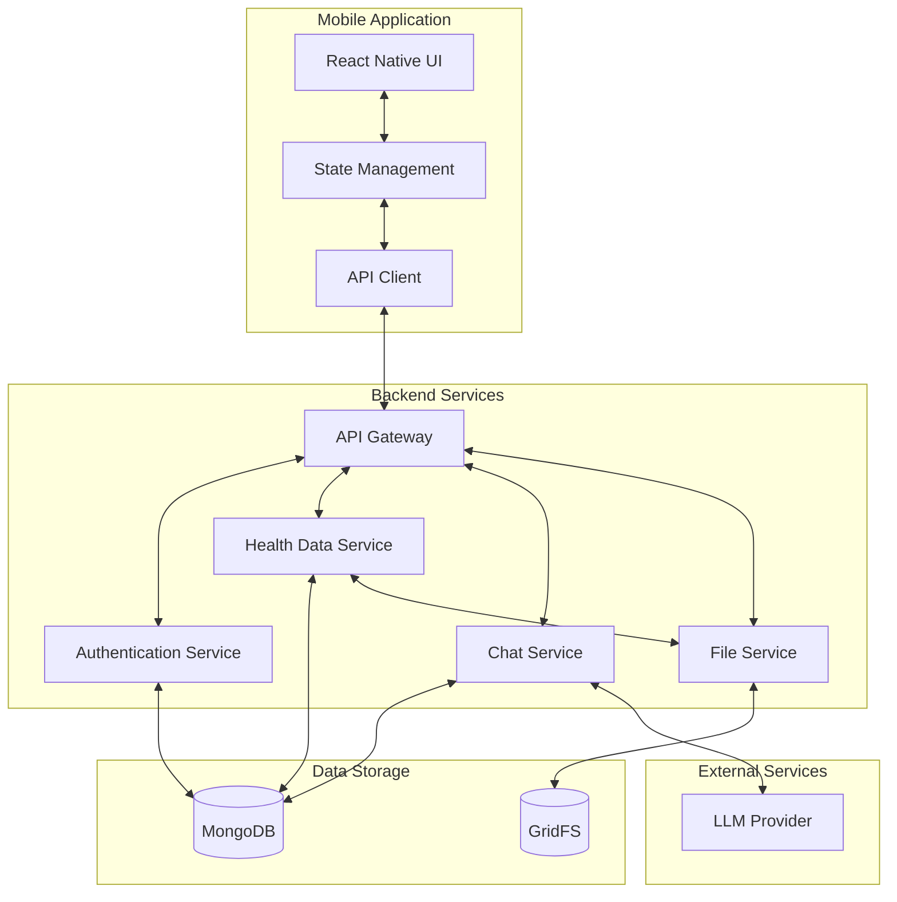

# Health Advisor Architecture Documentation

This documentation provides a comprehensive overview of the Health Advisor application architecture, including the mobile application, backend services, data model, and integration points.

<!-- toc -->
- [1. Introduction](#1-introduction)
  * [1.1 Purpose](#11-purpose)
  * [1.2 System Overview](#12-system-overview)
  * [1.3 Key Requirements](#13-key-requirements)
- [2. High-Level Architecture](#2-high-level-architecture)
  * [2.1 Architecture Diagram](#21-architecture-diagram)
  * [2.2 Component Overview](#22-component-overview)
  * [2.3 Key Design Decisions](#23-key-design-decisions)
- [3. Mobile Application Architecture](#3-mobile-application-architecture)
  * [3.1 Key Features](#31-key-features)
  * [3.2 Technology Stack](#32-technology-stack)
  * [3.3 Detailed Documentation](#33-detailed-documentation)
- [4. Backend Architecture](#4-backend-architecture)
  * [4.1 Key Features](#41-key-features)
  * [4.2 Technology Stack](#42-technology-stack)
  * [4.3 Detailed Documentation](#43-detailed-documentation)
- [5. Data Model](#5-data-model)
  * [5.1 Key Entities](#51-key-entities)
  * [5.2 Entity Relationships](#52-entity-relationships)
  * [5.3 Detailed Documentation](#53-detailed-documentation)
- [6. API Design](#6-api-design)
  * [6.1 API Endpoints](#61-api-endpoints)
  * [6.2 Authentication](#62-authentication)
  * [6.3 Detailed Documentation](#63-detailed-documentation)
- [7. Integration Points](#7-integration-points)
  * [7.1 LLM Integration](#71-llm-integration)
  * [7.2 File Storage](#72-file-storage)
  * [7.3 Mobile-Backend Integration](#73-mobile-backend-integration)
- [8. Security Architecture](#8-security-architecture)
  * [8.1 Authentication and Authorization](#81-authentication-and-authorization)
  * [8.2 Data Protection](#82-data-protection)
  * [8.3 API Security](#83-api-security)
- [9. Deployment Architecture](#9-deployment-architecture)
  * [9.1 Containerization](#91-containerization)
  * [9.2 Cloud Infrastructure](#92-cloud-infrastructure)
  * [9.3 Scaling Strategy](#93-scaling-strategy)
- [10. Monitoring and Observability](#10-monitoring-and-observability)
  * [10.1 Logging](#101-logging)
  * [10.2 Metrics](#102-metrics)
  * [10.3 Alerting](#103-alerting)
- [11. Future Enhancements](#11-future-enhancements)
  * [11.1 Architectural Improvements](#111-architectural-improvements)
  * [11.2 Feature Enhancements](#112-feature-enhancements)
- [12. Conclusion](#12-conclusion)
<!-- tocstop -->

## 1. Introduction

The Health Advisor is a mobile application that enables users to interact with an LLM as a personalized health advisor. The application allows users to log health data through various input methods (photos, text, voice), view their health history, and receive personalized health advice through a chat interface.

### 1.1 Purpose

This architecture documentation serves as a comprehensive reference for developers, architects, and other stakeholders to understand the technical design and implementation of the Health Advisor application.

### 1.2 System Overview

The Health Advisor system consists of two primary components:

1. **React Native Mobile Application**: User-facing interface with five main sections: Chat, Health Log, Data Entry, Insights, and Profile

2. **Express Backend Service**: Manages user authentication, data storage, LLM communication, and health information retrieval

### 1.3 Key Requirements

The architecture is designed to meet the following key requirements:

- Cross-platform mobile experience (iOS and Android)
- Secure user authentication and data privacy
- Flexible health data input methods (photos, text, voice)
- Personalized health advice through LLM integration
- Searchable health history with date filtering
- Scalable and maintainable codebase

## 2. High-Level Architecture

The Health Advisor follows a client-server architecture with a mobile frontend and RESTful backend service.

### 2.1 Architecture Diagram

### 2.2 Component Overview

The system consists of the following main components:

- **Mobile Application**: React Native app with TypeScript, providing the user interface and client-side logic
- **API Gateway**: Express middleware handling request routing, authentication, and validation
- **Authentication Service**: Manages user registration, login, and JWT token handling
- **Health Data Service**: Handles storage and retrieval of health information
- **Chat Service**: Manages conversations and integrates with the LLM provider
- **File Service**: Handles file uploads, storage, and retrieval
- **MongoDB Database**: Stores user data, health records, and chat history
- **GridFS**: Stores binary data like images and voice recordings
- **LLM Provider**: External service providing AI-powered health advice

### 2.3 Key Design Decisions

The architecture is based on the following key design decisions:

- **Client-Server with RESTful API**: Provides simplicity, wide tooling support, and stateless scaling
- **Component-based Mobile Architecture**: React Navigation for cross-platform consistency and familiar navigation patterns
- **Modular Monolith Backend**: Offers simplicity in development and deployment while maintaining logical separation of concerns
- **Document-oriented Database**: MongoDB's document model aligns with varied health data types and schema flexibility requirements

## 3. Mobile Application Architecture

The mobile application is built using React Native to support both iOS and Android platforms. It follows a component-based architecture with clear separation of concerns.

### 3.1 Key Features

- Cross-platform support for iOS and Android
- Bottom tab navigation with five main sections
- Camera and voice recording integration for health data input
- JWT-based authentication with secure token storage
- Offline capability for authentication state
- Context API for state management

### 3.2 Technology Stack

- React Native (v0.71+)
- TypeScript
- React Navigation
- Axios for API communication
- AsyncStorage for local data persistence
- React Native Camera and Voice for data capture

### 3.3 Detailed Documentation

For detailed information about the mobile application architecture, including component hierarchy, navigation structure, state management, and data flow, see [Mobile Architecture](./mobile.md).

## 4. Backend Architecture

The backend is implemented as a modular monolith using Express.js with TypeScript. It provides RESTful API endpoints for the mobile application and integrates with MongoDB for data persistence.

### 4.1 Key Features

- RESTful API endpoints for mobile application
- JWT-based authentication and authorization
- MongoDB integration for data persistence
- LLM service integration for health advice
- File storage using GridFS
- Error handling and logging

### 4.2 Technology Stack

- Node.js with Express.js
- TypeScript
- MongoDB with Mongoose ODM
- JWT for authentication
- Multer for file upload handling
- Winston for logging

### 4.3 Detailed Documentation

For detailed information about the backend architecture, including the Express server setup, middleware configuration, service layer, data models, API endpoints, and integration with external services, see [Backend Architecture](./backend.md).

## 5. Data Model

The application uses MongoDB as its primary database, with Mongoose as the object modeling tool for schema definition and validation.

### 5.1 Key Entities

- **User**: Represents user accounts in the system
- **Health Data**: Stores various types of health information (meals, lab results, symptoms)
- **Chat Conversation**: Represents a conversation session between a user and the LLM
- **Chat Message**: Represents individual messages within a chat conversation
- **File Storage**: GridFS collections for storing binary data (images, audio)

### 5.2 Entity Relationships

- User (1) → Health Data (Many): A user can have multiple health data entries
- User (1) → Chat Conversation (Many): A user can have multiple chat conversations
- Chat Conversation (1) → Chat Message (Many): A conversation contains multiple messages
- Health Data (1) → File Reference (Many): Health data entries may include file attachments

### 5.3 Detailed Documentation

For detailed information about the data model, including MongoDB schemas, relationships, validation rules, indexing strategy, and data access patterns, see [Data Model](./data-model.md).

## 6. API Design

The Health Advisor API follows RESTful principles and provides endpoints for authentication, health data management, chat interactions, and user profile management.

### 6.1 API Endpoints

The API is organized into the following main sections:

- **Authentication API**: User registration, login, and token management
- **Health Data API**: Managing health data (meals, lab results, symptoms)
- **Chat API**: Interacting with the LLM health advisor
- **User Profile API**: Managing user profile information

### 6.2 Authentication

The API uses JWT (JSON Web Tokens) for authentication. After registering or logging in, clients receive a JWT token that must be included in the Authorization header of subsequent requests.

### 6.3 Detailed Documentation

For detailed information about the API endpoints, request/response formats, authentication, and error handling, see the [API Documentation](../api/README.md).

## 7. Integration Points

The Health Advisor system integrates with several external systems and services.

### 7.1 LLM Integration

The Chat Service integrates with an external LLM provider to generate personalized health advice. The integration includes:

- Context building from user health data
- Prompt management for effective LLM interaction
- Response processing and safety filtering
- Error handling and retry logic

### 7.2 File Storage

The File Service handles binary data storage using GridFS, MongoDB's specification for storing and retrieving large files. This includes:

- Image storage for meal photos and lab results
- Voice recording storage for symptom reporting
- File retrieval and streaming

### 7.3 Mobile-Backend Integration

The mobile application communicates with the backend through RESTful API endpoints. This integration includes:

- JWT-based authentication
- JSON data exchange
- File uploads using multipart/form-data
- Error handling and retry logic

## 8. Security Architecture

The Health Advisor system implements several security measures to protect user data and ensure secure operation.

### 8.1 Authentication and Authorization

- JWT-based authentication with secure token storage
- Password hashing using bcrypt
- Role-based access control
- User data isolation through query filtering

### 8.2 Data Protection

- HTTPS for all communications
- Encryption at rest for sensitive data
- Secure file storage
- Input validation to prevent injection attacks

### 8.3 API Security

- Rate limiting to prevent abuse
- Request validation
- CORS configuration
- Security headers (Helmet middleware)

## 9. Deployment Architecture

The Health Advisor system is designed for cloud deployment with scalability and reliability in mind.

### 9.1 Containerization

The backend services are containerized using Docker, enabling consistent deployment across environments and simplified scaling.

### 9.2 Cloud Infrastructure

The system is deployed on AWS with the following components:

- ECS Fargate for container orchestration
- MongoDB Atlas for database hosting
- S3 for additional file storage (alternative to GridFS)
- CloudFront for content delivery
- Application Load Balancer for traffic distribution

### 9.3 Scaling Strategy

The system implements horizontal scaling for handling increased load:

- Backend services scale based on CPU utilization and request count
- Database scales through replica sets and sharding
- File storage scales through distributed object storage
- LLM integration scales through request pooling and caching

## 10. Monitoring and Observability

The Health Advisor system includes comprehensive monitoring and observability features to ensure reliable operation.

### 10.1 Logging

- Structured logging with Winston
- Request/response logging
- Error logging with context
- Audit logging for security events

### 10.2 Metrics

- API response times
- Error rates
- Database performance
- LLM integration performance
- Mobile app performance

### 10.3 Alerting

- Service availability alerts
- Performance degradation alerts
- Error rate alerts
- Security event alerts

## 11. Future Enhancements

The architecture is designed to support future enhancements and scaling:

### 11.1 Architectural Improvements

- Evolution to microservices for high-growth components
- Enhanced offline support in the mobile application
- Real-time updates using WebSockets
- Enhanced caching strategy

### 11.2 Feature Enhancements

- Wearable device integration
- Multi-language support
- Push notifications
- Enhanced analytics and insights

## 12. Conclusion

The Health Advisor architecture provides a solid foundation for a responsive, user-friendly health management application with AI-powered advice. The architecture emphasizes modularity, type safety, and clear separation of concerns, making it maintainable and extensible for future enhancements.