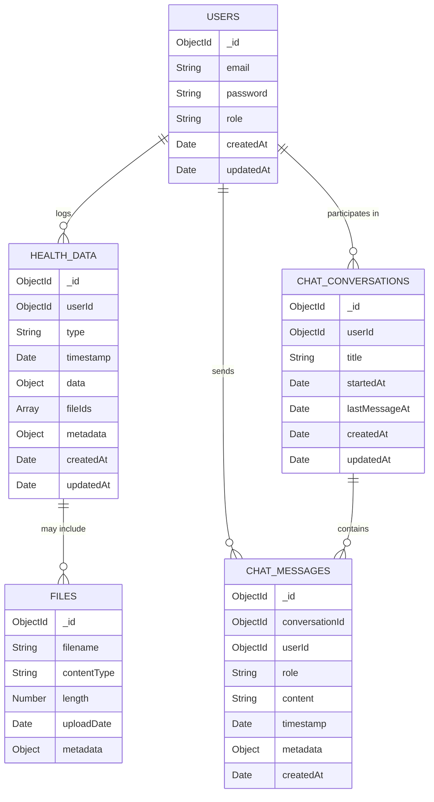
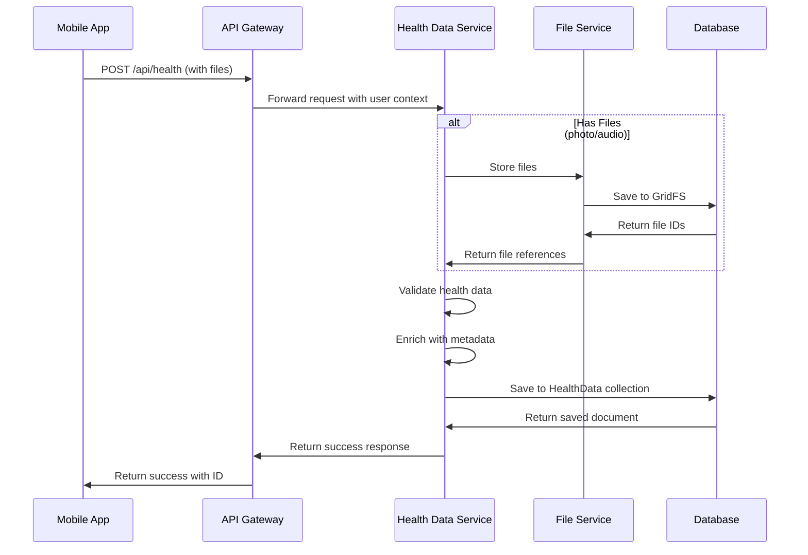
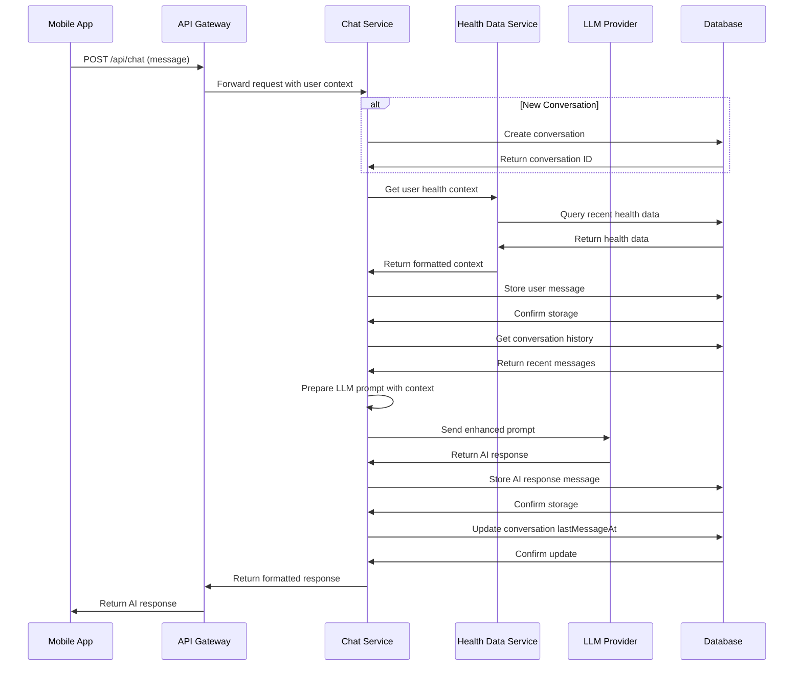
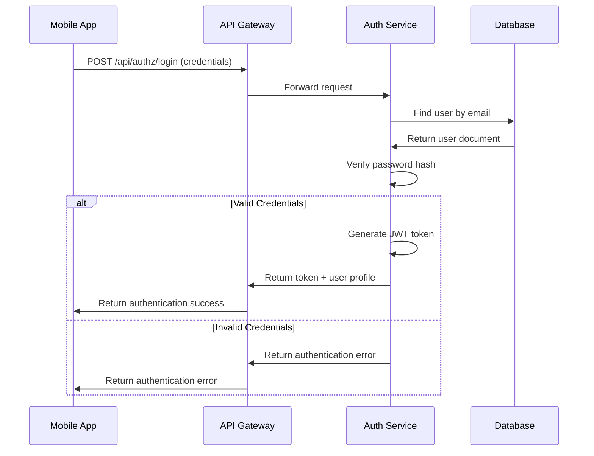
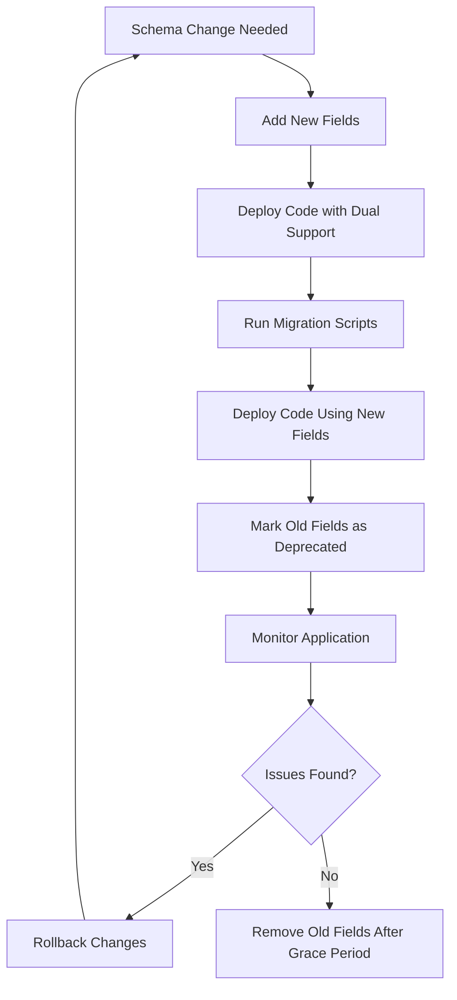

## Table of Contents
- [Overview](#overview)
- [Entity Relationships](#entity-relationships)
- [Collection Schemas](#collection-schemas)
  - [Users Collection](#users-collection)
  - [HealthData Collection](#healthdata-collection)
  - [ChatConversations Collection](#chatconversations-collection)
  - [ChatMessages Collection](#chatmessages-collection)
  - [Files Collection (GridFS)](#files-collection-gridfs)
- [Data Types](#data-types)
  - [User Types](#user-types)
  - [Health Data Types](#health-data-types)
  - [Chat Types](#chat-types)
  - [File Types](#file-types)
  - [Authentication Types](#authentication-types)
- [Indexing Strategy](#indexing-strategy)
- [Data Flow Patterns](#data-flow-patterns)
  - [Health Data Storage Flow](#health-data-storage-flow)
  - [Chat Interaction Flow](#chat-interaction-flow)
  - [Authentication Flow](#authentication-flow)
- [Schema Evolution](#schema-evolution)
```

## Overview

The Health Advisor application uses MongoDB, a document-oriented database, to store user information, health data, and chat interactions with the LLM health advisor. This document-based approach was chosen for its flexibility in handling various types of health data structures (meals, lab results, symptoms) without requiring rigid schema definitions.

The data model consists of five primary collections:

1. **Users**: Stores user account information with authentication details
2. **HealthData**: Stores various types of health information entered by users
3. **ChatConversations**: Stores metadata about chat sessions between users and the LLM
4. **ChatMessages**: Stores individual messages within chat conversations
5. **Files (GridFS)**: Stores binary data like images and audio recordings

This document-oriented design aligns perfectly with the JSON-based API architecture and provides the flexibility needed to evolve the data model as the application's requirements change over time.

## Entity Relationships

The following entity relationship diagram illustrates the connections between the different collections in the Health Advisor application:



**Key relationships:**

- Each **user** can log multiple **health data** entries (one-to-many)
- Each **user** can participate in multiple **chat conversations** (one-to-many)
- Each **chat conversation** contains multiple **chat messages** (one-to-many)
- Each **health data** entry may include multiple **files** like images or audio recordings (one-to-many)

## Collection Schemas

### Users Collection

The Users collection stores user account information including authentication credentials and role.

```typescript
// User schema definition
const userSchema = new Schema<UserDocument>(
  {
    // Email field - unique identifier for users
    email: {
      type: String,
      required: [true, 'Email is required'],
      unique: true,
      trim: true,
      lowercase: true,
      match: [
        /^([\w-.]+@([\w-]+\.)+[\w-]{2,4})?$/,
        'Please provide a valid email address'
      ]
    },
    
    // Password field - stored as bcrypt hash
    password: {
      type: String,
      required: [true, 'Password is required'],
      minlength: [8, 'Password must be at least 8 characters long']
    },
    
    // Role field - determines user permissions
    role: {
      type: String,
      enum: Object.values(UserRole),
      default: UserRole.USER
    }
  },
  { 
    timestamps: true, // Automatically add createdAt and updatedAt fields
    toJSON: { 
      // Exclude password when converting to JSON
      transform: (doc, ret) => {
        delete ret.password;
        return ret;
      }
    }
  }
);
```

**Key features:**
- **Email validation**: Ensures email addresses are properly formatted and unique
- **Password security**: Passwords are hashed using bcrypt before storage
- **Role-based access control**: Supports different user roles for authorization
- **Timestamps**: Automatic tracking of account creation and update times
- **JSON transformation**: Excludes sensitive password data from JSON serialization

### HealthData Collection

The HealthData collection stores various types of health information entered by users, including meals, lab results, and symptoms.

```typescript
// HealthData schema definition
const healthDataSchema = new Schema<HealthDataDocument, HealthDataModel>(
  {
    userId: {
      type: Schema.Types.ObjectId,
      ref: 'User',
      required: true,
      index: true,
    },
    type: {
      type: String,
      enum: Object.values(HealthDataType),
      required: true,
      index: true,
    },
    timestamp: {
      type: Date,
      required: true,
      index: true,
      default: Date.now,
    },
    data: {
      type: Schema.Types.Mixed,
      required: true,
      validate: {
        validator: function(this: HealthDataDocument, value: any) {
          if (!value) return false;
          
          const type = this.type;
          
          if (type === HealthDataType.MEAL) {
            return value.description && value.mealType;
          } else if (type === HealthDataType.LAB_RESULT) {
            return value.testType && value.testDate;
          } else if (type === HealthDataType.SYMPTOM) {
            return value.description && value.severity;
          }
          
          return false;
        },
        message: 'Data must be valid for the specified type'
      }
    },
    fileIds: {
      type: [Schema.Types.ObjectId],
      default: [],
      ref: 'fs.files',
    },
    metadata: {
      type: Schema.Types.Mixed,
      required: true,
      validate: {
        validator: function(value: any) {
          return value && 
                 Object.values(InputSource).includes(value.source) && 
                 Array.isArray(value.tags);
        },
        message: 'Metadata must include a valid source and tags array'
      }
    },
  },
  {
    timestamps: true,
  }
);
```

**Data field structure by type:**

#### Meal Data
```typescript
interface MealData {
  description: string;    // Description of the meal
  mealType: MealType;     // Type of meal (breakfast, lunch, dinner, snack)
  imageUrl: string;       // URL to the image of the meal
}
```

#### Lab Result Data
```typescript
interface LabResultData {
  testType: string;               // Type of lab test
  testDate: Date;                 // Date when the lab test was conducted
  results: Record<string, any>;   // Key-value pairs of test results
  notes: string;                  // Additional notes
  imageUrl: string;               // URL to the image of the lab result
}
```

#### Symptom Data
```typescript
interface SymptomData {
  description: string;            // Description of the symptom
  severity: SymptomSeverity;      // Severity level of the symptom
  duration: string;               // Duration of the symptom
  audioUrl: string;               // URL to the audio recording
  transcription: string;          // Transcription of the voice recording
}
```

**Key features:**
- **Flexible data structure**: Supports different types of health data with type-specific validation
- **File associations**: Can reference images and audio recordings stored in GridFS
- **Metadata tagging**: Includes source information and tags for improved searchability
- **Timestamps**: Automatic tracking of creation and update times
- **Type validation**: Ensures each data type has the required fields

### ChatConversations Collection

The ChatConversations collection stores metadata about chat sessions between users and the LLM health advisor.

```typescript
// ChatConversation schema definition
const ChatConversationSchema = new Schema<ChatConversation>({
  userId: {
    type: Schema.Types.ObjectId,
    ref: 'User',
    required: true,
    index: true // Index for faster queries by userId
  },
  title: {
    type: String,
    required: true,
    trim: true
  },
  startedAt: {
    type: Date,
    required: true,
    default: Date.now
  },
  lastMessageAt: {
    type: Date,
    required: true,
    default: Date.now,
    index: true // Index for sorting by last message time
  }
}, {
  timestamps: true // Automatically adds createdAt and updatedAt fields
});
```

**Key features:**
- **User association**: Links conversations to specific users
- **Conversation tracking**: Records start time and last message time for sorting and filtering
- **Title field**: Allows for naming and identifying conversations
- **Timestamps**: Automatic tracking of creation and update times

### ChatMessages Collection

The ChatMessages collection stores individual messages within chat conversations between users and the LLM health advisor.

```typescript
// ChatMessage schema definition
const ChatMessageSchema = new Schema<ChatMessage>({
  conversationId: {
    type: Schema.Types.ObjectId,
    ref: 'ChatConversation',
    required: true,
    index: true // Index for faster queries by conversationId
  },
  userId: {
    type: Schema.Types.ObjectId,
    ref: 'User',
    required: true
  },
  role: {
    type: String,
    enum: Object.values(ChatRole),
    required: true
  },
  content: {
    type: String,
    required: true,
    trim: true
  },
  timestamp: {
    type: Date,
    required: true,
    default: Date.now,
    index: true // Index for sorting by timestamp
  },
  metadata: {
    type: Schema.Types.Mixed,
    default: {}
  }
}, {
  timestamps: true // Automatically adds createdAt and updatedAt fields
});
```

**Key features:**
- **Conversation association**: Links messages to specific conversations
- **Role differentiation**: Distinguishes between user, assistant, and system messages
- **Content storage**: Stores the text of each message
- **Timestamp tracking**: Records when each message was sent for chronological display
- **Metadata capability**: Can store additional contextual information with messages

### Files Collection (GridFS)

The application uses MongoDB's GridFS for storing binary data like images and audio recordings. GridFS divides files into chunks stored in two collections:

#### fs.files Collection
```typescript
interface FileDocument {
  _id: ObjectId;
  length: number;          // Size of the file in bytes
  chunkSize: number;       // Size of each chunk
  uploadDate: Date;        // Date the file was uploaded
  filename: string;        // Name of the file
  contentType: string;     // MIME type of the file
  metadata: FileMetadata;  // Custom metadata associated with the file
}
```

#### fs.chunks Collection
```typescript
interface ChunkDocument {
  _id: ObjectId;
  files_id: ObjectId;      // Reference to the file document
  n: number;               // Chunk sequence number
  data: Binary;            // Binary data chunk
}
```

**FileMetadata structure:**
```typescript
interface FileMetadata {
  userId: ObjectId;         // User who uploaded the file
  healthDataId: ObjectId;   // Health data entry associated with the file
  originalname: string;     // Original filename from the user
  fileType: FileType;       // Type of file (image, audio, document)
  tags: string[];           // Tags for categorizing and searching
}
```

**Key features:**
- **Large file support**: Can store files larger than MongoDB's document size limit
- **Efficient chunking**: Divides files into manageable chunks for storage and retrieval
- **Metadata association**: Stores custom metadata with files, including user and health data references
- **Content type tracking**: Records MIME types for proper file serving
- **Streaming capability**: Supports efficient streaming of file data for download

## Data Types

### User Types

```typescript
// User roles for authorization purposes
export enum UserRole {
  USER = 'user',
  ADMIN = 'admin'
}

// Base user data structure
export interface User {
  email: string;
  password: string; // Hashed password, not plaintext
  role: UserRole;
  createdAt: Date;
  updatedAt: Date;
}

// Extended user document with Mongoose methods
export interface UserDocument extends User, Document {
  _id: Types.ObjectId;
  comparePassword(candidatePassword: string): Promise<boolean>;
}
```

### Health Data Types

```typescript
// Types of health data
export enum HealthDataType {
  MEAL = 'meal',
  LAB_RESULT = 'labResult',
  SYMPTOM = 'symptom'
}

// Input methods for health data
export enum InputSource {
  PHOTO = 'photo',
  VOICE = 'voice',
  TEXT = 'text'
}

// Severity levels for symptom reporting
export enum SymptomSeverity {
  MILD = 'mild',
  MODERATE = 'moderate',
  SEVERE = 'severe'
}

// Types of meals for meal logging
export enum MealType {
  BREAKFAST = 'breakfast',
  LUNCH = 'lunch',
  DINNER = 'dinner',
  SNACK = 'snack'
}

// Metadata for health data entries
export interface HealthDataMetadata {
  source: InputSource;
  tags: string[];
  location: {
    latitude?: number;
    longitude?: number;
    name?: string;
  };
}

// Core health data structure
export interface HealthData {
  userId: Types.ObjectId;
  type: HealthDataType;
  timestamp: Date;
  data: MealData | LabResultData | SymptomData;
  fileIds: Types.ObjectId[];
  metadata: HealthDataMetadata;
}
```

### Chat Types

```typescript
// Message roles in chat conversations
export enum ChatRole {
  USER = 'user',
  ASSISTANT = 'assistant',
  SYSTEM = 'system'
}

// Chat message structure
export interface ChatMessage {
  _id: Types.ObjectId;
  conversationId: Types.ObjectId;
  userId: Types.ObjectId;
  role: ChatRole;
  content: string;
  timestamp: Date;
  metadata?: Record<string, any>;
  createdAt: Date;
}

// Chat conversation structure
export interface ChatConversation {
  _id: Types.ObjectId;
  userId: Types.ObjectId;
  title: string;
  startedAt: Date;
  lastMessageAt: Date;
  createdAt: Date;
  updatedAt: Date;
}

// LLM message format
export interface LLMMessage {
  role: ChatRole;
  content: string;
}
```

### File Types

```typescript
// Types of files supported by the application
export enum FileType {
  IMAGE = 'image',
  AUDIO = 'audio',
  DOCUMENT = 'document'
}

// File metadata structure
export interface FileMetadata {
  userId: ObjectId;
  healthDataId: ObjectId;
  originalname: string;
  filename: string;
  mimetype: string;
  size: number;
  fileType: FileType;
  uploadDate: Date;
  tags: string[];
}

// GridFS file document structure
export interface FileDocument {
  _id: ObjectId;
  length: number;
  chunkSize: number;
  uploadDate: Date;
  filename: string;
  contentType: string;
  metadata: FileMetadata;
}
```

### Authentication Types

```typescript
// Token types for authentication
export enum TokenType {
  ACCESS = 'access',
  REFRESH = 'refresh'
}

// JWT payload structure
export interface JwtPayload {
  userId: string;
  email: string;
  iat: number; // Issued at timestamp
}

// Authentication error types
export enum AuthErrorType {
  INVALID_CREDENTIALS = 'Invalid email or password',
  EMAIL_EXISTS = 'Email is already registered',
  UNAUTHORIZED = 'Unauthorized access',
  INVALID_TOKEN = 'Invalid authentication token',
  TOKEN_EXPIRED = 'Authentication token has expired'
}
```

## Indexing Strategy

The Health Advisor application uses a comprehensive indexing strategy to optimize query performance while minimizing storage and write overhead. The following indexes are configured:

### Users Collection
| Index | Type | Purpose | Justification |
|-------|------|---------|---------------|
| email | Unique | Lookup by email | Fast authentication and preventing duplicate emails |

```typescript
// Create index for email field for faster lookups and to enforce uniqueness
userSchema.index({ email: 1 }, { unique: true });
```

### HealthData Collection
| Index | Type | Purpose | Justification |
|-------|------|---------|---------------|
| userId | Standard | Filter by user | Most queries filter by user first |
| type | Standard | Filter by health data type | Frequent filtering by type |
| timestamp | Standard | Date-based queries | Timeline view and date filtering |
| userId + timestamp | Compound | Date-based queries by user | Efficient retrieval of health data by date |
| userId + type | Compound | Type filtering by user | Quick filtering by health data type |
| userId + metadata.tags | Compound | Tag-based search | Enables efficient tag searching |

```typescript
// Create compound indexes for common query patterns
healthDataSchema.index({ userId: 1, timestamp: -1 }); // For date-based queries by user
healthDataSchema.index({ userId: 1, type: 1 }); // For type filtering by user
healthDataSchema.index({ userId: 1, 'metadata.tags': 1 }); // For tag-based search
```

### ChatConversations Collection
| Index | Type | Purpose | Justification |
|-------|------|---------|---------------|
| userId | Standard | Filter by user | Retrieve user's conversations |
| lastMessageAt | Standard | Sort by recency | Display most recent conversations first |
| userId + lastMessageAt | Compound | Recent conversations by user | Efficient retrieval of recent conversations |

```typescript
// Add compound index for more efficient queries with sorting
ChatConversationSchema.index({ userId: 1, lastMessageAt: -1 });
```

### ChatMessages Collection
| Index | Type | Purpose | Justification |
|-------|------|---------|---------------|
| conversationId | Standard | Filter by conversation | Retrieve messages in a conversation |
| timestamp | Standard | Sort chronologically | Display messages in order |
| conversationId + timestamp | Compound | Chronological messages in a conversation | Efficient pagination of conversation history |

```typescript
// Add compound index for more efficient queries with sorting
ChatMessageSchema.index({ conversationId: 1, timestamp: 1 });
```

### Files Collection (GridFS)
| Index | Type | Purpose | Justification |
|-------|------|---------|---------------|
| filename | Standard | Lookup by filename | Fast file retrieval |
| metadata.userId | Standard | Filter by user | User-specific file queries |
| metadata.healthDataId | Standard | Filter by health data | Retrieve files for a specific health data entry |
| uploadDate | Standard | Sort by upload date | Display files in chronological order |

GridFS automatically creates indexes on the files_id field in the chunks collection for efficient chunk retrieval.

## Data Flow Patterns

### Health Data Storage Flow

This diagram illustrates how health data flows through the system during the data entry process:



### Chat Interaction Flow

This diagram illustrates how data flows through the system during a chat interaction with the LLM:



### Authentication Flow

This diagram illustrates how data flows through the system during the authentication process:



## Schema Evolution

The Health Advisor application follows best practices for schema evolution to allow for changes to the data model while maintaining backward compatibility:

### Versioning Strategy

1. **Schema versioning**: A version field in the database tracks the overall schema version
2. **Backward compatibility**: New fields are optional or have default values
3. **Field deprecation**: Fields are marked as deprecated before removal
4. **Migration scripts**: Automated scripts handle data migration between versions

### Migration Process



### Best Practices

1. **Add, don't remove**: Add new fields instead of modifying existing ones
2. **Gradual transitions**: Allow code to work with both old and new schema versions
3. **Validation flexibility**: Make validation rules adaptable to schema changes
4. **Automated tests**: Comprehensive tests verify schema compatibility
5. **Monitoring**: Track errors related to schema changes in production
6. **Document changes**: Maintain a changelog of schema modifications

By following these practices, the Health Advisor application can evolve its data model over time while ensuring a smooth experience for users and developers.