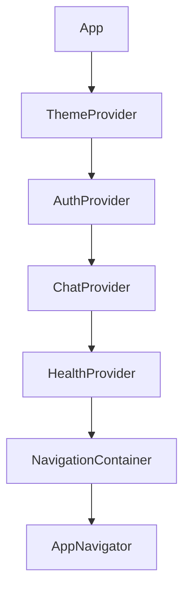
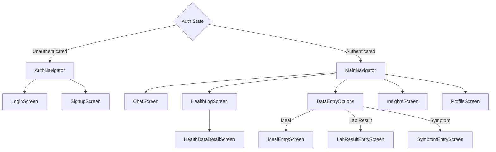
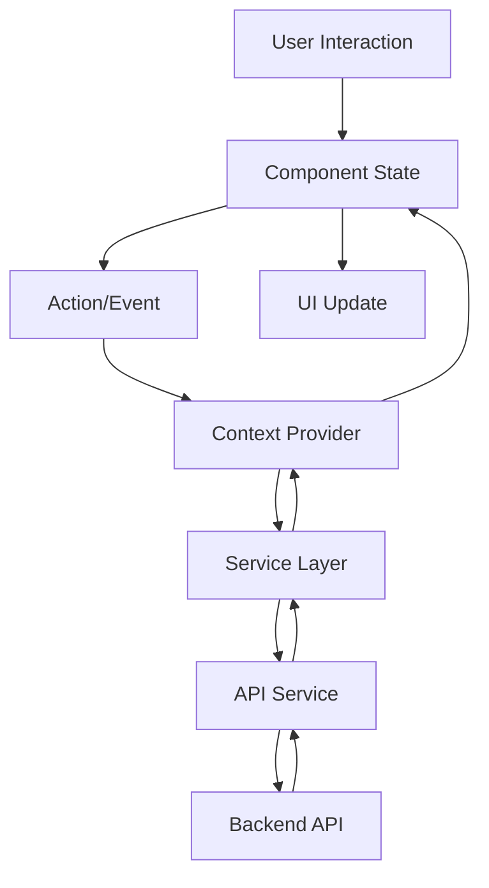
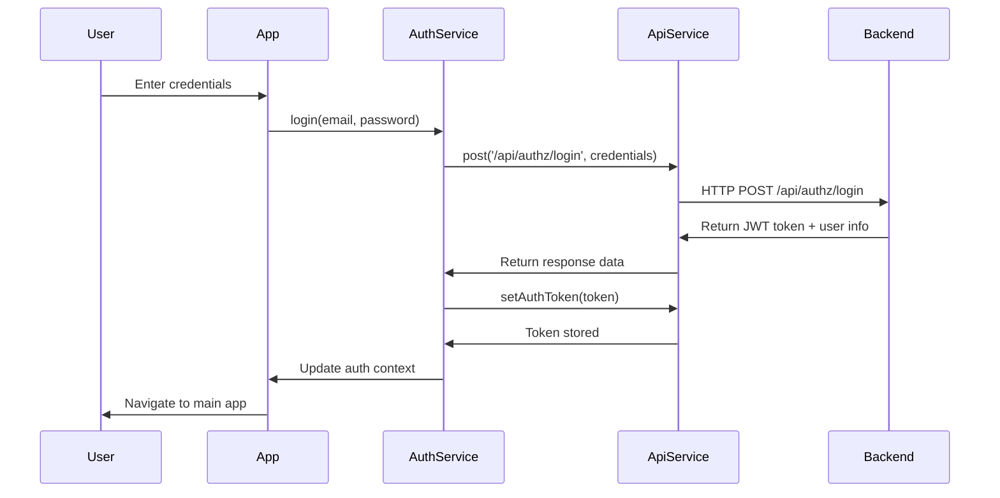
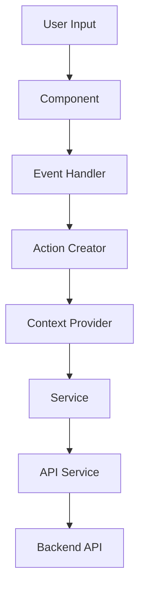
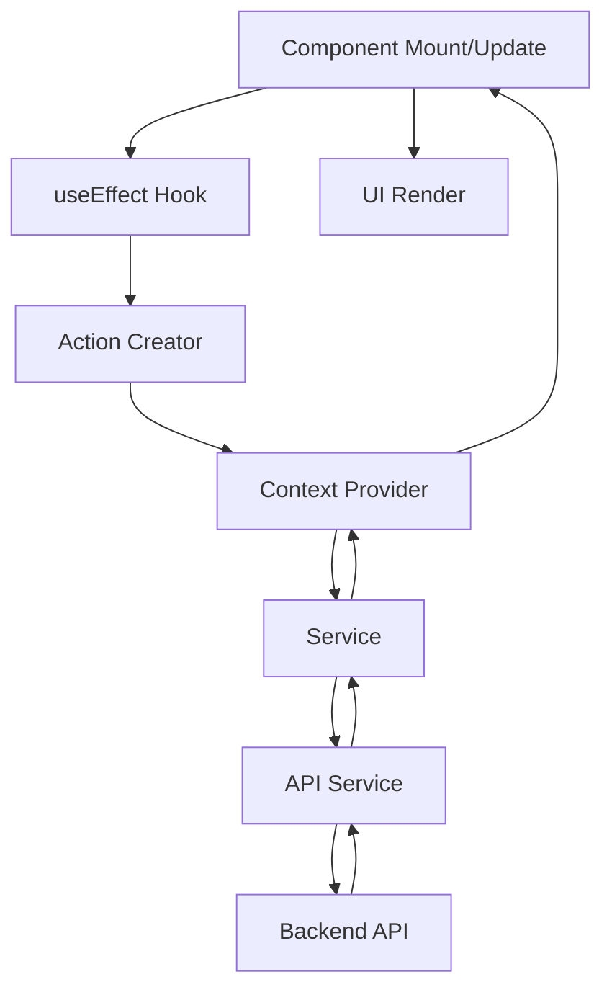
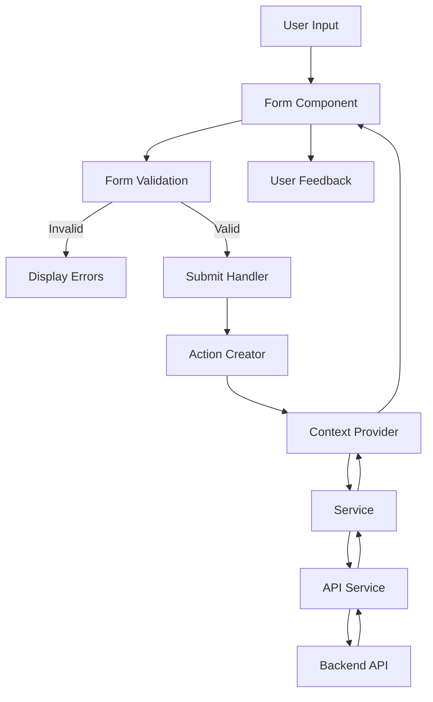
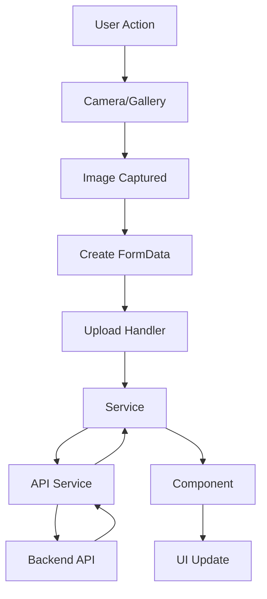

# Health Advisor Mobile Architecture

This document provides a comprehensive overview of the Health Advisor mobile application architecture. The mobile application is built using React Native to support both iOS and Android platforms, with TypeScript for type safety and improved developer experience.

## Table of Contents

- [1. Introduction](#1-introduction)
  * [1.1 Purpose](#11-purpose)
  * [1.2 Key Requirements](#12-key-requirements)
- [2. Technology Stack](#2-technology-stack)
  * [2.1 Core Technologies](#21-core-technologies)
  * [2.2 UI Components](#22-ui-components)
  * [2.3 Development Tools](#23-development-tools)
- [3. Application Architecture](#3-application-architecture)
  * [3.1 Architectural Patterns](#31-architectural-patterns)
  * [3.2 Directory Structure](#32-directory-structure)
  * [3.3 Code Organization Principles](#33-code-organization-principles)
- [4. Component Hierarchy](#4-component-hierarchy)
  * [4.1 Root Component](#41-root-component)
  * [4.2 Navigation Structure](#42-navigation-structure)
  * [4.3 Screen Components](#43-screen-components)
  * [4.4 Reusable Components](#44-reusable-components)
- [5. State Management](#5-state-management)
  * [5.1 Context Providers](#51-context-providers)
  * [5.2 Local Component State](#52-local-component-state)
  * [5.3 State Flow Diagram](#53-state-flow-diagram)
- [6. Custom Hooks](#6-custom-hooks)
  * [6.1 API Hooks](#61-api-hooks)
  * [6.2 UI Hooks](#62-ui-hooks)
  * [6.3 Device Hooks](#63-device-hooks)
  * [6.4 Hook Implementation Pattern](#64-hook-implementation-pattern)
- [7. Service Layer](#7-service-layer)
  * [7.1 API Service](#71-api-service)
  * [7.2 Domain Services](#72-domain-services)
  * [7.3 Device Services](#73-device-services)
  * [7.4 Service Implementation Pattern](#74-service-implementation-pattern)
- [8. API Integration](#8-api-integration)
  * [8.1 API Client](#81-api-client)
  * [8.2 Authentication Flow](#82-authentication-flow)
  * [8.3 API Endpoints](#83-api-endpoints)
  * [8.4 Error Handling](#84-error-handling)
- [9. Data Flow](#9-data-flow)
  * [9.1 User Input Flow](#91-user-input-flow)
  * [9.2 Data Retrieval Flow](#92-data-retrieval-flow)
  * [9.3 Form Submission Flow](#93-form-submission-flow)
  * [9.4 File Upload Flow](#94-file-upload-flow)
- [10. Styling and Theming](#10-styling-and-theming)
  * [10.1 Theming System](#101-theming-system)
  * [10.2 Styling Approach](#102-styling-approach)
  * [10.3 Design System](#103-design-system)
- [11. Offline Support](#11-offline-support)
  * [11.1 Authentication State](#111-authentication-state)
  * [11.2 Error Handling](#112-error-handling)
  * [11.3 Future Enhancements](#113-future-enhancements)
- [12. Testing Strategy](#12-testing-strategy)
  * [12.1 Unit Testing](#121-unit-testing)
  * [12.2 Integration Testing](#122-integration-testing)
  * [12.3 End-to-End Testing](#123-end-to-end-testing)
  * [12.4 Test Organization](#124-test-organization)
- [13. Performance Considerations](#13-performance-considerations)
  * [13.1 Rendering Optimization](#131-rendering-optimization)
  * [13.2 State Management Optimization](#132-state-management-optimization)
  * [13.3 Network Optimization](#133-network-optimization)
- [14. Security Considerations](#14-security-considerations)
  * [14.1 Authentication Security](#141-authentication-security)
  * [14.2 Data Security](#142-data-security)
  * [14.3 Device Security](#143-device-security)
- [15. Accessibility](#15-accessibility)
  * [15.1 Screen Reader Support](#151-screen-reader-support)
  * [15.2 Visual Accessibility](#152-visual-accessibility)
- [16. Future Enhancements](#16-future-enhancements)
  * [16.1 State Management](#161-state-management)
  * [16.2 Performance](#162-performance)
  * [16.3 Features](#163-features)
- [17. Conclusion](#17-conclusion)
- [18. References](#18-references)

## 1. Introduction

The Health Advisor mobile application provides a user-friendly interface for interacting with an LLM-powered health advisor. It allows users to log health data through various input methods, view their health history, and receive personalized health advice through a chat interface.

### 1.1 Purpose

This document describes the architecture of the Health Advisor mobile application, including its component structure, navigation flow, state management, data flow, and integration with backend services.

### 1.2 Key Requirements

The mobile application is designed to meet the following key requirements:

- Cross-platform support for iOS and Android
- User authentication with JWT tokens
- Health data input through photos, text, and voice
- Chat interface for interacting with the LLM health advisor
- Searchable health history with date filtering
- Offline capability for authentication state
- Responsive and intuitive user interface

## 2. Technology Stack

The Health Advisor mobile application is built using the following technologies:

### 2.1 Core Technologies

- **React Native (v0.71+)**: Cross-platform mobile framework
- **TypeScript (v4.9+)**: Typed superset of JavaScript
- **React Navigation (v6.x)**: Navigation library for React Native
- **Axios**: HTTP client for API communication
- **AsyncStorage**: Local data persistence
- **Context API**: State management

### 2.2 UI Components

- **React Native Core Components**: View, Text, Image, etc.
- **React Native Camera**: Camera integration for photo capture
- **React Native Voice**: Voice recording for symptom reporting
- **Custom UI Components**: Buttons, cards, inputs, etc.

### 2.3 Development Tools

- **ESLint**: Code linting
- **Prettier**: Code formatting
- **Jest**: Testing framework
- **React Native Testing Library**: Component testing
- **Detox**: End-to-end testing

## 3. Application Architecture

The Health Advisor mobile application follows a component-based architecture with clear separation of concerns.

### 3.1 Architectural Patterns

The application implements the following architectural patterns:

- **Component-Based Architecture**: UI is composed of reusable components
- **Context API for State Management**: Global state is managed using React Context
- **Custom Hooks**: Encapsulate and reuse stateful logic
- **Service Layer**: Abstracts API communication and device interactions
- **Repository Pattern**: Abstracts data access and persistence

### 3.2 Directory Structure

```
src/web/
├── android/            # Android-specific files
├── ios/                # iOS-specific files
├── src/
│   ├── api/            # API client implementations
│   ├── assets/         # Static assets (images, icons, fonts)
│   ├── components/     # Reusable UI components
│   ├── constants/      # Application constants
│   ├── contexts/       # React Context providers
│   ├── hooks/          # Custom React hooks
│   ├── navigation/     # Navigation configuration
│   ├── screens/        # Screen components
│   ├── services/       # Service layer
│   ├── theme/          # Theming and styling
│   ├── types/          # TypeScript type definitions
│   ├── utils/          # Utility functions
│   ├── App.tsx         # Root component
│   └── index.js        # Entry point
├── __tests__/          # Test files
└── e2e/                # End-to-end tests
```

### 3.3 Code Organization Principles

The application follows these code organization principles:

- **Feature-Based Organization**: Code is organized by feature (auth, chat, health, etc.)
- **Component Reusability**: UI components are designed for reuse across features
- **Type Safety**: TypeScript interfaces define data structures and component props
- **Separation of Concerns**: UI, business logic, and data access are separated
- **Consistent Naming**: Consistent naming conventions across the codebase

## 4. Component Hierarchy

The application is structured as a hierarchy of components, from the root App component down to individual UI elements.

### 4.1 Root Component

The `App.tsx` component is the root of the application. It sets up the following providers:

- **ThemeProvider**: Provides theme context for styling
- **AuthProvider**: Manages authentication state
- **ChatProvider**: Manages chat state and LLM interactions
- **HealthProvider**: Manages health data state
- **NavigationContainer**: Root navigation container



### 4.2 Navigation Structure

The navigation structure is organized as follows:

- **AppNavigator**: Root navigator that conditionally renders AuthNavigator or MainNavigator based on authentication state
- **AuthNavigator**: Stack navigator for authentication screens (Login, Signup)
- **MainNavigator**: Bottom tab navigator for main app screens (Chat, Health Log, Data Entry, Insights, Profile)



### 4.3 Screen Components

Each screen component is responsible for a specific view in the application:

- **Authentication Screens**:
  - LoginScreen: User login with email and password
  - SignupScreen: User registration with email and password

- **Main Screens**:
  - ChatScreen: LLM chat interface
  - HealthLogScreen: Health data history and search
  - InsightsScreen: Future health insights (placeholder)
  - ProfileScreen: User profile and logout

- **Data Entry Screens**:
  - MealEntryScreen: Capture and log meal data
  - LabResultEntryScreen: Capture and log lab result data
  - SymptomEntryScreen: Record and log symptom data

- **Detail Screens**:
  - HealthDataDetailScreen: Detailed view of health data entry

### 4.4 Reusable Components

The application includes several categories of reusable components:

- **Common Components**:
  - Header: Screen header with title
  - Button: Standard button component
  - TextInput: Text input field
  - Card: Container for content
  - DatePicker: Date selection component
  - SearchBar: Search input with functionality
  - LoadingIndicator: Loading state indicator
  - ErrorMessage: Error display with retry option

- **Chat Components**:
  - ChatList: Displays chat messages
  - ChatBubble: Individual message bubble
  - ChatInput: Text input with send and voice buttons

- **Health Components**:
  - HealthItemList: List of health data entries
  - HealthDataCard: Card displaying health data summary
  - CalendarView: Calendar for date selection

- **Data Input Components**:
  - CameraView: Camera interface for photo capture
  - VoiceRecorder: Voice recording interface
  - DataEntryOptions: Bottom sheet with data entry options

## 5. State Management

The application uses a combination of React Context API for global state and local component state for UI-specific state.

### 5.1 Context Providers

The application includes the following context providers:

- **AuthContext**: Manages authentication state and user information
  - State: authentication status, user data, loading state, error state
  - Actions: login, signup, logout, check authentication status

- **ChatContext**: Manages chat conversations and LLM interactions
  - State: active conversation, messages, loading state, error state
  - Actions: send message, load conversation, create new conversation

- **HealthContext**: Manages health data state
  - State: health data entries, filters, loading state, error state
  - Actions: add health data, load health data, search health data

- **ThemeContext**: Manages theme settings
  - State: current theme, color scheme
  - Actions: toggle theme, set theme

### 5.2 Local Component State

Individual components manage their own local state using React's useState hook for UI-specific state such as:

- Form input values
- Validation errors
- UI toggle states (expanded/collapsed)
- Loading indicators
- Modal visibility
- Scroll positions

### 5.3 State Flow Diagram



## 6. Custom Hooks

The application uses custom hooks to encapsulate and reuse stateful logic.

### 6.1 API Hooks

- **useApi**: Generic hook for API requests with loading and error states
- **useAuth**: Hook for authentication operations (login, signup, logout)
- **useChat**: Hook for chat operations and LLM interactions
- **useHealthData**: Hook for health data operations

### 6.2 UI Hooks

- **useForm**: Form state management and validation
- **useKeyboard**: Keyboard visibility and behavior
- **useTheme**: Access to current theme and theme switching

### 6.3 Device Hooks

- **useCamera**: Camera access and photo capture
- **useVoiceRecorder**: Voice recording and transcription
- **useLocalStorage**: AsyncStorage wrapper for persistent storage

### 6.4 Hook Implementation Pattern

Custom hooks follow a consistent implementation pattern:

```typescript
function useCustomHook(initialParams) {
  // State declarations
  const [data, setData] = useState(null);
  const [loading, setLoading] = useState(false);
  const [error, setError] = useState(null);
  
  // Effect hooks for initialization, cleanup, etc.
  useEffect(() => {
    // Initialization logic
    return () => {
      // Cleanup logic
    };
  }, [dependencies]);
  
  // Action functions
  const performAction = async (params) => {
    setLoading(true);
    setError(null);
    try {
      // Action implementation
      setData(result);
    } catch (err) {
      setError(err);
    } finally {
      setLoading(false);
    }
  };
  
  // Return state and actions
  return {
    data,
    loading,
    error,
    performAction
  };
}
```

## 7. Service Layer

The service layer abstracts communication with the backend API and device interactions.

### 7.1 API Service

The `api.service.ts` provides a centralized client for all HTTP requests to the backend:

- HTTP methods (GET, POST, PUT, DELETE, PATCH)
- Authentication token management
- Error handling and standardization
- Request retry logic
- File upload handling

### 7.2 Domain Services

Domain-specific services implement business logic and API integration:

- **auth.service.ts**: Authentication operations
- **chat.service.ts**: Chat and LLM interactions
- **health.service.ts**: Health data operations
- **user.service.ts**: User profile operations

### 7.3 Device Services

Services for device-specific functionality:

- **camera.service.ts**: Camera access and photo capture
- **voice.service.ts**: Voice recording and transcription
- **storage.service.ts**: Local data persistence with AsyncStorage

### 7.4 Service Implementation Pattern

Services follow a consistent implementation pattern:

```typescript
class DomainService {
  private apiService: ApiService;
  
  constructor() {
    this.apiService = apiService; // Singleton instance
  }
  
  async performOperation(params) {
    try {
      // Prepare request data
      const response = await this.apiService.method('/endpoint', data, options);
      // Process response
      return processedResult;
    } catch (error) {
      // Handle domain-specific errors
      throw this.handleError(error);
    }
  }
  
  handleError(error) {
    // Domain-specific error handling
    return standardizedError;
  }
}

// Export singleton instance
export const domainService = new DomainService();
```

## 8. API Integration

The mobile application communicates with the backend through a RESTful API.

### 8.1 API Client

The API client is implemented using Axios with the following features:

- Base URL configuration
- Request/response interceptors
- Authentication token handling
- Error standardization
- Retry logic for network failures

### 8.2 Authentication Flow



### 8.3 API Endpoints

The mobile application interacts with the following API endpoints:

- **Authentication Endpoints**:
  - POST /api/authz/signup: User registration
  - POST /api/authz/login: User authentication
  - POST /api/authz/refresh: Token refresh

- **Health Data Endpoints**:
  - GET /api/health: Retrieve health data with filtering
  - POST /api/health: Create new health data entry
  - GET /api/health/:id: Get specific health data entry
  - DELETE /api/health/:id: Delete health data entry

- **Chat Endpoints**:
  - GET /api/chat: Get chat history
  - POST /api/chat: Send message to LLM
  - GET /api/chat/:id: Get specific conversation

- **User Endpoints**:
  - GET /api/user/profile: Get user profile
  - PUT /api/user/profile: Update user profile

### 8.4 Error Handling

API errors are handled consistently throughout the application:

1. **API Service Level**:
   - Network errors are caught and standardized
   - Authentication errors trigger token refresh or logout
   - Retry logic for transient failures

2. **Service Level**:
   - Domain-specific error handling
   - Error transformation for UI consumption

3. **UI Level**:
   - Error messages displayed to user
   - Retry options for recoverable errors
   - Graceful degradation for non-critical features

## 9. Data Flow

The application follows a unidirectional data flow pattern.

### 9.1 User Input Flow



### 9.2 Data Retrieval Flow



### 9.3 Form Submission Flow



### 9.4 File Upload Flow



## 10. Styling and Theming

The application implements a consistent styling approach with support for light and dark themes.

### 10.1 Theming System

The theming system is implemented using React Context:

- **ThemeContext**: Provides theme values and theme switching functionality
- **Theme Types**: Light and dark themes
- **Theme Properties**: Colors, typography, spacing, etc.
- **Theme Detection**: Respects system theme settings with manual override option

### 10.2 Styling Approach

The application uses React Native's StyleSheet API for styling:

- Component-specific styles defined alongside components
- Common styles extracted to shared style objects
- Theme-aware styling using the useTheme hook
- Responsive design with flexible layouts
- Platform-specific styling where needed

### 10.3 Design System

The application implements a consistent design system:

- **Colors**: Primary, secondary, accent, background, text, etc.
- **Typography**: Font family, sizes, weights, line heights
- **Spacing**: Consistent spacing scale
- **Shadows**: Elevation and shadow styles
- **Border Radius**: Consistent border radius values
- **Icons**: Consistent icon set and sizing

## 11. Offline Support

The application provides limited offline functionality.

### 11.1 Authentication State

Authentication state is persisted locally using AsyncStorage:

- JWT token stored securely
- User information cached
- Automatic restoration on app launch
- Token expiration handling

### 11.2 Error Handling

Network errors are handled gracefully:

- Informative error messages for connectivity issues
- Retry options for failed requests
- Graceful degradation of features requiring connectivity

### 11.3 Future Enhancements

Planned enhancements for offline support:

- Offline data cache for health history
- Offline data entry with synchronization
- Background synchronization when connectivity is restored
- Conflict resolution for offline changes

## 12. Testing Strategy

The application implements a comprehensive testing strategy.

### 12.1 Unit Testing

Unit tests focus on individual components and functions:

- **Component Testing**: Using React Testing Library
- **Hook Testing**: Custom hook testing
- **Utility Function Testing**: Pure function testing
- **Service Testing**: Service method testing with mocked dependencies

### 12.2 Integration Testing

Integration tests verify component interactions:

- **Screen Testing**: Testing screen components with mocked navigation
- **Context Testing**: Testing context providers with consumers
- **Service Integration**: Testing service interactions

### 12.3 End-to-End Testing

End-to-end tests verify complete user flows:

- **User Flows**: Authentication, health data entry, chat interaction
- **Cross-Platform**: Testing on iOS and Android
- **Device Features**: Camera, voice recording, etc.

### 12.4 Test Organization

Tests are organized to mirror the source code structure:

- `__tests__/components/`: Component tests
- `__tests__/hooks/`: Hook tests
- `__tests__/services/`: Service tests
- `__tests__/screens/`: Screen tests
- `__tests__/utils/`: Utility function tests
- `e2e/`: End-to-end tests

## 13. Performance Considerations

The application implements several performance optimizations.

### 13.1 Rendering Optimization

- **React.memo**: Memoization for expensive components
- **useMemo/useCallback**: Memoization for values and functions
- **List Virtualization**: FlatList for efficient list rendering
- **Lazy Loading**: Lazy loading for non-critical components
- **Image Optimization**: Proper image sizing and caching

### 13.2 State Management Optimization

- **Context Splitting**: Separate contexts for different domains
- **Selective Updates**: Prevent unnecessary re-renders
- **Batch Updates**: Batch state updates where possible

### 13.3 Network Optimization

- **Request Caching**: Cache API responses where appropriate
- **Pagination**: Paginated data loading for large datasets
- **Debouncing**: Debounce search inputs and other frequent events
- **Compression**: Request/response compression
- **Optimistic Updates**: Update UI before API response for better perceived performance

## 14. Security Considerations

The application implements several security measures.

### 14.1 Authentication Security

- **JWT Token Storage**: Secure storage of authentication tokens
- **Token Expiration**: Handling of token expiration
- **Secure Login**: HTTPS for all authentication requests
- **Input Validation**: Validation of authentication inputs

### 14.2 Data Security

- **HTTPS**: All API communication over HTTPS
- **Input Sanitization**: Sanitization of user inputs
- **Sensitive Data Handling**: Proper handling of health data
- **Error Handling**: Secure error handling without exposing sensitive information

### 14.3 Device Security

- **Permission Handling**: Proper requesting and handling of device permissions
- **Camera Security**: Secure camera usage
- **Microphone Security**: Secure microphone usage
- **Local Storage Security**: Secure local storage of sensitive data

## 15. Accessibility

The application implements accessibility features for users with disabilities.

### 15.1 Screen Reader Support

- **Accessibility Labels**: Descriptive labels for UI elements
- **Accessibility Hints**: Additional context for screen readers
- **Focus Management**: Proper focus handling for keyboard navigation
- **Announcements**: Dynamic announcements for important changes

### 15.2 Visual Accessibility

- **Color Contrast**: WCAG-compliant color contrast
- **Text Sizing**: Support for dynamic text sizes
- **Touch Targets**: Adequately sized touch targets
- **Reduced Motion**: Support for reduced motion preferences

## 16. Future Enhancements

Planned enhancements for the mobile application architecture.

### 16.1 State Management

- **Redux Integration**: For more complex state management needs
- **Persistence Layer**: Enhanced offline data persistence
- **State Synchronization**: Real-time state updates

### 16.2 Performance

- **Code Splitting**: Further code splitting for faster loading
- **Native Modules**: Performance-critical features in native code
- **Worker Threads**: Background processing for intensive tasks

### 16.3 Features

- **Push Notifications**: For important health reminders
- **Wearable Integration**: Connection to health wearables
- **Offline Mode**: Enhanced offline capabilities
- **Multi-Language Support**: Internationalization

## 17. Conclusion

The Health Advisor mobile application architecture provides a solid foundation for a responsive, user-friendly health management application with AI-powered advice. The architecture emphasizes component reusability, type safety, and clear separation of concerns, making it maintainable and extensible for future enhancements.

## 18. References

- [Backend Architecture](./backend.md)
- [Data Model](./data-model.md)
- [API Documentation](../api/README.md)
- [React Native Documentation](https://reactnative.dev/docs/getting-started)
- [React Navigation Documentation](https://reactnavigation.org/docs/getting-started)